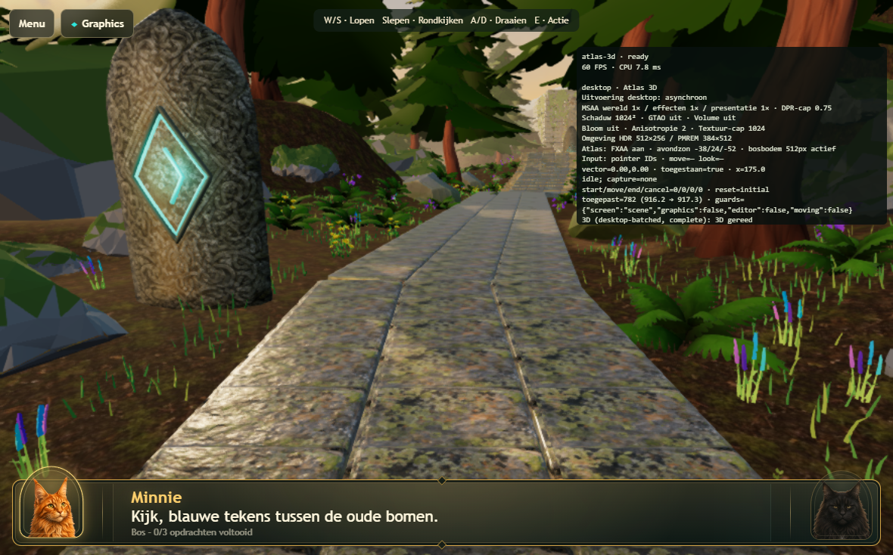
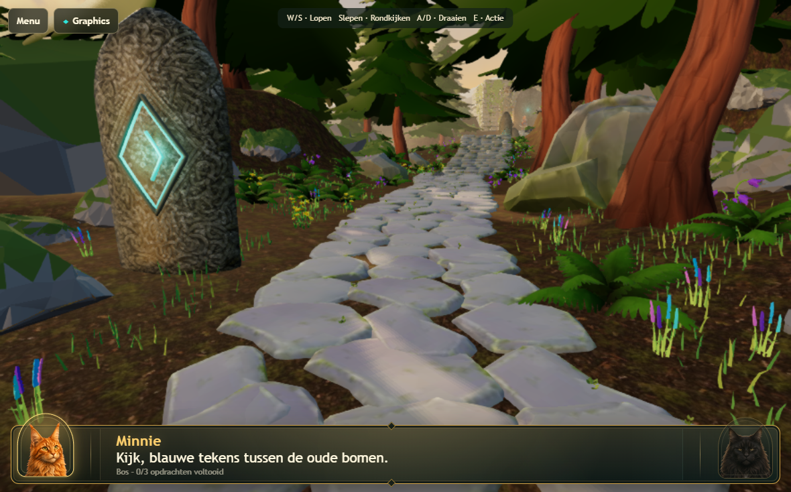

> Archived historical reference; not current instructions. Preserve the baseline and findings below as a record.
> Current contract: [canonical successor](../../renderer-current-spec.md).

# Atlas v173 — organic supplied-stone path

Replaces the rejected v172 sidewalk-like paving. Continues the current Atlas
scene; no renderer, foliage, lighting, menu, challenge or route changes.

## Visual implementation

All four supplied path sets were inspected. `rockpath1` (783 triangles) and
`rockpath4` (2,256) are more rectilinear; `rockpath2` (3,500) is unnecessarily
costly. `rockpath3` (2,254 per complete set) supplies rounded, irregular worn
flagstones and is the visual source used throughout.

Six original connected stone shapes are shared, retaining their facets and UVs.
The source GLB on disk is untouched. The layout uses variable widths, staggered
joints, restrained rotation, and subtly meandering edges inside the existing
route corridor. It widens toward the temple rather than forming straight curbs.

- 189 forest-path stones, seated on the terrain.
- 183 uphill/stair-course stones replace the old combined textured stair mesh.
- 12 shallow landing stones continue the approach to the temple door.
- 80 overlapping legacy temple terrace stones are removed visually: they crossed
  the actual route above its walking surface. Their named anchors/transforms
  remain, as do the gameplay route, door and NPC positions.
- 384 physical stones total. The 189 forest stones use six shared meshes; the
  195 static course/landing stones are baked into one mesh with the same material.

Runtime drafts exposed wide joints, the remaining combined stair mesh, and
overlapping old temple terraces. Those drafts were rejected. The final version
closes the joints, replaces the rising route surface and removes the duplicate
terraces. Upper cap geometry is kept shallow (at most 18 cm for the source's full
normalized depth); only lower supporting faces extend to the old course bases.
This avoids stretching the entire thin source stone into a rounded pillar.

Independent authoring audit: 2,849 samples across the central 1.8-metre walking
strip, **99.0% directly over stone**; at uncovered samples the nearest stone was
within **15 cm** in the sampled radial directions. This is a sampled geometric
check, not proof that every boundary joint has an exact maximum width. Soil
seams remain intentional. All sampled main-path underside roots are embedded.
Uphill stones retain the original courses' top/base elevations. Some stone
edges overlap slightly to avoid wide gaps; the source stones remain visibly
irregular rather than perfectly tessellated paving.

## Cost and preservation

| Asset measure | v172 | v173 |
| --- | ---: | ---: |
| Path + all stair triangles | 129,220 | 47,680 |
| Atlas GLB bytes | 18,699,628 | 17,989,292 |
| Materials / images | 26 / 22 | 27 / 23 |

One shared opaque 512×512 stone palette, metallic 0 / roughness 0.94, adds about
1.33 MiB RGBA8 storage including mips. No new normal maps, effects or render
targets. Existing spatial grouping and canonical tablet configuration remain
unchanged. Lower geometry/file size does not by itself establish faster iPad
rendering; measured runtime results are recorded below.

6,000 unaffected authoring-object transforms were checked unchanged. Real 3D
SHA-256 remains `57a2e0589df616d2d91a2d40e93169bd5ffea4d5281d06414c6e3096c2d8a086`;
route SHA-256 remains `68aa2d8255a4dfce166c3a99b0e47d6350e9e14149ee6970a889b0638d92d319`.
The saved Atlas GLB hash is
`c5ac00d18186ade7b580d6e5e078ac1fe7facb8bfbb017c268b13dcaeab14936`.

Authoring sequence from v172: `scripts/atlas-organic-path.py`, then
`scripts/atlas-organic-step-caps.py`; independent audit:
`scripts/atlas-organic-path-audit.py`; outputs: `atlas-organic-path-ledger.json`
and `atlas-organic-path-audit.json` in the level's 3d directory.

No commit or deployment. Physical iPad Safari acceptance remains outstanding.

## Runtime measurement

Matched local Chromium benchmark, 1180×734 viewport / 885×551 render buffer:

| Measure | v172 | Final v173 |
| --- | ---: | ---: |
| Stationary FPS | 60.00 | 60.00 |
| Walking FPS | 60.00 | 60.00 |
| Stationary CPU submission | 9.17 ms | 8.67 ms |
| Walking CPU submission | 9.20 ms | 9.49 ms |
| Stationary draws | 398 | 412 |
| Walking draws | 374.51 | 385.49 |
| Preparation | 21.17 s | 24.03 s |

More stone shapes add modest draw overhead despite the lower triangle count.
CPU results vary with host load; these are capped-FPS local measurements, not
physical Safari results or isolated GPU timings. Preparation was about 2.9 s
slower in this pair and also depends on compiler/cache state. Both benchmark runs recorded
zero page/GPU errors. Raw results: `atlas-organic-path-measurements.json`.

## Screenshots

| Rejected v172 path | Final supplied-stone path |
| --- | --- |
|  |  |

[Forest continuation](images/atlas-v173/path-650.png) ·
[Uphill courses](images/atlas-v173/path-1017.png) ·
[Upper route](images/atlas-v173/path-1322.png) ·
[Temple approach](images/atlas-v173/path-1617.png) ·
[Temple transition](images/atlas-v173/path-1697.png).

Remaining aesthetic limits: the steps retain readable course alignment because
they are stairs; the supplied stone palette is cooler/lighter than the temple
walls. Narrow soil joints and occasional edge overlaps are intentional. No
terrain, foliage or lighting redesign was added to conceal these differences.

## Final validation

- **21/21 passed** against the final export (`test-results/v173-release`, 10.1 min):
  art/source checks, canonical settings, Desktop High/world switching, cleanup,
  desktop/tablet image parity and injected-loss recovery, 1770×1101 preparation,
  full walking/look/challenge/gate progression, and both real-WebGPU tablet
  acceptance cases (1180×734 and 1180×689, DPR 2, three warm-ups, first playable
  frame, sustained rendering, Illustrated/Cinematic switching and same-session
  re-entry).
- The benchmark and release tests report no unexpected page/GPU errors.
- Source/diff checks and the independent route/ground-contact audit passed.
- Earlier draft runs are not used as acceptance evidence for this final export.
- WebKit/source/cleanup run: **17/18 initially passed**. The pending-mock-adapter
  cancellation test reached its 30-second limit at the final recovery tap. Its
  unchanged traced rerun passed in **27.1 seconds**, including recovery. No
  timeout increase or application/test workaround was made. Retain this timing
  caveat (`test-results/v173-webkit` and `v173-webkit-cancel-recheck`).
