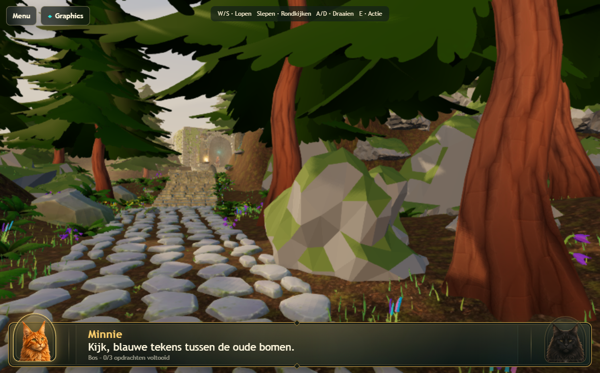
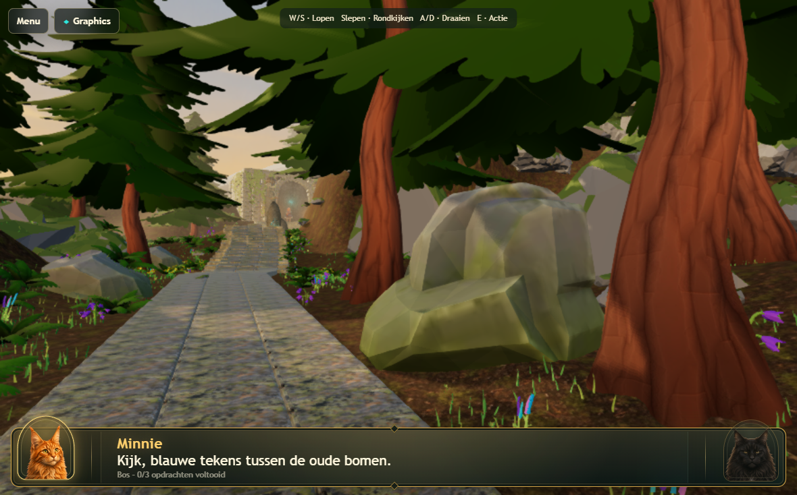
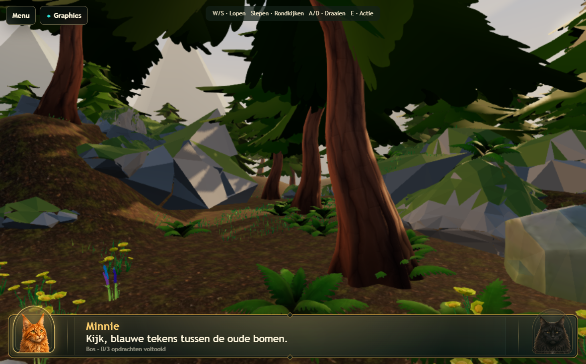
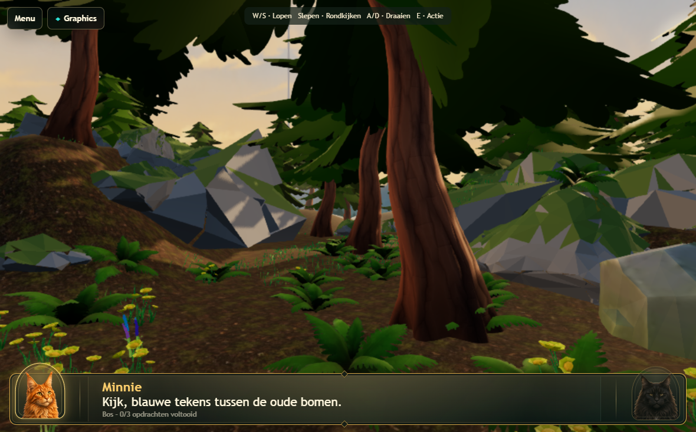
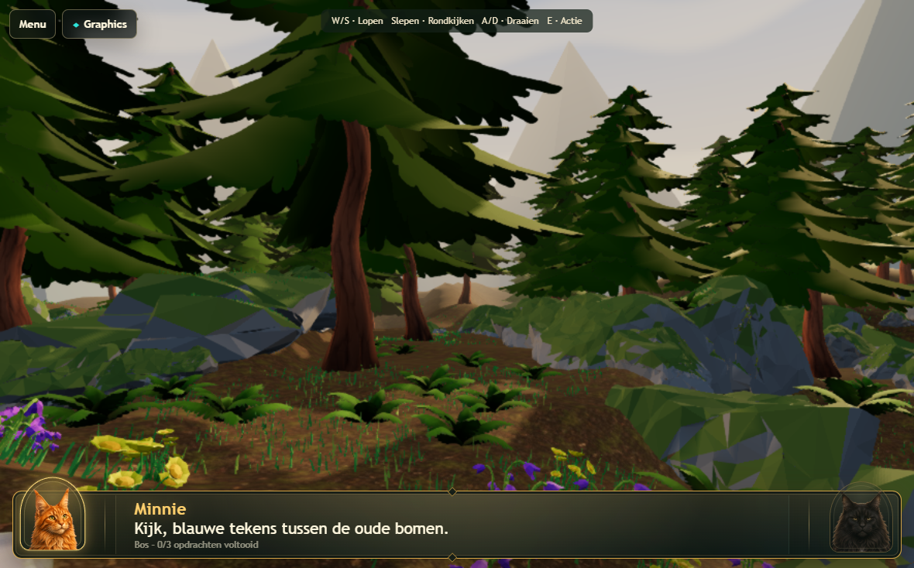
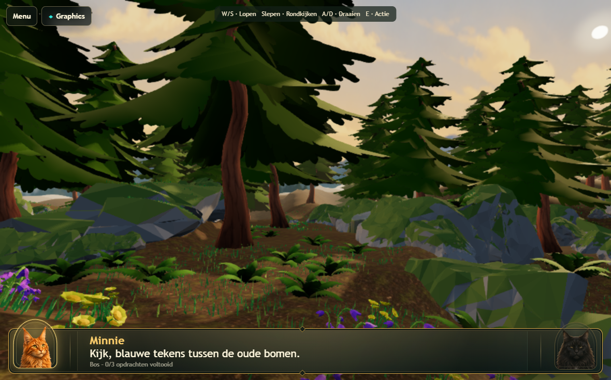
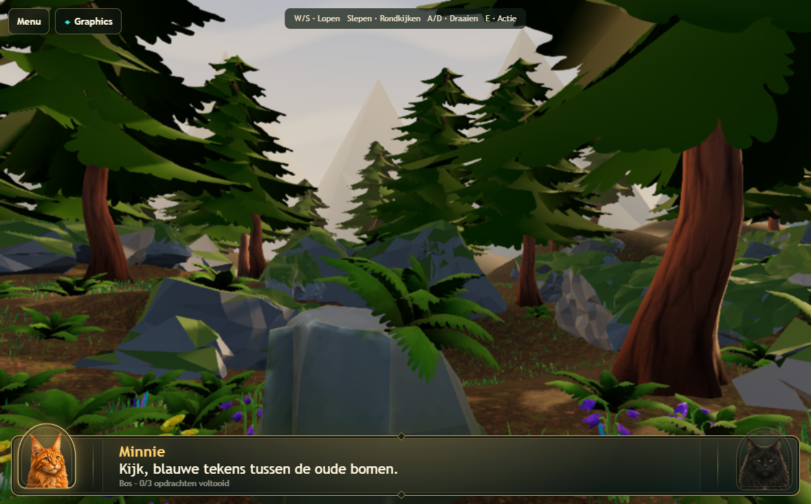
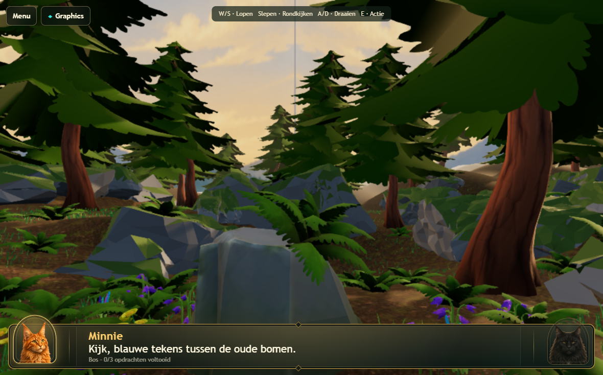
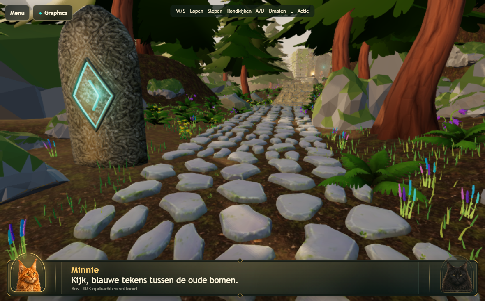
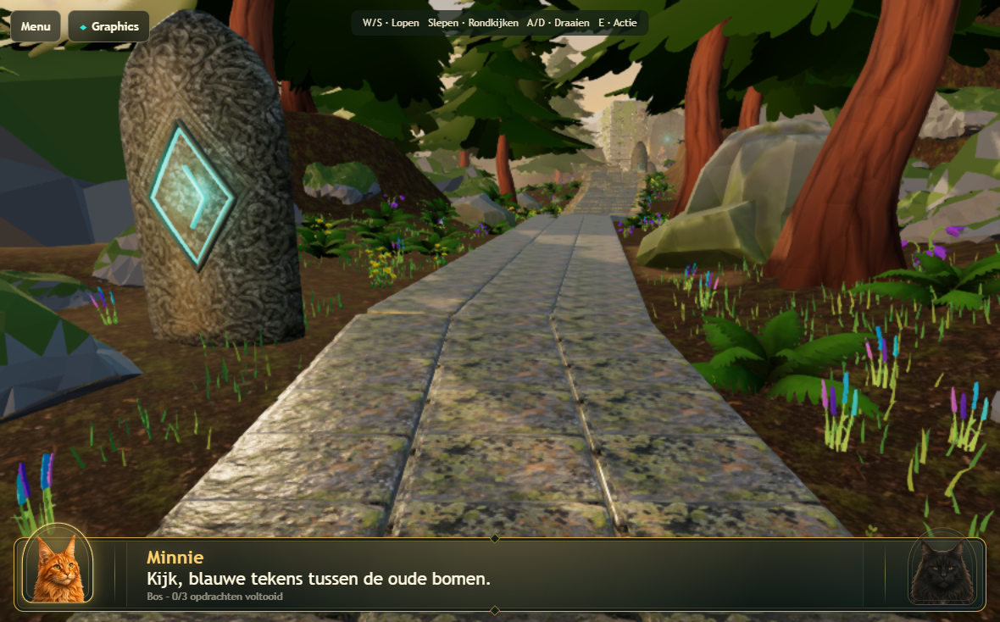

> Archived historical reference; not current instructions. Preserve the baseline and findings below as a record.
> Current contract: [canonical successor](../../renderer-current-spec.md).

# Atlas v172 — temple path, selective planting and illustrated panorama

This pass continues v171. Real 3D, route.json, challenge IDs, NPCs, temple stairs,
80 curated pines, 4,000 grass patches, the accepted floor material, renderer
presets and compact GPU scheduling are preserved. No commit or deployment.

## Eight requested changes

1. **Path:** evaluated the actual temple stair mesh: closed after welding inspection,
   188 triangles, one existing material. Reused that mesh and material for 288 path
   stones (three across, 1.02 m cross spacing, .60 m row spacing, 1 × .67 m tiles).
   Narrow joints and overlapping row footprints replace the stepping-stone gaps.
   54,144 placed triangles versus 37,838 before; one shared mesh replaces eighteen.
   The path-specific 512px palette is no longer needed. Twelve initially exposed slab
   bases were extended into slopes without raising their tops. All 288 base checks
   are below terrain; the gameplay route and temple stair transforms are unchanged.
2. **Second rune:** moved the entire assembly from Blender (12.8,35,3.387) to
   (11.4,42.5,1.46), placing its blue face toward the normal approach. Body and all
   three blue meshes translate together. Base contact range is approximately
   -0.199 to -0.018 m: seated, not hovering. Atlas authoring metadata moves the
   in-memory light/interaction target to runtime (11.4,3.66,-42.5), without editing
   shared route data or changing the challenge. The other anchors remain unchanged.
3. **Plants:** twelve shared ferns plus nine flower groups in three selective
   midground zones; three existing ferns enlarged by 30% where contact permits.
   Totals: 177 ferns, 99 flower groups (31/34/34), 80 pines, 4,000 grass patches.
   Independent audit: 4,356 objects, 464,195 root samples, zero floating roots.
   Most fern scales remain .17–.228; occasional larger specimens reach .273.
4. **Panorama:** removed `Atlas distant ridgeline`. One new static illustrated
   1024×342 PNG replaces the mathematical cloud/gradient background on the same
   dome. View-direction sampling avoids translation parallax; mirrored horizontal
   wrapping removes a hard image seam. Painted gold horizon, olive tree layers,
   soft blue hills and restrained clouds. Existing near/midground terrain remains.
5. **Evening:** retained the accepted warm sun/exposure and simple warm 22–155 m
   distance fog. Warmth now also comes from the illustration. The actual light
   still drives the sun disc; no second painted sun, new light or effect.
6. **Rocks:** `Opening fractured moss boulder` uses shared rock1 (640→342 triangles);
   `Atlas moss rock.294` uses rock2 (1,200→244); `.017` uses rock3 (1,200→244).
   All supplied rock1–4 candidates were inspected: zero open/nonmanifold edges
   after coincident-vertex welding. Existing four supplied rocks and other rocks
   are retained. All replacements share the previous 512px opaque palette.
7. **Graphics:** FPS/Debug buttons moved inside Graphics under Weergave-informatie.
   The outside Menu/Graphics navigation remains; optional `x FPS` badge stays small
   at top-right. Toggle behavior, reset behavior and retained renderer are preserved.
8. **Costs avoided:** no bloom, volumetrics, MSAA increase, new shadow light,
   higher shadow resolution, global density multiplier, new plant materials,
   Real changes or renderer redesign.

## Asset and resource costs

Panorama: `assets/textures/atlas-evening-panorama-v172.png`, 408,714 bytes.
Uncompressed RGBA8+mips estimate: 1024×342×4×4/3 = **1.78 MiB**. Loaded sequentially
and registered in the existing texture cleanup set; no additional render target
or draw. The removed path palette was approximately 1.33 MiB RGBA8+mips, so the
net estimated texture increase is about **0.45 MiB**, excluding driver overhead.
No HDR input/output change. The GLB retains Draco compression and shared meshes.

The panorama was generated with the built-in image generator (no library import).
Original source remains in Codex generated_images; the project uses its bounded
1024px copy. Prompt:

> Use case: stylized-concept. Create a production game background texture: a seamless horizontally wrapping 360 degree illustrated forest-valley panorama, very wide 3:1 aspect. Beautiful restrained hand-painted storybook Atlas fantasy forest style, broad clean readable forms, NOT photorealistic. Top 55 percent mostly softly painted muted slate-blue sky fading to pale warm golden apricot at horizon with sparse elegant cream cloud ribbons. Bottom 45 percent layers of distant rounded soft mountain forms, blue-green hills and overlapping pine forest silhouettes, with nearest distant tree layer deep desaturated olive green at bottom. No foreground objects, no path, no buildings, no characters, no text, no UI. Golden-hour early evening mood, warm horizon and subtle atmospheric depth, tasteful rather than dramatic. Avoid sharp gray polygon mountains. No visible sun disc (game renders its own directional sun). Left and right edges must meet seamlessly in color and silhouette for wrapping. Low detail at top and bottom, readable layered depth in center-bottom. Asset intended to be downsized to 1024px wide and sampled on a sky dome; broad painted shapes remain attractive at that resolution.

## Validation

The 32-test real-WebGPU acceptance run passed in 8.5 minutes, including both
tablet sizes, same-session re-entry, three warm-up views plus first playable
frame, 1770×1101 preparation, desktop/tablet pixel parity, FXAA on/off cleanup,
mode switching and Graphics controls. Additional gameplay/recovery and browser
checks are recorded below. Local Chromium does not prove physical
Safari stability. Physical iPad acceptance remains required after deployment.

## Remaining visual limits

The temple-style path is deliberately more regular than the former organic stones.
The low-resolution panorama is softened at large display sizes and remains partly
occluded by existing trees/hills; it is scenery, not explorable geometry. Some
existing faceted near/midground rocks remain intentionally untouched. No physical
iPad FPS or stability claim is made.

## Final QA and measurements

- 32/32 desktop-Chromium acceptance/art/mode-switch tests passed, 8.5 min.
- 6/6 gameplay/pressure tests passed, 5.8 min: all three challenges and gate,
  Desktop High, normal tablet switching, stalled frame, validation error and loss.
- 33/33 focused preset/texture/diagnostic/art assertions passed, 6.1 s.
- WebKit: 13/14 passed initially. Navigation completed its assertions but exceeded
  30 s during the final screenshot; a traced reproduction reached the same point.
  The saved v171 UI completed in 27.7 s; current UI then passed unchanged in 28.8 s.
  No timeout increase, test removal, production workaround or swallowed exception.
  This navigation test has little timing margin on this host; retain that caveat.
- Both final matched benchmark runs passed with zero page/GPU errors.
- Source syntax checks, diff whitespace check, independent plant-root audit and
  unchanged Real/route SHA-256 checks passed.

Matched Chromium runs, 1180×734 viewport, canonical 885×551 render buffer:

| Metric | Saved v171 | Final v172 |
| --- | ---: | ---: |
| Preparation | 24.03 s | 20.00 s |
| Stationary FPS | 59.99 | 60.00 |
| Stationary CPU submission | 9.06 ms | 7.70 ms |
| Stationary draws | 447 | 398 |
| Walking FPS | 60.00 | 60.00 |
| Walking CPU submission | 9.89 ms | 7.84 ms |
| Walking draws | 412.41 | 374.51 |
| Stationary visible triangles | 1,707,088 | 1,736,643 |
| GLB bytes | 18,775,880 | 18,699,628 |
| GLB materials / images / meshes | 27 / 23 / 234 | 26 / 22 / 214 |

These are local capped-frame-rate measurements, not GPU timer results or physical
Safari predictions. Preparation depends on cache/compiler state. Earlier local
CPU readings varied substantially, so the table uses the adjacent matched runs
with no simultaneous Blender work. The small texture increase and reduced draws
are favorable budget indicators, not physical iPad acceptance.

### Captures

| View | Before | Final |
| --- | --- | --- |
| 1 |  |  |
| 2 |  |  |
| 3 |  |  |
| 4 |  |  |
| Path |  |  |

[Full second-rune view](images/atlas-v172/second-rune-context.png) ·
[Blue face / interaction](images/atlas-v172/second-rune.png) ·
[Warm panoramic horizon](images/atlas-v172/panorama-4.png) ·
[Graphics panel controls](images/atlas-v172/graphics-controls.png).

Final Atlas SHA-256:
`f9ec00a3c576f8ab837fbaf7ef573835d2f5a163c586bb68ac2300e3e77c3cf1`.
Authoring scene saved to `Levels/LVL-0001/3d/lvl0001-stylized.blend`.
No commit or deployment. Physical Safari testing remains outstanding.
