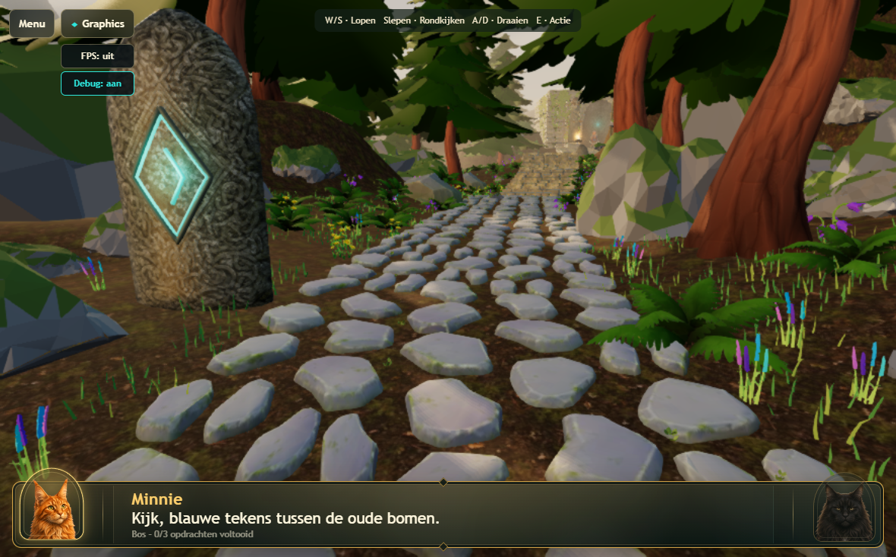
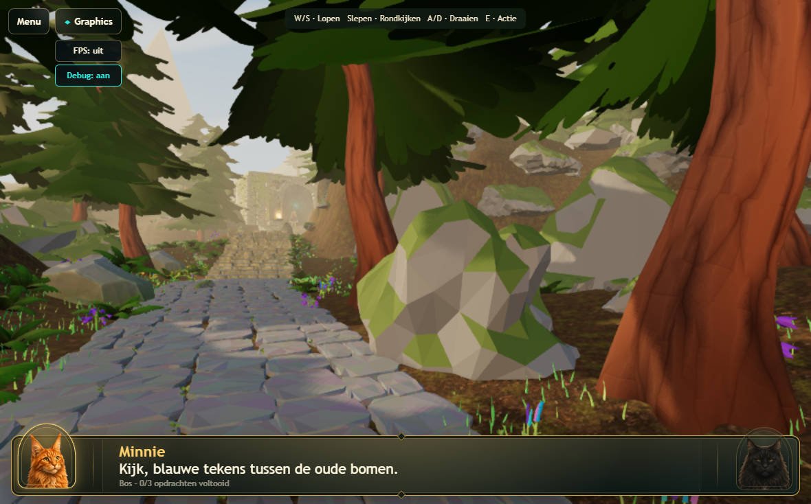
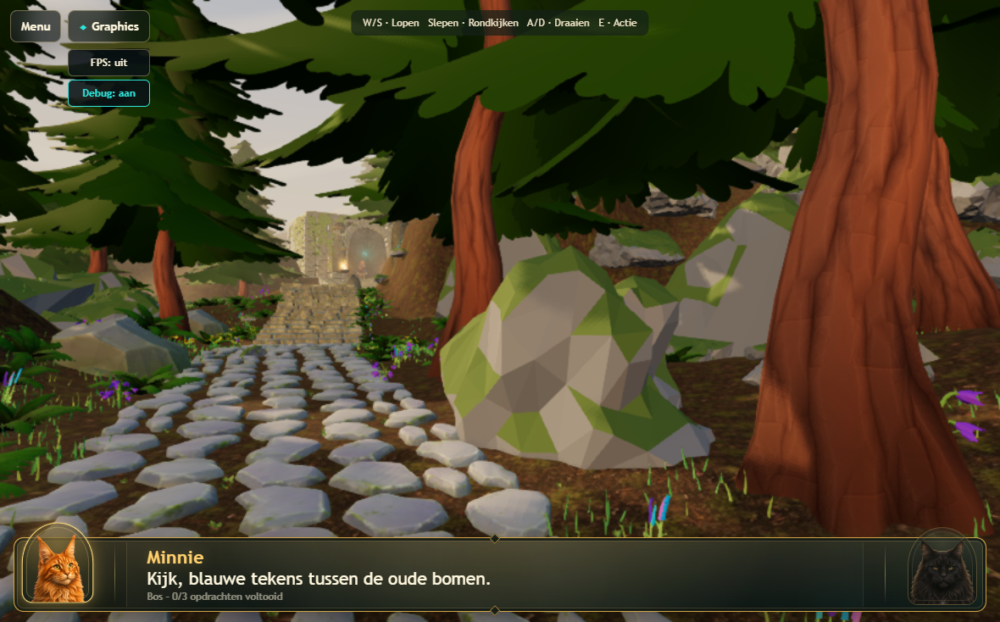
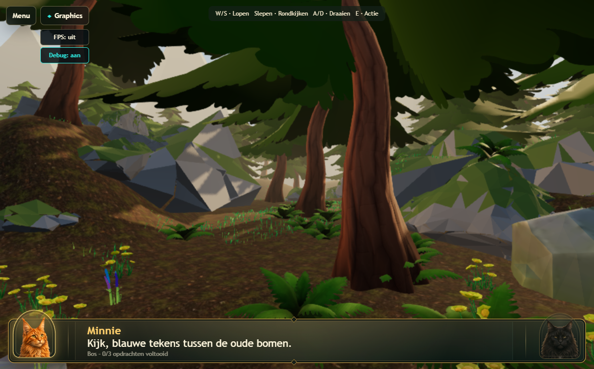
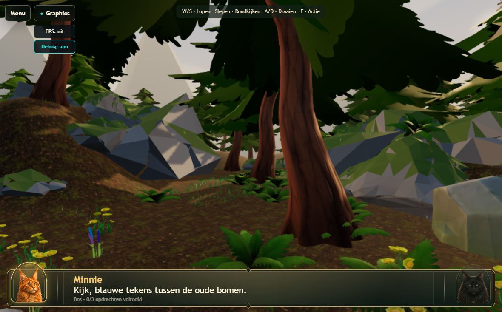
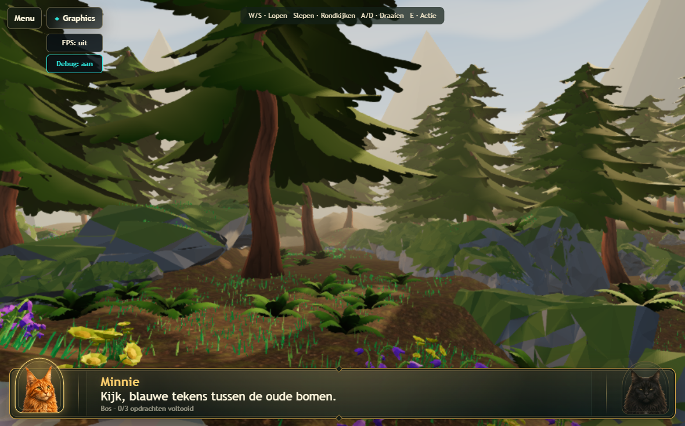
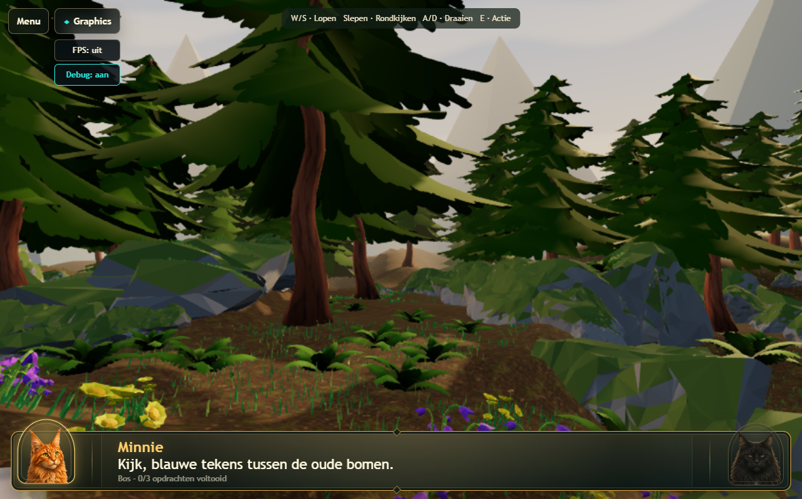
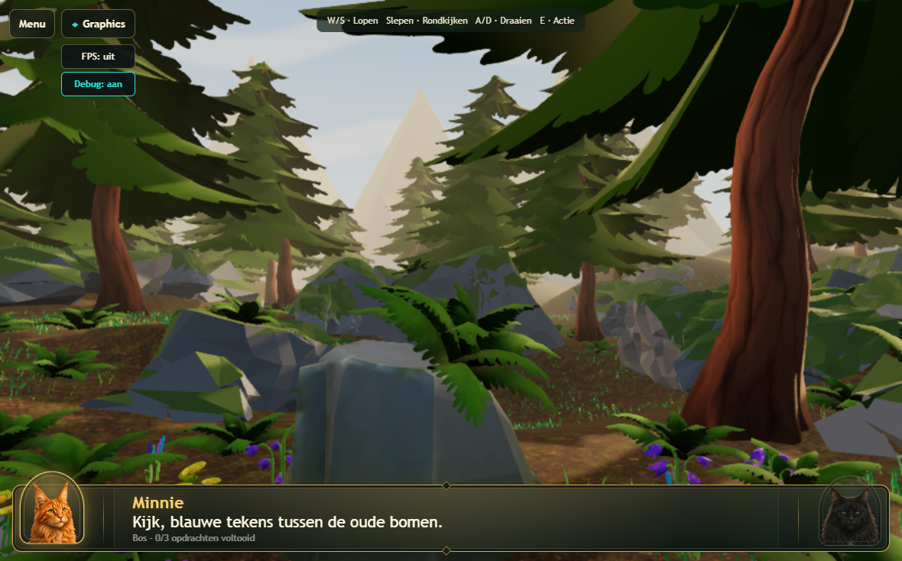
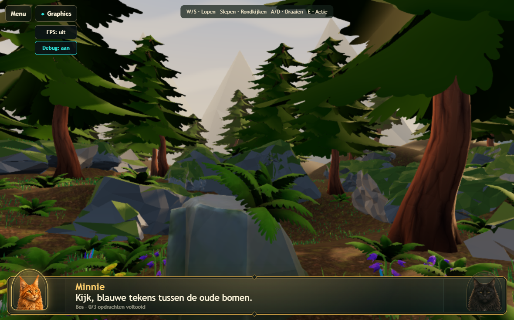

> Archived historical reference; not current instructions. Preserve the baseline and findings below as a record.
> Current contract: [canonical successor](../../renderer-current-spec.md).

# Atlas v171 — supplied path and restrained evening art

Continues the current Atlas world and preserves the v170 reset/FPS/debug controls.
No Real 3D, source-asset, route, challenge or progression changes. No deployment.

## Path choice

All four GLBs were inspected in Blender, including rendered oblique views.
All have one opaque material and one 1024² source colour texture, with no extra
normal/roughness maps. The imported source metallic factor is 0.4; runtime Atlas
stone is correctly non-metallic with roughness 0.94.

| Source | Triangles per full set | Footprint, m | Assessment |
| --- | ---: | --- | --- |
| rockpath1 | 783 | 1.02 × 0.97 | Lowest total cost, but square, regular brick-like shapes |
| rockpath2 | 3,500 | 2.11 × 2.13 | Attractive rounded stones, more geometry than needed |
| **rockpath3** | **2,254** | **1.46 × 2.09** | **18 rounded variants; best natural shape/cost compromise** |
| rockpath4 | 2,256 | 2.05 × 1.99 | Efficient broad set, but rectilinear masonry rather than woodland paving |

The entire old path (251 broad flagstones plus 51 infill stones) is replaced.
Rather than repeating large tile sets, the 18 connected stones from rockpath3
are separated into shared meshes and placed individually within the existing
path footprint. Their scale/orientation varies, and their bases contact terrain.
Temple stairs and the gameplay route are preserved.

Total placed path geometry is **37,838 triangles versus 48,320** (21.7% less).
One shared opaque **512²** palette adds approximately **1.33 MiB** of RGBA8 GPU
storage including mips; no normal/displacement/material variants. The existing
32-metre instance grouping policy also applies to the new repeated path stones.
No batching-system redesign. The exported GLB is **18,775,880 bytes** (previous
18,834,472). Original supplied files are untouched.

## Vegetation and rocks

- Grass retains two distinct greens. Linear RGB changes approximately
  `(0.070,0.440,0.080)` → `(0.073,0.260,0.056)` and
  `(0.270,0.550,0.070)` → `(0.209,0.324,0.049)`; less neon, still distinct from ferns.
- 80 distant grass patches, nine ferns and six flower groups are reallocated
  into restrained clusters near four route-side zones. One proposed fern move
  was skipped because it could not meet grounding constraints.
- Total counts remain **80 pines, 165 ferns, 4,000 grass patches and 90 flowers**.
  No global density increase or unique mesh/material per plant.
- Eight near-route pines use different rotations, preserving trunk XY positions,
  scale, source geometry and foliage materials. Ground contact was rechecked.
- Only `Atlas moss rock.294` and `.017` were rotated (about 26°) and regrounded.
  These large background rocks had no nearby foliage requiring disruptive moves.
  Other rocks, including the four previously supplied boulders, are retained.
- Independent Blender audit: **4,335 plants, 462,800 root samples, zero failures**.
  Path base contact and all protected gameplay transforms also checked.

## Evening / sky / haze

Sun remains the same direction `[-38,24,-52]`, slightly warmer `#ffd095`, intensity
6.6 (was 7), exposure 1.09 (was 1.12). Hemisphere/bounce, shadow resolution,
FXAA, sample counts and render DPR remain unchanged.

The existing inexpensive skydome now blends a golden muted horizon into a cooler
dusk blue upper sky, with static soft cloud ribbons. The existing sun disc still
derives from the actual directional light. No new sky texture, draw or target.

Atlas replaces its exponential scene fog with ordinary distance fog: warm
`#d6bea0`, near **22 m**, far **155 m**. Foreground is clear; mid/far scenery
gradually warms. This is the renderer's existing simple fog path, not volumetrics.
Real 3D retains its original exponential fog.

Bloom, volumetrics, extra shadow-casting lights, heavier textures, more trees and
a wholesale rock overhaul were deliberately avoided. Existing distant mountain
silhouettes remain angular; this is not a backdrop-geometry redesign.

## Measurements and visual review

Matched sequential local real-Chromium runs:

| Metric | Before | Final |
| --- | ---: | ---: |
| Preparation | 21.66 s | 19.78 s |
| Stationary FPS | 57.22 | 57.10 |
| Walking FPS | 57.26 | 57.34 |
| Stationary draws | 482 | 447 |
| Stationary triangles | 1,708,518 | 1,707,088 |
| Stationary CPU | 3.52 ms | 3.59 ms |
| Walking CPU | 3.88 ms | 3.77 ms |

No meaningful measured FPS regression. Timing differences are single-run
measurements, not a guarantee of a speedup. Reallocation/grouping can expose a
few more triangles while turning. All capture runs completed without recorded
device loss or GPU/page errors. Physical iPad performance remains unverified
for this build; the local suite is not physical Safari.

[Raw measurements](atlas-path-evening-measurements.json)

| View | Before | Final |
| --- | --- | --- |
| 1 |  |  |
| 2 |  |  |
| 3 |  |  |
| 4 |  |  |

Candidate renders: [1](images/atlas-v171/path1.png), [2](images/atlas-v171/path2.png),
[3](images/atlas-v171/path3.png), [4](images/atlas-v171/path4.png).

## Validation

- **29/29 passed (7.7 min)**: focused path budget/grounding/anchor checks,
  existing foliage and floor tests, FXAA on/off, Graphics modes, desktop/tablet
  image parity, cancellation/device recovery, 1770×1101 preparation, and the
  real-WebGPU tablet acceptance gate at both 1180×734 and 1180×689 (DPR 2).
  Each tablet case completes three warm-up views, the first playable frame,
  motion, sustained rendering, Illustrated/Cinematic and same-session re-entry.
- **3/3 capture/benchmark runs passed**: baseline, initial art candidate and
  final existing-instance-group integration. Final figures are reported above.
- **6/6 passed (5.2 min)**: Desktop High and tablet transitions through Cinematic,
  forced GPU stall/validation/device-loss recovery, plus the Atlas route with
  all three challenges and gate unlock. Injected faults validate recovery only.
- **29/29 passed (3.4 s)**: preset, texture-budget and diagnostic regressions.
- **14/14 passed (1.4 min)**: WebKit navigation, native touch, Illustrated
  challenge forms, cleanup and the existing FPS/debug controls. WebKit does
  not substitute for the physical Safari GPU check.
- Blender root audit, source/Real/route hash checks and JavaScript syntax passed.

No physical Safari success is claimed. Tests use Chromium WebGPU on this host.
