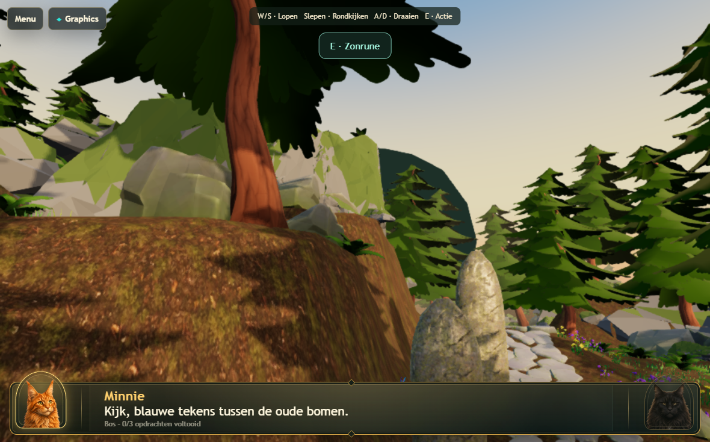
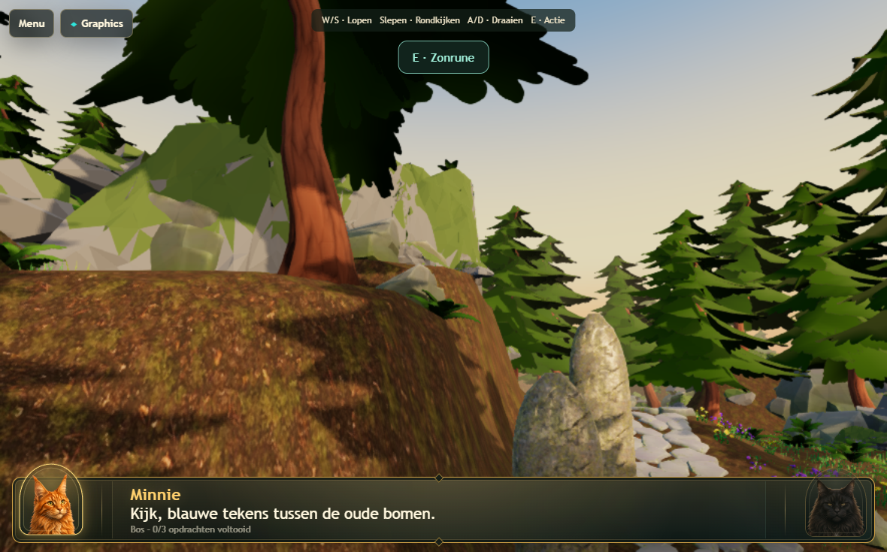
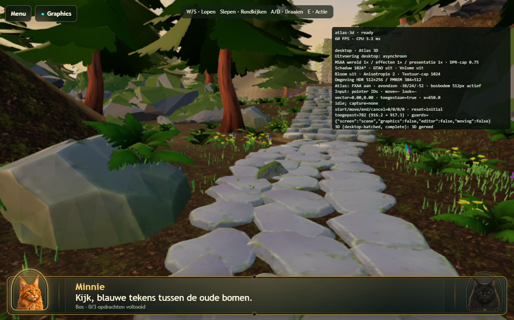
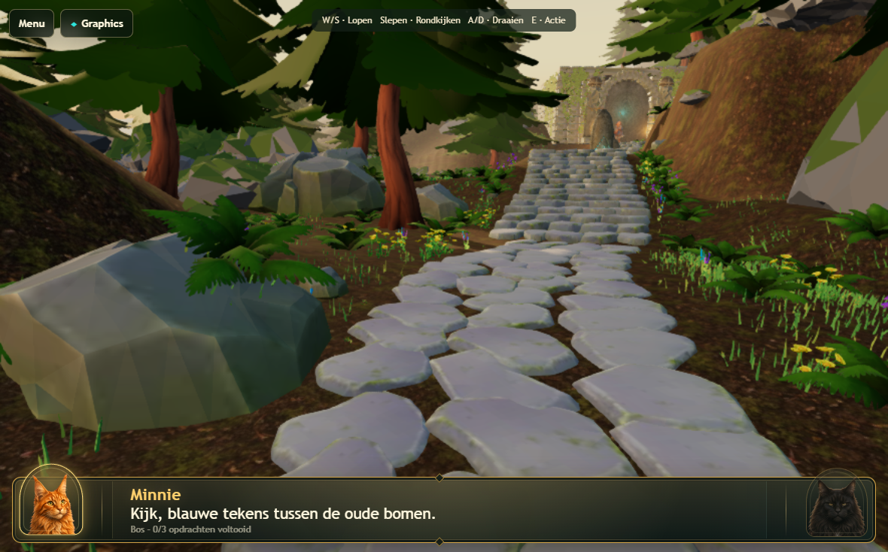

> Archived historical reference; not current instructions. Preserve the baseline and findings below as a record.
> Current contract: [canonical successor](../../renderer-current-spec.md).

# Atlas v174 — premium forest-floor polish

Continues the existing v173 scene and preserves gameplay, route data, tree style,
the supplied path stones, established good rocks and canonical iPad settings.
The pre-pass files are preserved locally in `output/premium-backup`.

## Visual changes

1. **Clean paving.** Placement clearance uses the actual stone surface and full
   plant vertices/edge samples, rather than plant pivots or an approximate route
   width. Conflicting plants move to nearby banks. The small legacy stone that
   protruded through the paving also moves off the route and uses supplied geometry.
   A final authoring check finds no plant or replacement-rock footprint hits.
2. **Round background artifact.** The 180 m sky sphere was fixed at the origin.
   From the temple, its back surface reached 231.6 m in camera depth, beyond the
   220 m far plane. The missing sky exposed the clear background as a round dark
   shape. The sphere now follows the camera, without increasing far distance.
   A real-camera ray regression fails with the original placement and passes with
   the correction; screenshots confirm the hole disappears.
3. **Selective rock replacement.** 49 rejected painted rocks/border boulders use
   the existing four supplied meshes and shared opaque palette: 22 `rock2`, 12
   `rock3`, 7 `rock1`, and 8 `rock4`. `rock2`/`rock3` cost 244 triangles each;
   the broader `rock1`/`rock4` silhouettes cost 342. Replacement triangles total
   13,426 versus 46,476 previously. The four established supplied hero rocks,
   earlier good replacements, gameplay runes and tall retaining cliffs remain.
   Exact object names and source choices are in
   `Levels/LVL-0001/3d/atlas-premium-ledger.json`.
4. **Seamless sky.** An altitude-only gradient runs from peach/red through orange
   and gold into evening blue. There is no panorama sampling or longitude seam.
   The old image remains on disk as historical material but is not requested.
5. **Evening sun.** Angular radius increases from 0.65 to 1.8 degrees, with warm
   golden color replacing the overbright near-white disc. The broad, faint halo
   is part of the sky material, not bloom. Its direction matches the light.
6. **Organic edges.** 104 outer stones move outward by roughly 3.5–11 cm with
   restrained rotation. Interior stones and stair courses stay compact. The
   independent 2,849-sample path audit records 98.53% direct stone coverage;
   uncovered samples find stone within 15 cm. These are sampled measurements,
   not a mathematical maximum for every possible joint.
7. **Local contact shading.** A baked 1024² mask covers the playable floor.
   Small soft ellipses darken fern bases by at most 13%, and tree/rock/stone
   contacts by at most 23%. Overlaps take the strongest value, preventing stacked
   black halos. One texture sample modulates the existing ground material; no
   additional geometry, draw, AO pass or render target. RGBA8 storage with mips
   is approximately 5.33 MiB, replacing the former panorama's approximately
   1.78 MiB: about 3.55 MiB net sampled-texture storage added.
8. **Reference interpretation.** Reference 1 informed readable vegetation islands
   and restrained flower accents. Reference 2 informed clear route/bank separation
   and broad light/dark ground patterns. Reference 3 informed fern/grass groups
   around tree and rock bases. Reference 4 informed olive floor color blending
   around planted clusters. 180 existing distant grass instances are regrouped
   around established ferns, with modest scale variation; broad olive vertex-color
   patches tie them into the existing floor. No global density increase: counts
   stay at 4,000 grass, 177 ferns, 99 flowers and 80 curated pines.
9. **Performance restraint.** No bloom, volumetric fog, raymarching, realtime SSAO,
   new lights, shadow changes or additional fullscreen effects. Dense blanket
   vegetation and per-object shadow decals were avoided. Tall cliff silhouettes
   remain to preserve the level enclosure; this is not a terrain redesign.

## Geometry and preservation

All 4,356 curated plants pass the independent root-contact audit, totaling
464,195 root samples. Maximum gap is -0.00797 m (embedded); the deepest pine root
is within the existing 0.25 m limit. Existing non-pine burial limits are retained.
Slope-fitting corrections and five temple-footprint corrections are recorded in
the ledger. All 164 protected tree/gameplay/stair anchor transforms are preserved.
Real 3D and route hashes remain unchanged.

The authored delta is in `scripts/atlas-premium-pass.py`, followed by
`scripts/atlas-premium-grounding.py`; `scripts/atlas-premium-export.py` exports the
verified active Atlas scene. Independent existing root and path audit scripts
remain unweakened. Blender MCP was used for review/corrections; export used
background Blender because the MCP context lacked the export operator's active
object context.

## Validation

The original sky regression deliberately fails at 231.6 m against the unchanged
220 m camera far limit (`output/premium-sky-regression-before`). This reintroduces
the actual fixed-origin placement, not an arbitrary injected exception.

| Fixed-origin sky: clipped | Camera-centered sky: complete |
| --- | --- |
|  |  |

[Warm sun and sky](images/atlas-v174/evening-sun.png).

Physical iPad Safari remains untested; Chromium's real-WebGPU tablet configuration
does not establish physical Safari performance or resolve an unrelated reported
physical-device failure.

Final release gate: **53/53 passed** in 13.6 minutes, strictly sequential
(`output/premium-final-release`). This includes both 1180×734 and 1180×689 / DPR 2
real-WebGPU tablet cases, the 512×299 warm-up aspect, repeated entry, sustained
rendering, all Desktop High/tablet pressure scenarios, cleanup, canonical presets,
and the separate 1770×1101 preparation case. No timeouts or quality requirements
were weakened. The fixed sky's maximum sampled camera depth is 179.79 m.

All four supplied rock meshes pass the welded-edge manifold audit; the retained
UV seam vertices are not holes. See `atlas-premium-rock-audit.json` in the level's
3d directory.

Final Atlas GLB: 17,994,068 bytes, SHA-256
`fdc84875d124864ddb30793c9d706156e8199fce331fce4a5201d0bfa1eb0d2a`.
Real 3D remains `57a2e0589df616d2d91a2d40e93169bd5ffea4d5281d06414c6e3096c2d8a086`;
route data remains `68aa2d8255a4dfce166c3a99b0e47d6350e9e14149ee6970a889b0638d92d319`.

## Matched host performance

Same local Chromium canonical Atlas configuration, 1180×734 viewport / 885×551
render buffer, sequential before/final runs. No page or GPU errors in either run.

| Measure | Before v173 | Final v174 |
| --- | ---: | ---: |
| Stationary FPS | 60.00 | 60.00 |
| Walking FPS | 59.99 | 60.00 |
| Stationary CPU submission | 3.65 ms | 3.54 ms |
| Walking CPU submission | 3.89 ms | 3.82 ms |
| Walking + looking CPU submission | 2.36 ms | 2.42 ms |
| Stationary draws | 412 | 420 |
| Walking draws | 385.56 | 391.53 |
| Stationary visible triangles | 1,655,425 | 1,560,958 |
| Preparation | 17.95 s | 19.17 s |

The pass trades a small draw/upload/preparation increase for the contact mask and
new placement groups. Capped FPS remains stable; CPU differences are small and
host-load dependent. These are not isolated GPU timings or physical iPad results.
Raw measurements: [atlas-premium-measurements.json](atlas-premium-measurements.json).

| Paving before | Cleaned paving and banks |
| --- | --- |
|  |  |

[Forest-floor grouping and contacts](images/atlas-v174/forest-floor.png).

## WebKit coverage

**15/15 passed** in the WebKit-compatible follow-up: navigation with/without
Pointer Lock, mode guards, saved-mode behavior, mocked device cleanup, canonical
quality, shared replacement meshes and the 1024px contact-map cap
(`output/premium-webkit-final`). The final matched benchmark also passed.

An earlier broad WebKit selection found the expected stale v173 asset hash
(updated to the verified final export) plus three incompatible legacy test
assumptions: two try to modify an absent native `navigator.gpu`, and one tries to
enter desktop-only Real 3D on an iPad profile. Those tests were not weakened or
used as GPU acceptance evidence; the product's Real 3D tablet guard remains intact.
Native GPU acceptance is the separate 53-test Chromium run above.

The matching WebKit-compatible adapter/recovery suite also passed **4/4**:
adapter diagnostics without Pointer Lock, requestAdapter/requestDevice failures,
and cancellation followed by a new startup (`output/premium-webkit-recovery`).
Total final WebKit follow-up: **19 passed**. Source/diff checks passed. No commit
or deployment was performed.
