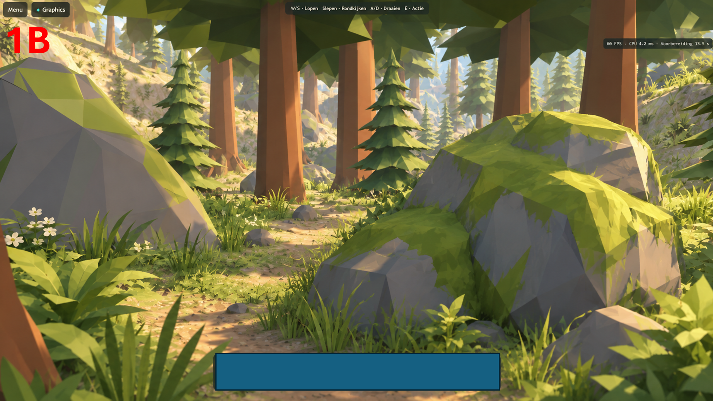
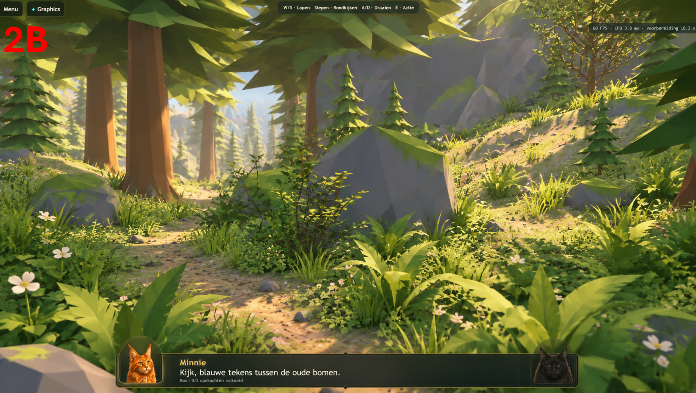
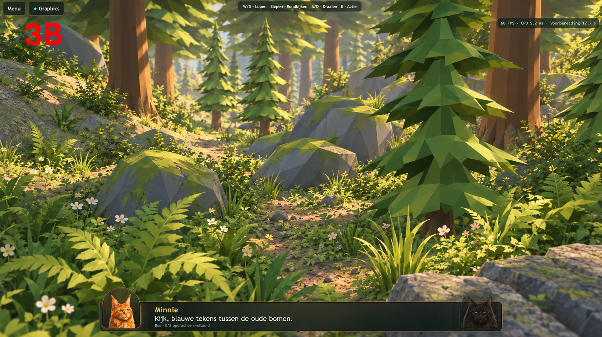
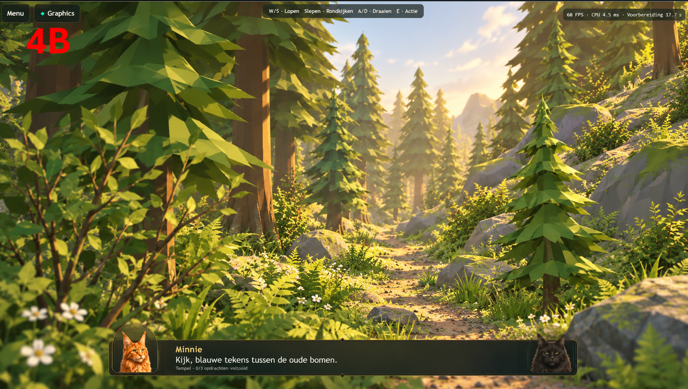

# Atlas 3D art pass — local v162

This is an Atlas-only authoring and art-lighting pass. It is not deployed or committed. Real 3D, its source checkpoint, route data, renderer quality presets and input/progression code are unchanged.

## Direction and visual assessment

Only references 1B–4B were used as targets: warm light, planted foreground foliage, open ground between groups, readable mossy rocks, a few pale/pink flowers and distant layered conifers. The four runtime views below are actual Chromium/WebGPU captures, with the same canonical Atlas quality used on tablet. They are not generated or retouched images.

The pass makes the glades more intentional, the floor darker and calmer, and the background warmer. It does **not** yet reproduce the references' soft foliage shading, fine silhouettes or rich indirect light. The current canopy still reads as coarse repeated tiers; some foliage remains visually busy at canonical resolution. These remain visual shortcomings, not a physical-iPad acceptance claim.

## Assets and composition

1. **Ferns:** replaced the old stretched/simplified family with two shared custom feather-fern meshes. Each has six arched fronds with paired folded leaflets, 444 triangles, upright physical scale and broader blades for first-person readability. Existing fern placements reuse the two meshes; 24 larger foreground clumps provide framing. The original problem involved source silhouette and inherited scaling, not input or renderer architecture.
2. **Floor:** sculpted 1,502 terrain vertices outside the protected route corridor to open four scenic glades. Replaced the pale photographic floor combination with one packed, tileable 256×256 painted soil/moss texture and constant roughness 0.94. No floor normal/roughness textures are needed. Original source images remain untouched.
3. **Flowers:** three shared custom low-poly blossom variants in ivory, muted pink and berry tones. Added 55 small patch groups and 32 foreground accent groups to the existing 93 placements. They sit around planted edges rather than covering the clear centres.
4. **Rocks:** preserved the 640-triangle focal boulder and made surrounding masses useful frames. Repositioned obstructing nature masses at glade edges and planted boulder bases into terrain. The rocks keep the shared faceted stone/moss palette and silhouette rather than imported photogrammetry.
5. **Shrubs/small trees:** rebuilt broadleaf rosettes and rounded bilberry shrubs as shared assets. Replaced 84 noisy hazel saplings with three shared opaque shrub meshes. Retained 175 mature and 73 young firs; selected trees and rocks were reframed around clear sightlines. Nearby mature crowns were opened without scaling their trunks down.
6. **Grounding:** corrected 1,806 initially recorded plant/rock offsets, then re-grounded plants after terrain and framing edits. Removed 20 detached root clusters and one floating soil-plate community; 175 shared, planted root collars replace them. The final near-route audit checked 5,201 plant roots against terrain and rock terraces: **zero roots more than 10 cm above their support**. This checks root contact, not every leaf tip or every far-background asset.
7. **Backdrop:** added 100 very simple distant fir silhouettes using two shared meshes and a 324-triangle, twelve-peak ridge mass. Lowered peak heights during visual review. These backdrop elements do not cast foreground shadows.
8. **Light:** warmer Atlas sun and bounce, lifted ambient fill, gentler shadow darkness and stronger warm distance fog. No additional render targets or volumetric pass. Static light ribbons were tested and rejected because they read as visible sheets; none are present in the final export.

No Poly Pizza or Poly Haven assets were imported. Reusing the existing palette and making small custom shared geometry avoided material/style mismatch and additional library texture cost.

## Four target areas

| Area | Art changes | Remaining gap to B |
| --- | --- | --- |
| 1 — opening boulder/path | Clear paving, exposed focal rock face, ferns/flowers at the edges, warm distant closure. | More angular and less softly lit than 1B; the path remains the gameplay paving. |
| 2 — side glade | Lowered enclosing bank, moved blocking masses to the sides, opened soil centre, shrub and flower framing. | Ground is simpler and the canopy is still coarse. |
| 3 — upper forest clearing | Open centre between rocks, broadleaf/fern foreground, fir layering and pale flower accents. | Less intimate and less richly shaded than 3B. |
| 4 — upper valley view | Opened lateral sightline, distant conifers/ridge, planted edge masses, stronger warm depth. | Background remains more schematic than the panoramic 4B target. |

A final composition check removed 412 tiny grass/groundcover dots from the deliberately clear centres and reframed 16 mature trees without moving crowns into the other views. Tree counts, flower patches and fern groups were retained.

These are scenic openings viewed from the existing route, not new walkable routes. The camera/route and gameplay target coordinates are unchanged. A direct comparison with commit `8cc48c0` verified all **709 protected exported rune/gate/temple transforms** unchanged.

## Comparisons

Captures use 1840×1034 CSS pixels and canonical 0.75 render scale. The larger viewport is only for comparison framing; it does not enable a desktop quality uplift. The small HUD is real runtime telemetry; capture-time FPS is not a sustained physical-device measurement.

| B target | New actual runtime |
| --- | --- |
|  |  |
|  |  |
|  |  |
|  |  |

## Cost and validation

The Atlas GLB is **19,372,116 bytes**, down from 24,403,720 bytes in v161 (20.6% smaller). Source geometry is still shared and instanced. Instance-weighted exported triangles decreased from 2,141,933 to 2,065,279 (3.6%). Final runtime inventory from the capture run: 738 mesh batches, 264 geometries, 16 materials and 18 textures; v161 had 807, 292, 16 and 20 respectively. No new post-processing resources are introduced. The exported floor image was verified as 256×256 RGB with no normal or roughness texture. Capture preparation took 26.5 seconds locally; this is not a controlled before/after load benchmark or an iPad prediction.

WebKit navigation/input/recovery: **72 passed** (landscape and portrait). Final exported art checks: **4 passed**, including shared fern/shrub geometry, retained trees, protected route/Real hashes and the simplified floor material. Full sequential Chromium/WebGPU regression: **64 passed (22.7 minutes)**. This includes both real tablet acceptance sizes (1180x734 and 1180x689), same-session re-entry, 1770x1101 preparation coverage, mode switching, device-loss/pressure recovery, Desktop High and gameplay/navigation. After the final nature-placement adjustment, the focused **19-test GPU/asset rerun passed (7.5 minutes)**, including both tablet acceptance sizes and same-session re-entry. The separate **Atlas-only full progression test passed again on the final export (60 seconds)**, including walking, looking, three challenges and gate exit. Both sustained short rendering benchmarks passed again on the final export with no page or GPU errors. JavaScript/Python syntax checks and `git diff --check` passed. No test timeout or GPU assertion was weakened.

### Short rendering measurements

Measured sequentially on the same local Chromium/WebGPU machine at 1180×734, drawing buffer 885×551. Each phase ran for 6.5 seconds; compact used the tablet device classification and one in-flight GPU frame. These are short regression measurements, not a long-duration stress test or iPad FPS estimates.

| Execution | Preparation | Stationary | Walking | Looking | Walking + looking | Mean CPU range |
| --- | ---: | ---: | ---: | ---: | ---: | ---: |
| Desktop | 26.1 s | 57.0 FPS | 57.1 FPS | 57.2 FPS | 56.9 FPS | 2.2–4.4 ms |
| Compact tablet strategy on PC | 31.5 s | 57.1 FPS | 56.7 FPS | 56.8 FPS | 57.0 FPS | 2.2–4.7 ms |

[Machine-readable measurements](atlas-art-measurements.json). This supports broadly acceptable local performance; it does not establish a controlled performance improvement over v161. The art pass retains all canonical sample counts, DPR, texture limits and compact resource lifetimes.

Physical Safari acceptance remains required after an explicitly authorized deployment. This pass makes no claim of physical iPad success.

## Authoring/reproduction

Blender MCP edited `Levels/LVL-0001/3d/lvl0001-stylized.blend` directly. The `.blend` and its pre-art backup are locally ignored, as before; the GLB is the versioned deliverable. Starting from `lvl0001-stylized-before-art-v162.blend`, the applied scripts are:

1. `beautify-atlas-world.py`
2. `compose-atlas-art-glades.py`
3. `finish-atlas-art-framing.py`
4. `dress-atlas-art-views.py`
5. `harmonize-atlas-art-palette.py`
6. `shape-atlas-backdrop.py`
7. `finalize-atlas-art.py`
8. `paint-atlas-floor.py`
9. `clarify-atlas-panorama.py`

Scripts have Atlas checkpoint/application guards. Export using the existing Atlas-only GLB export settings; never rerun the original Real-to-Atlas conversion against this finished checkpoint. Detailed placement and grounding records are in `Levels/LVL-0001/3d/atlas-art-ledger.json`.
