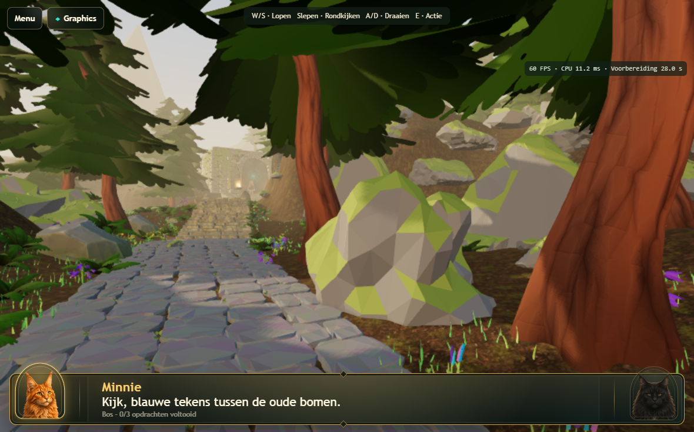
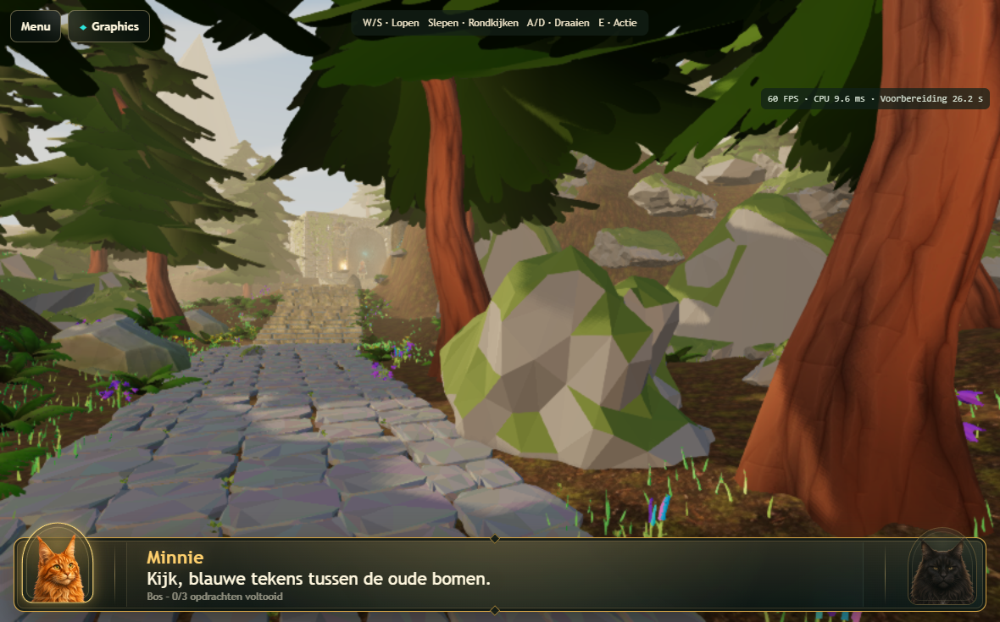
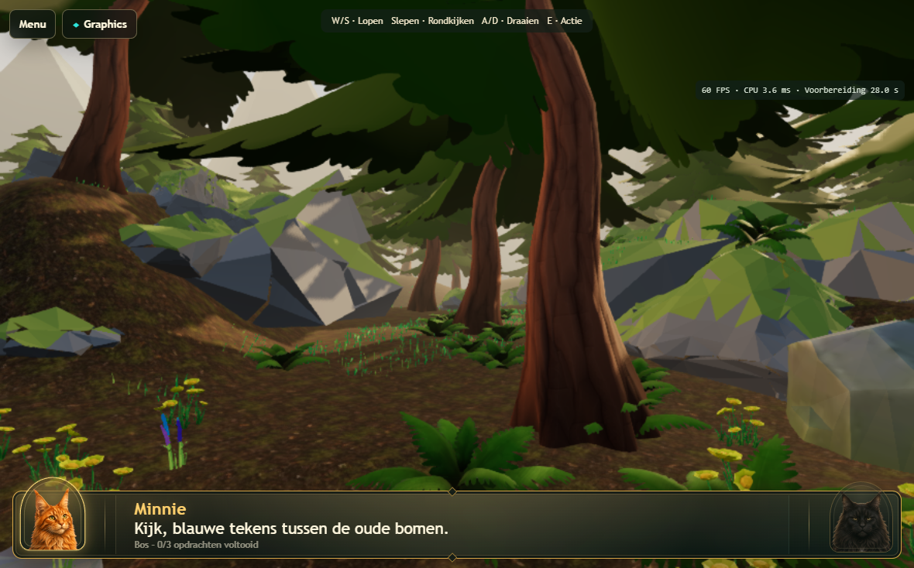
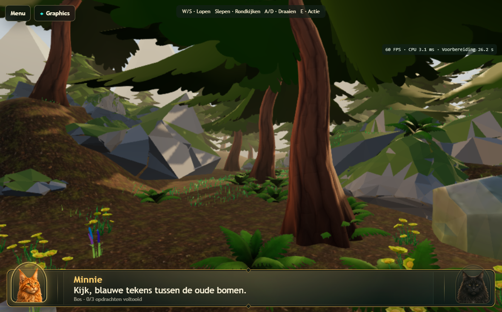
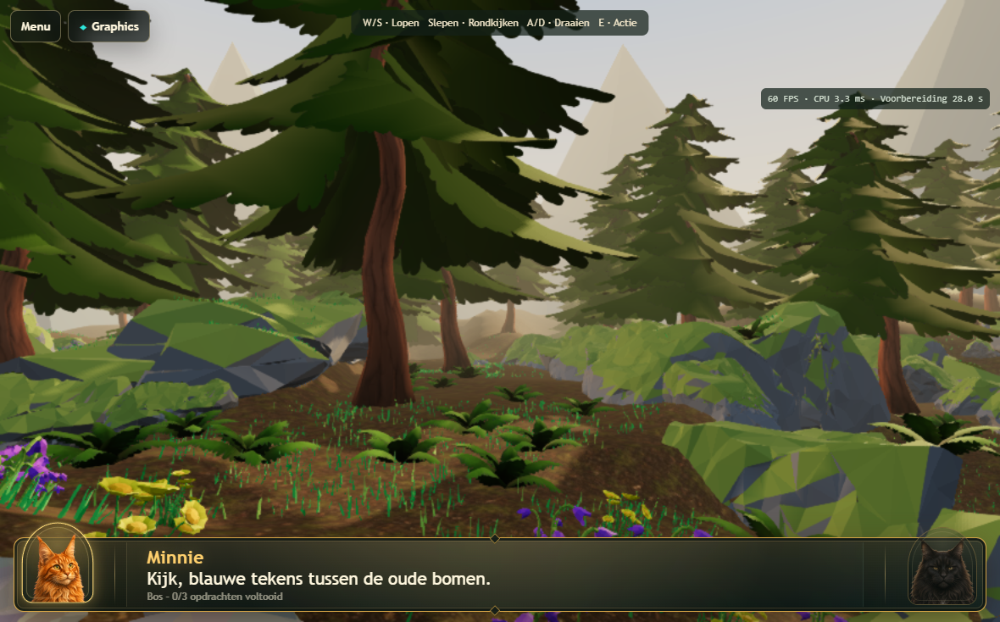
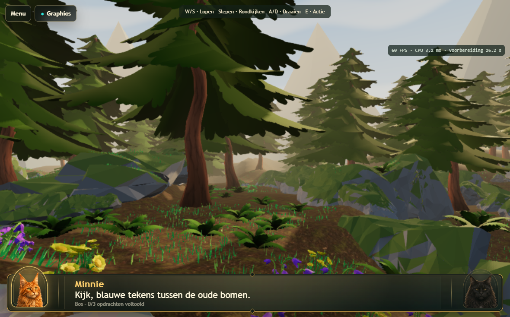
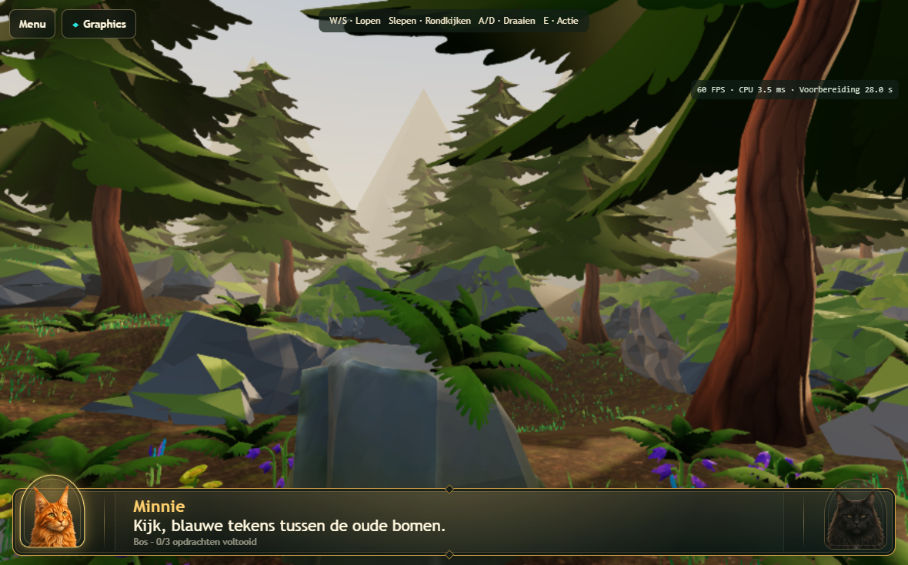
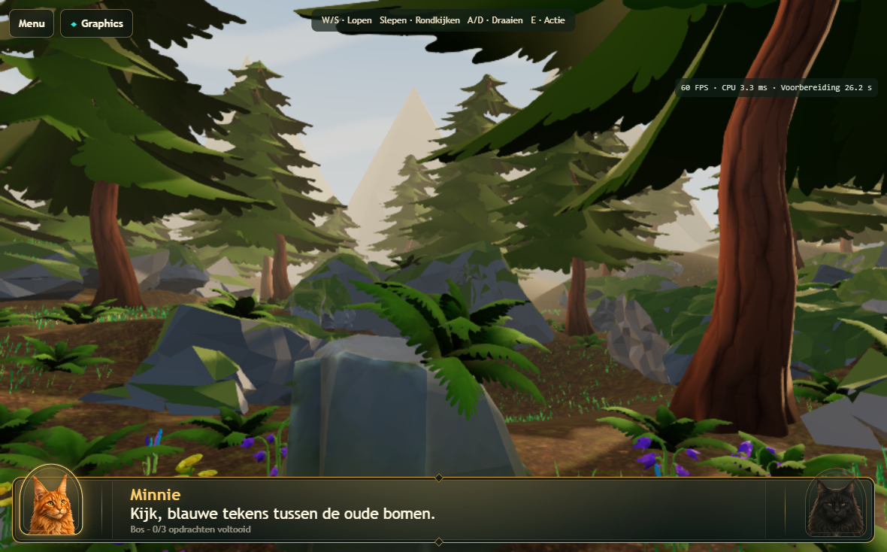
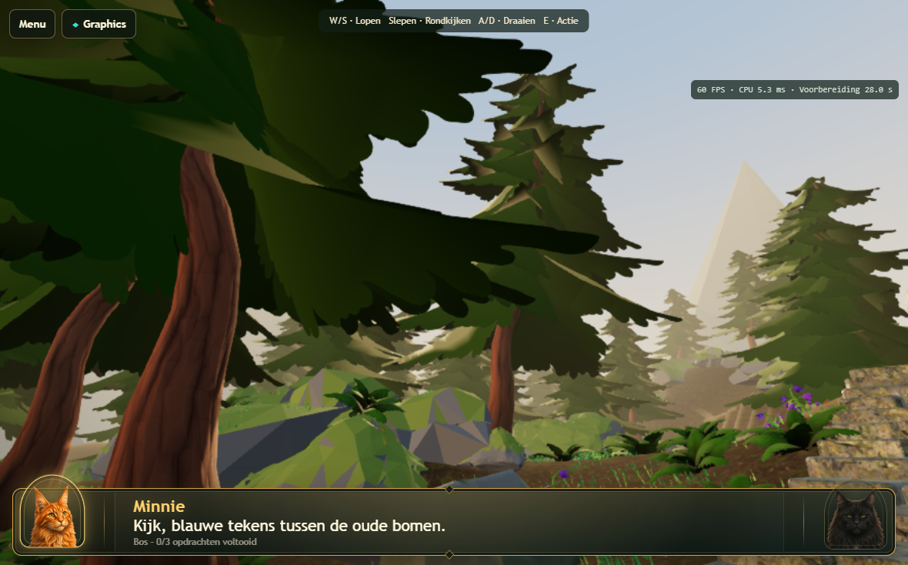
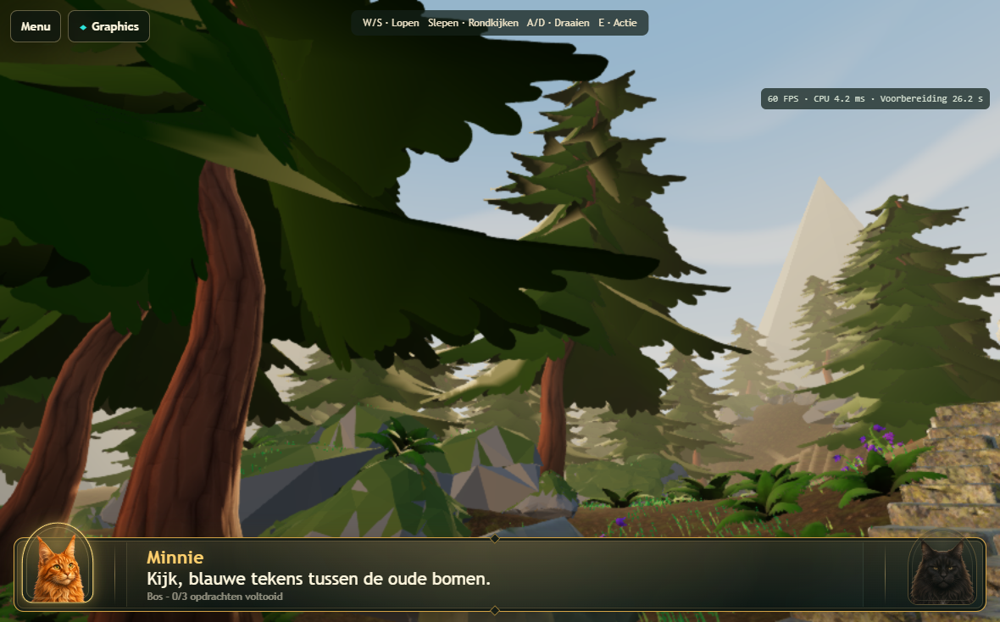

# Atlas v169 — moss and sky cohesion

Focused on the user's approved Pine1/Fern palette. Real 3D, gameplay, ground,
lighting, FXAA, renderer presets and all foliage placements remain unchanged.

## Art changes

- Moss painted into 11 shared rock/cliff meshes is darker forest olive:
  linear RGB approximately `(0.159, 0.235, 0.045)` → `(0.070, 0.120, 0.028)`.
  6,048 moss corners changed. Grey rock corners and the four supplied rock
  palettes remain unchanged. This reduces the bright yellow-green competition
  with the approved fern and pine colours.
- The existing Atlas sky dome now has a cooler blue upper sky, a muted warm
  horizon and broad soft cloud ribbons. The existing sun disc remains tied to
  the directional light. No baked second sun, new textures, objects, render
  targets or lighting effects. Three sine evaluations add modest sky shading
  arithmetic; the environment-lighting input is unchanged.
- Authoring scene saved and Atlas GLB exported; cache version is v169.

## Integrity and measurements

`node scripts/audit-atlas-cohesion.cjs` compares with the v168 backup. All 6,360
nodes (including transforms/extras), 26 materials, 22 embedded images and accessor
descriptors are unchanged. All 4,335 curated foliage instances reference byte-identical
compressed mesh data, including their colour attributes. Therefore their grounding
and the previous gameplay-clearance audit remain applicable. Real/route hashes
are recorded in [integrity results](atlas-cohesion-integrity.json).

Matched sequential real-Chromium runs: preparation **28.04 → 26.24 seconds**;
all four motion phases **~60 FPS** before and after. Stationary draws **482 → 482**;
stationary triangles **1,708,518 → 1,708,518**. CPU measurements were slightly lower
in the new run, but this is not evidence of an optimization: host timing varies.
Both runs completed with no captured GPU/page errors. Full data:
[measurements](atlas-cohesion-measurements.json).

## Runtime comparisons

| View | Before | After |
| --- | --- | --- |
| 1 |  |  |
| 2 |  |  |
| 3 |  |  |
| 4 |  |  |
| Sky |  |  |

The moss reads more coherently with the foliage and the sky has more depth. The
existing distant mountain silhouettes remain angular and somewhat artificial;
this pass does not replace the world backdrop geometry. Grass remains brighter
than the ferns. A full illustrated panorama would be a further art change.

Physical iPad acceptance is outstanding. No commit or deployment.

## Validation

- 27/27 passed (9.1 min): Atlas evening/FXAA/foliage tests, Graphics modes,
  real-WebGPU world switching, compact preparation at 1770x1101, and the tablet
  acceptance suite (1180x734 and 1180x689, DPR 2, two entries each).
  Includes all warm-up views, first playable frame, movement/look, sustained
  rendering, Illustrated/Cinematic recovery and desktop/tablet image parity.
- 29/29 passed (6.6 s): preset, texture-budget and GPU diagnostic regressions.
- 13/13 passed (1.5 min): WebKit navigation, native touch IDs, Illustrated
  challenge submission, cancelled startup and cleanup/error recovery. The
  separate warm-up test is covered by the real-WebGPU gate rather than WebKit
  emulation. This is not a physical Safari GPU validation.
- 2/2 passed: matched before/after real-WebGPU screenshot/performance runs.
- Export integrity audit, JavaScript syntax and `git diff --check` passed.

Changed in this pass: `src/three-renderer.js`, Atlas authoring `.blend` and runtime
`atlas-3d.glb`, `service-worker.js`, `tests/graphics-modes.spec.js`, the benchmark's
v168 comparison route, `scripts/atlas-cohesion-palette.py`,
`scripts/audit-atlas-cohesion.cjs`, the cohesion ledger, this report/measurements/
integrity evidence/screenshots, and the current renderer specification.
