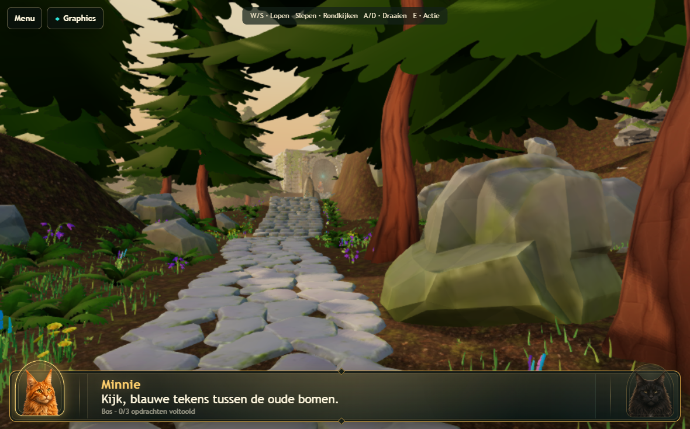
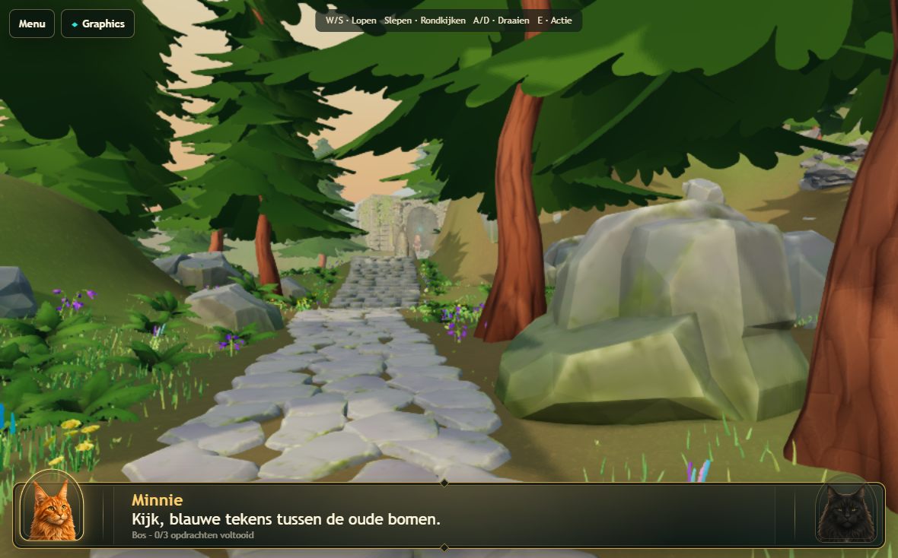
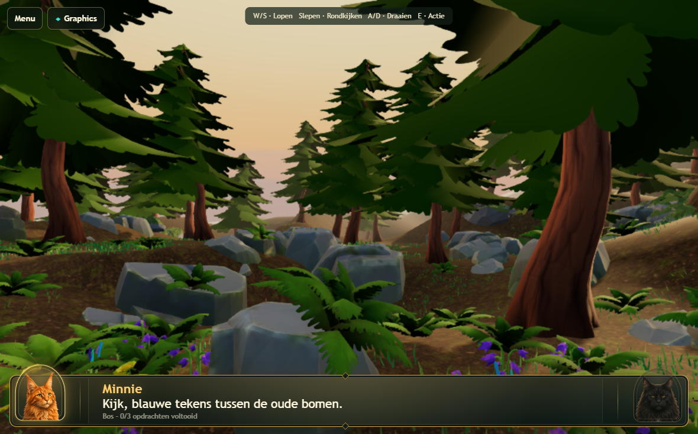
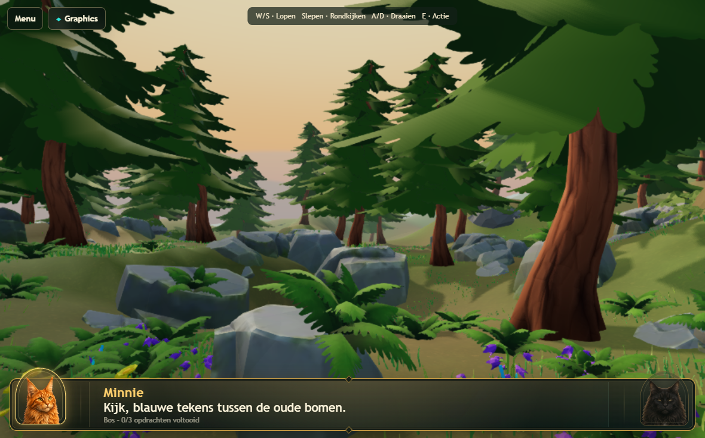

# Atlas v176 — whole-frame forest cohesion

Continues the v175 scene without changing the gameplay route, terrain geometry,
tree poses, rune assemblies, temple anchors, or stone path. The pre-pass Blender
file, GLB, lighting policy, renderer and contact mask are saved locally in
`output/v176-backup`.

## Reference interpretation

Reference 1 uses broad lit grass masses, cool shade, warm trunks and quieter rocks
to bind the whole frame together. Reference 2 makes the route a readable opening
between mixed fern/grass groups, with successive tree layers carrying depth.
Both depend on controlled large color regions and light/shadow rhythm before
small decorative detail. Their literal vegetation density was not copied.

The largest Atlas gaps were the dominant noisy brown floor, nearly black leaf
undersides, weak separation of cool shade from evening light, and vegetation
that read as scattered items. The existing tree shapes already provided usable
foreground framing; changing the light and the floor made that framing clearer.

## Changes

- **Ground as a connecting material:** both terrain meshes now carry broad olive,
  moss, earth and cool shade regions in their existing vertex-color layer. An
  earthen margin remains beneath the paving. The existing soil map is blended at
  48% against a quieter mineral base, preserving texture detail without allowing
  brown speckles to dominate the entire view.
- **Actual color-channel correction:** runtime inspection found `COLOR_0` was a
  white export placeholder while authored terrain colors were in `COLOR_1`.
  The contact material now explicitly reads `color_1`. Merely reconnecting the
  Blender graph or sampling the default color channel did not fix the runtime
  result. The first pale-floor draft was rejected; captured runtime attributes
  established the cause. The Blender graph now also expresses texture multiplied
  by the authored color layer.
- **Lighting hierarchy:** the warm key moves from `[-38,24,-52]` to `[-38,28,24]`,
  lighting more of the forward-facing trees and temple and casting lateral
  shadows across the ground. Key intensity changes from 6.6 to 5.1 and its color
  from `#ffd095` to `#ffe0b0`. Cooler hemisphere/ground fill and a cool bounce
  preserve shaded forms. Hemisphere intensity is 2.7, bounce 1.0, exposure 1.02,
  and shadow intensity 0.68. Shadow resolution and update policy are unchanged.
- **Readable foliage shade:** a small constant cool material fill on fern/pine
  leaves lifts the darkest undersides. This is an inexpensive emissive material
  term, not a new light, glow pass or bloom. It is deliberately subtle and does
  not simulate full leaf translucency.
- **Shared palette:** rocks receive a slight cool balance, path brightness is
  reduced to 84% of its prior material factor, and purple bellflowers are muted.
  Warm bark, cooler rock/shade, green banks and restrained flower accents now
  occupy more distinct roles within the same frame.
- **Vegetation rhythm:** 240 distant grass instances and 18 distant ferns are
  reused across 12 existing route-side banks. Grass receives an 18% uniform scale
  increase where regrouped and is re-seated against the actual surface. No
  flowers were relocated: there were no suitable distant donors meeting the
  placement criterion, so established flower groups were retained. All 4,356
  curated plants remain: 4,000 grass, 177 ferns, 99 flowers and 80 pines.
- **Depth:** the existing distance fog receives a cooler, quieter tint while
  retaining its 22–155 m range. The two existing procedural hill layers shift
  toward muted blue-green. The seamless warm evening gradient, upper blue and
  camera-following sky remain. The visible sun follows the new key direction.
- **Contact:** the same 1024² contact mask is rebaked for regrouped plants. Its
  local radius, capped strength and maximum-overlap behavior remain unchanged.

The authoring delta is in `scripts/atlas-cohesion-v176.py` and
`scripts/atlas-cohesion-groups-v176.py`. Exact placements and protected matrices
are recorded in [the ledger](../Levels/LVL-0001/3d/atlas-cohesion-v176-ledger.json).

## Iteration and visual review

Four runtime review stages were used: initial material/light balance, default
color-channel check, verified second-channel color plus plant groups, and final
texture/fill refinement. Captures cover opening, middle forest, temple approaches,
both rune faces, forward/return path views, and full sky rotation. The rejected
pale-floor drafts are retained in `output/v176-pass1` and `output/v176-pass2`;
the final benchmark captures are in `output/v176-final-benchmark`.

Before:

After:

Before:

After:

## Performance and validation

The saved previous scene and final scene were benchmarked sequentially at
1180×734 CSS, reported DPR 2, and the unchanged 885×551 world render resolution.
Both ran at approximately 57 FPS on this host during these runs. Page and GPU
errors were zero. These are host frame intervals and CPU submission times, not
physical iPad GPU execution timings.

| Phase | Before CPU ms | After CPU ms | Before world draws | After world draws |
|---|---:|---:|---:|---:|
| Stationary | 2.89 | 2.88 | 407.0 | 405.0 |
| Walking | 3.54 | 3.36 | 379.3 | 377.3 |
| Turning | 1.55 | 1.62 | 173.2 | 171.4 |
| Walking and looking | 1.80 | 1.91 | 175.8 | 174.3 |

Visible triangles increase about 1.3–3.8% in these phases because distant plants
were moved into readable groups. The new light direction also includes more
casters in shadow refreshes (roughly 231 draws versus 177); this is a measured
cost of the composition change, not a shadow-quality upgrade. Frame rate stayed
level in the matched run, but this must still be checked on physical hardware.

Both versions retain 6,436 total runtime instances, 222 geometries, 30 materials,
24 textures and 9 lights. Texture-budget measurements are identical. Instanced
batches decrease from 462 to 459. The GLB is 17,753,224 bytes, 32,328 bytes larger
from changed vertex-color/placement data. No geometry, textures, lights, render
targets, post-processing passes, or global vegetation count were added.

Independent Blender audits pass for 4,356 plants and 464,195 root samples, with
zero failures. Paving coverage remains 98.526% across 2,849 samples. Full plant
footprints remain clear of paving and rune envelopes. All protected trees and
gameplay anchors retain their matrices; Real 3D and route hashes are unchanged.

See [the measurements](atlas-cohesion-v176-measurements.json) for configuration,
inventories, phase results, errors and the final asset hash.

The final sequential Chromium release suite passed all 58 tests in 15.9 minutes:
scene and full-direction visual checks, desktop/tablet parity, world switching,
cleanup, Desktop High and tablet GPU pressure, presets, separate 1770×1101
preparation, and real-GPU acceptance at 1180×734 and 1180×689/DPR 2. Both tablet
cases completed repeated entries with four real preparation frames per entry.
No GPU work was skipped, no timeouts extended, and no quality presets weakened
to pass. The new light-direction expectations were updated to the authored
position; all effect/resource guardrails were retained.

Release log: `output/v176-release.log`. All 18 applicable WebKit navigation,
mode persistence, startup-recovery and cleanup checks also passed in 1.2 minutes
with no skips (`output/v176-webkit.log`). WebKit fixtures verify navigation and
recovery; they do not establish physical Safari WebGPU performance.

## Remaining visual ceiling

This is a more unified illustrated forest, not a claim of matching the references
or reaching AAA production quality. Broad, flat canopy tiers still reveal the
source tree construction. Coarse, steep terrain forms and some large rock shapes
remain conspicuous. Grass is intentionally sparse between selected groups, and
the existing 1024 shadow map cannot reproduce the references' fine light pattern.
The warm sky also provides less cool blue separation than the daylight references.

No bloom, volumetric fog, realtime SSAO, raymarching, dense blanket grass, or extra
fullscreen effect was introduced. Physical iPad Safari performance and appearance
remain unverified; Chromium tablet acceptance is not a substitute for that test.
