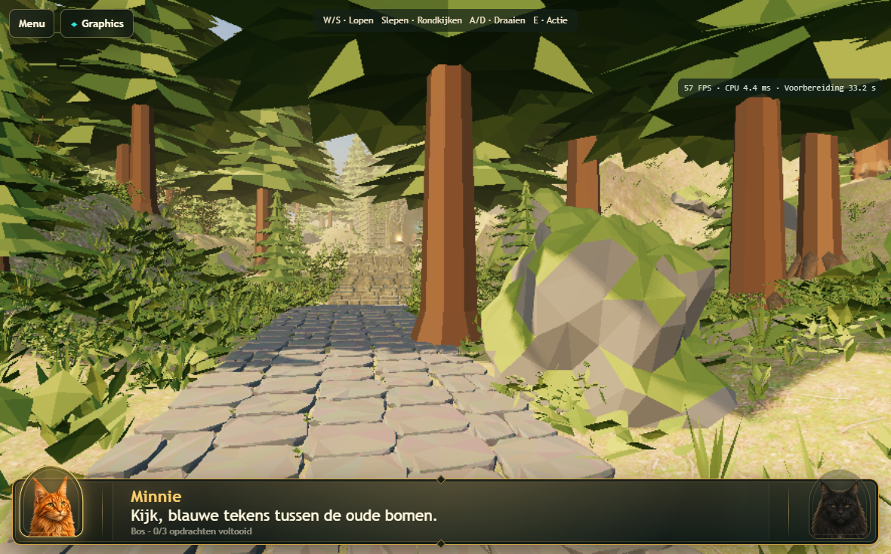
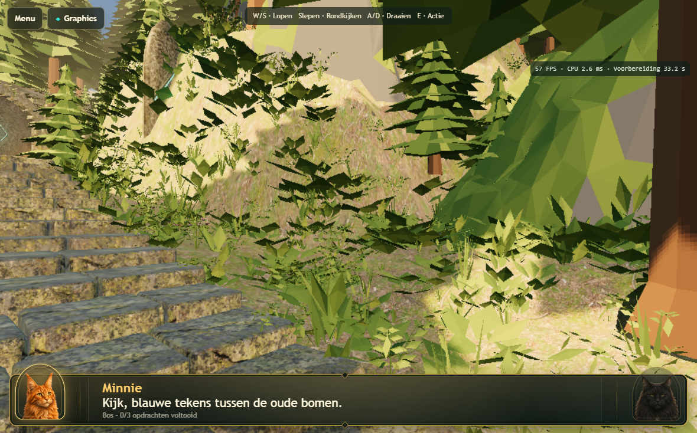
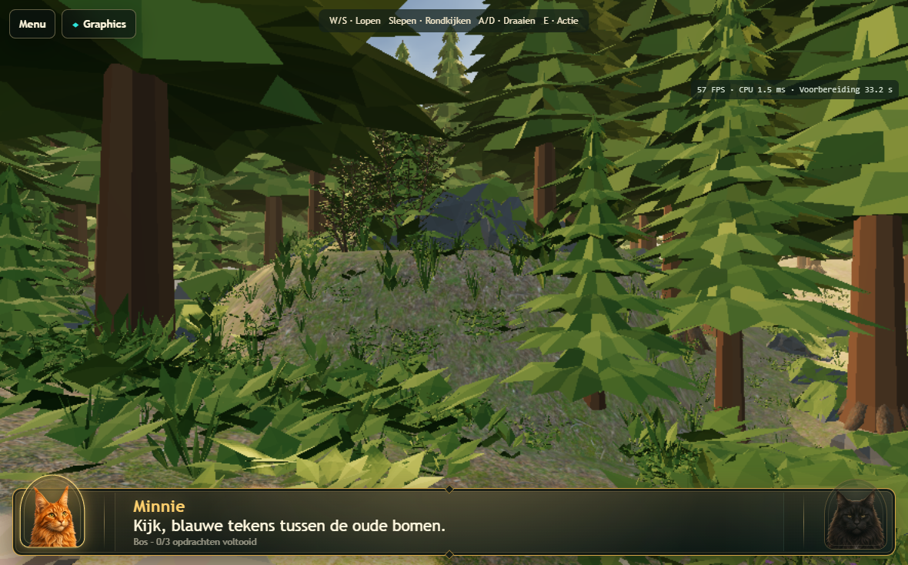
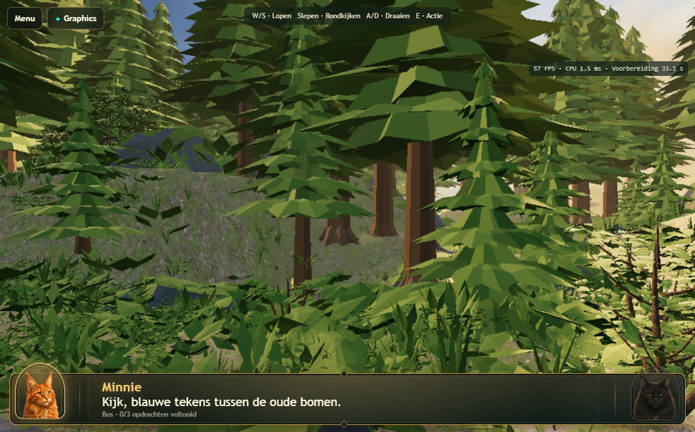

# Atlas 3D v161 — composition and submission cost

Local work only, 2026-09-11. No commit or deployment. Real 3D is unchanged.
The canonical Atlas settings remain identical on desktop and tablet; tablet
one-frame-in-flight execution and sequential preparation remain enabled.
Physical Safari 30 FPS is **not** established by these measurements.

## Renderer / runtime measurements

Real Chromium/WebGPU on the same local PC, 1180×734 viewport, Atlas buffer
885×551. Four 6.5-second phases start at route coordinate 322 with yaw −0.08:
stationary, W walking, turning, W plus turning. Turning follows the same timed
yaw sweep. Each run includes real loading, all warm-up work and GPU error checks.
Profiling is opt-in; it adds CPU overhead. These are submission/CPU wall times,
not hardware GPU timestamps. Browser/driver cache and system load vary by run.

| Measurement | Before (f8f16a3) | Final v161 |
| --- | ---: | ---: |
| Non-shadow draws, stationary | 1,238 | 651 |
| InstancedMesh groups, resident | 1,601 | 799 |
| Geometry/material pairs | 433 | 292 |
| Visible submitted triangles, stationary | 2,175,678 | 1,890,967 |
| Native pipeline transitions, stationary | 1,238 | 651 |
| Shadow-casting mesh groups, resident | 1,007 | 570 |
| Preparation, this capture | 58.84 s | 33.62 s |
| Active materials / material textures | 16 / 20 | 16 / 20 |
| Shader modules created during preparation | 2,635 | 1,396 |
| Native render pipelines created during preparation | 2,619 | 1,380 |
| Completed preparation GPU fences | 126 | 76 |

The earlier reported 1,314 draws / 2.28M triangles used the starting pose at
coordinate 175. The table uses matched coordinate 322; do not mix these poses.

| Phase | FPS before → after | CPU ms before → after | Non-shadow draws before → after | Shadow draws averaged over **all** frames before → after |
| --- | --- | --- | --- | --- |
| Stationary | 57.85 → 60.00 | 13.06 → 12.16 | 1,238 → 651 | 0 → 0 |
| Walking | 60.00 → 59.54 | 13.20 → 13.87 | 1,096 → 600 | 61.82 → 16.39 |
| Turning | 59.84 → 60.00 | 6.29 → 7.10 | 558 → 305 | 0 → 0 |
| Walking + looking | 56.32 → 58.62 | 9.45 → 8.34 | 602 → 313 | 65.71 → 16.69 |

Walking shadow refreshes: **6.60 → 3.21 per second**. Approximately 562 → 304
caster draws per refresh (all-frame shadow average divided by refresh fraction).
Walking + looking pipeline transitions: **668 → 329**. Stationary traversal +
culling: 0.354 → 0.341 ms; walking: 0.331 → 0.339 ms. The full phase metrics are
in [the measurement JSON](atlas-composition-measurements.json).

The draw and shadow reductions are clear. This initial run did **not** demonstrate
a general walking CPU improvement. A final matched confirmation below does show
lower CPU cost; both records are retained instead of selecting only favorable
numbers. Neither run reproduces the user's 30 FPS desktop walking drop on this
PC. Do not describe this as a measured doubling of desktop or physical-iPad FPS.
Preparation timing includes cache variation; fewer resident groups/pipelines is
the concrete reduction, not a guaranteed number of seconds on Safari.

### Final matched confirmation and tablet execution

After the clean regression pass, the original asset plus original renderer at
`f8f16a3` were served through test-only request interception, followed sequentially
by the final asset/renderer. Both use the same route phases, profile hooks and
canonical quality. No source rollback or production override was made.

| Phase | FPS before → after | CPU ms before → after | Draws before → after | Triangles before → after |
| --- | --- | --- | --- | --- |
| Stationary | 57.25 → 57.06 | 9.07 → 4.75 | 1,238 → 651 | 2,175,678 → 1,890,967 |
| Walking | 56.98 → 57.18 | 11.24 → 4.92 | 1,096 → 600 | 1,929,700 → 1,814,206 |
| Turning | 57.14 → 57.21 | 4.64 → 2.43 | 553 → 306 | 1,080,629 → 1,215,588 |
| Walking + looking | 57.04 → 57.03 | 6.51 → 3.17 | 597 → 318 | 1,180,624 → 1,287,226 |

Walking regular-frame CPU: **9.78 → 4.55 ms**. Walking shadow-refresh-frame CPU:
**22.93 → 10.96 ms**; **562 → 304 shadow draws per refresh**, **6.30 → 3.23
refreshes/s**. Walking all-frame shadow draws average **62.12 → 17.15**. Walking
pipeline transitions **1,158 → 617**, traversal/culling **0.300 → 0.137 ms**.
Walking + looking pipeline transitions **658 → 335**. Preparation **52.44 →
27.37 s**. This repeat supports lower submission/CPU cost, while FPS remains
limited by the observed browser/display pacing around 57 Hz. Larger groups
still submit more hidden triangles during turning; that tradeoff is explicit.

A separate real-WebGPU run forces tablet identity / DPR 2 and exercises the
compact one-frame-in-flight scheduler, with the same 885×551 world buffer:

| Phase | FPS on local GPU | CPU ms | Draws | All-frame shadow draws | Shadow refreshes/s |
| --- | ---: | ---: | ---: | ---: | ---: |
| Stationary | 57.00 | 4.86 | 651 | 0 | 0 |
| Walking | 55.37 | 4.99 | 600 | 17.68 | 3.22 |
| Turning | 56.92 | 2.51 | 305 | 0 | 0 |
| Walking + looking | 56.71 | 2.93 | 315 | 17.29 | 3.23 |

Tablet-execution preparation was **33.24 s**, with 799 groups, 1,396 shader
modules and 1,380 native pipelines. Walking shadow frames averaged 10.94 ms / 304
shadow draws. All three final profile runs passed with empty GPU/page error
lists. These FPS values are **not physical iPad measurements**. Full triangle,
pipeline and traversal metrics are in the JSON's `confirmation` section.

## Spatial grouping experiments

The unchanged original world was measured at each size before editing its GLB.
Only repeated opaque nature was coarsened; landmarks, architecture and other
objects stayed at 12 units. The first preliminary experiment matched only tree
names because GLB exports use underscores. That was caught and all four real
opaque-content candidates were rerun with normalized names. The preliminary
tree-only results are not presented as the full experiment.

| Cell size | Stationary draws | Stationary submitted triangles | Walking draws | Walking + looking draws |
| --- | ---: | ---: | ---: | ---: |
| 12 baseline | 1,238 | 2,175,678 | 1,096 | 602 |
| 18 | 969 | 2,213,316 | 876 | 496 |
| 24 | 836 | 2,268,122 | 763 | 414 |
| 32 | 746 | 2,323,938 | 684 | 374 |
| 36 | 715 | 2,330,724 | 658 | 364 |

Full CPU, FPS, shadow, pipeline and inventory metrics for each candidate are in
the JSON. Choose **32**: substantial fragmentation reduction while retaining more
spatial discrimination than 36. The stationary triangle increase was 6.8%; during
turning it was larger, so 36's additional hidden vegetation was not justified by
only 31 fewer stationary draws. Final authoring cleanup lowers total submitted
triangles below the original despite the coarser cells.

`src/atlas-world-policy.js` centralizes Atlas-only grouping and caster policy.
Transparency/alpha-tested materials retain 12-unit cells. Shadow eligibility is
part of the batch key, so groundcover cannot inherit a major caster's behavior.
Real retains 12-unit grouping and its 0.4 m shadow refresh distance. Atlas uses
0.8 m; turning in place continues reusing static world shadows. Broad-leaf
groundcover no longer casts individual shadows, but still receives them. Mature
and young trees, rocks, shrubs, temple and landmarks retain casting.

## World / Blender changes

Blender MCP opened the actual `lvl0001-stylized.blend`, inspected mesh dimensions,
materials, topology and category counts, edited it, and exported only
`atlas-3d.glb`. The original Atlas checkpoint is retained locally as
`lvl0001-stylized-before-composition.blend`. Source files remain ignored by Git
under the existing workflow; the final GLB and reproducible scripts are versioned
deliverables. Source textures were not altered. No Poly Haven or Poly Pizza
imports were needed; existing assets plus shared simple geometry were cheaper
and stylistically consistent.

| Broad category | Before | After |
| --- | ---: | ---: |
| Grass | 5,722 | 4,453 |
| Path-bank plants | 3,903 | 1,848 |
| Woodland ferns | 1,954 | 1,559 |
| Fern drifts | 561 | 311 |
| Rich route understory | 1,306 | 857 |
| Broad-leaf community | 741 | 328 |
| Flowers | 238 | 93 |
| Mature / young firs | 175 / 73 | 175 / 73 |
| Root surface pieces / submitted authoring groups | 160 / 160 | 160 / 20 |

Within 5 m of the playable route, these low-plant categories fall from **5,869 to
2,135 (−63.6%)**. Selection follows alternating patches, category-sensitive
density, boulder clearance and three authored glade sightlines; it is not an
empty deletion cylinder. Another 145 oversized foreground plants have smaller
footprints. The outer forest, young trees and shrubs remain. Total scene objects
fall from 17,114 to 11,998 including the root joining.

### Fern cause and repair

The previous stylization script generated leaflets with endpoints at the same
height and a tiny ridge, then stretched/compressed the entire plant into each
old source mesh's bounding box. One inspected fern was only 0.213 m tall in
local space. Dense repetition showed those almost edge-on leaf rows as horizontal
strips. This is source geometry/shape construction, not an alpha texture loading
failure: these are opaque vertex-colored meshes, with no alpha map.

Two shared replacement meshes have upright arching fronds, deliberately tilted
and folded leaflets, and thin ribs. They use physical proportions rather than an
old texture-card bounding box. Each has 348 polygons / 384 triangles, versus 392
triangles per old fern, and shares the existing painted-nature material. Shapes
remain legible close up; subpixel distant vegetation still aliases at the
unchanged 0.75 DPR / 1× sampling. Do not confuse that remaining sampling limitation
with the repaired malformed rows.

### Shrub cause and repair

The previous “small tree” was a tiny procedural stem/leaf arrangement independently
scaled on each axis to a roughly 2.9×4.3×4.6 m source box. Its stems were flat
quads with undersized leaf mass, producing oversized brown sticks in first person.
Two shared coherent meshes replace that family and nearby enclosure shrubs:
tapered five-sided stems, short branches and folded leaf clusters. They are 605
polygons each (730 triangles), with the same existing vertex-color material,
no new textures, and controlled physical scale. The separately authored hazel
saplings remain intact. No bulk replacement pack was imported.

### Boulder cause and repair

The focal rock still contained 26,613 polygons after the earlier stylization's
decimation. Inspection after welding found **113 disconnected components**;
simple collapse alone still left 24,887 faces. A small local voxel union closed
the scan fractures, then contour decimation produced **640 polygons**. Its
placement/orientation is unchanged. Moss now follows continuous top-facing height
regions rather than random per-face green speckles. The same coherent moss rule
also cleans existing faceted rock variants. Ground vegetation was cleared from
its foot; the rock remains a composition anchor rather than a shrub-like mass.

### Four visual directions

- **1A → 1B:** repaired the actual large rock, coherent moss cap, fewer plants at
  its foot, visible ground and route beside it; retained tree framing.
- **2A → 2B:** replaced fern rows, reduced overlapping groundcover, opened a
  lower-trail glade and bounded broad-leaf footprints; slope and stones remain.
- **3A → 3B:** clustered/sparser ferns and flowers around the rise, reduced large
  foreground plant footprints, and opened a sightline between existing trees.
- **4A → 4B:** coherent small shrubs replace stretched sticks; the templeward
  valley keeps tree layers and an open sightline through low vegetation.

The attached references do not encode camera coordinates. The captures are
landmark/route-based review approximations, not a claimed pixel-registered match
to A. The benchmark also retains a separate reproducible four-view set for exact
before/after local comparisons. B's softer lighting, atmospheric shafts and
antialiasing are **not** reproduced by secretly enabling higher desktop quality.
Some visual distance from B remains under the intentionally unchanged settings.

#### New runtime captures

Same local before/after camera coordinates; 1180×734 viewport, canonical
885×551 buffer. Debug overlay hidden for the photographs only; the renderer
settings and performance HUD remain unchanged. These side-facing review views
also expose remaining dense forest edges; they are not selected to conceal them.

1. Focal boulder / lower route, x=322, yaw=−0.4.
   [Before](images/atlas-v161/before-1.png).

2. Lower rise / fern edge, x=1017, yaw=−1.2.
   [Before](images/atlas-v161/before-2.png).

3. Mid-route forest side, x=1322, yaw=1.4.
   [Before](images/atlas-v161/before-3.png).

4. Templeward shrub / valley side, x=1617, yaw=1.5.
   [Before](images/atlas-v161/before-4.png).

The malformed large rock and foreground sticks are visibly repaired. Fern rows
and overlapping low plants are reduced, with exposed ground around the main
route. The side-facing 3/4 views still have dense silhouettes and low-resolution
aliasing; the full airy valley composition and soft illumination of B are not
achieved. This is a measured improvement, not a claim of complete visual parity.

No mature tree deletion or generic lower-crown pruning was justified: the three
mature trees within 5 m of the route start their crowns about 4.6–5.7 m above
their bases; no young fir is within 3.5 m. All 248 tree placements are retained.

The authoring guard verifies protected object transforms, and route.json and the
Real GLB are hash-checked. Runes, challenge positions, temple, NPC placement,
route/camera and gate behavior were not edited. Root batching preserves all
25,760 root polygons and their material/UV data; it is not root removal.

### Budget and reproducibility

Final GLB: **24,403,720 bytes**, down from 26,869,972 (−9.2%). Active material
count remains 16 and material textures remain 20. No new image budget, PBR set,
MSAA/effect target or environment representation was added. Shared geometry
replacements plus fewer batches reduce the number of pipelines to prepare;
compact fencing, sequential uploads and cleanup are unchanged.

Authoring order: `compose-atlas-forest.py`, `batch-atlas-roots.py`,
`refine-atlas-sightlines.py`, then the existing guarded Atlas export. The scripts
refuse the Real checkpoint. Detailed category counts and removed names are in
`Levels/LVL-0001/3d/atlas-composition-ledger.json`.

## QA and remaining acceptance

Changed files:

- Runtime: `src/atlas-world-policy.js`, `src/three-renderer.js`, `index.html`,
  `service-worker.js`.
- World: `Levels/LVL-0001/3d/atlas-3d.glb`,
  `Levels/LVL-0001/3d/atlas-composition-ledger.json`, and the local ignored
  `lvl0001-stylized.blend` checkpoint.
- Reproducible authoring: `scripts/compose-atlas-forest.py`,
  `scripts/batch-atlas-roots.py`, `scripts/refine-atlas-sightlines.py`.
- Tests: `tests/atlas-world-policy.spec.js`,
  `tests/atlas-composition-performance.spec.js`, `tests/graphics-modes.spec.js`,
  `tests/three-preparation.spec.js`.
- Documentation: this report, `atlas-composition-measurements.json`,
  `renderer-current-spec.md`, `3d-world-modes.md`, and eight before/after runtime
  PNGs in `Docs/images/atlas-v161/`.

QA caught and corrected a preparation regression caused by the new group count:
the final 16-object batch could contain the caster-only NPC plus sky/effects,
without any shadow-receiving material. Three's lazy shadow nodes were therefore
not exercised for that NPC. Existing detailed shader evidence identified an
unnamed non-instanced `MeshStandardMaterial` mesh (the runtime NPC) creating its
shadow shader during warm-up 2. The strict existing 1770×1101 test failed before
the correction. Sorting the small non-receiver set before world receivers keeps
it in a batch containing receivers; object count, batch limit and number of
renders do not increase. The same test then passed, including no unexpected
pipelines while moving and resizing. No timeout or pipeline assertion was relaxed.
This explains the **local QA regression**, not the historical Safari device-loss
failures. The corrected ordering applies to Atlas's batched preparation only.

Completed focused checks: **30 passed (5.7 s)**, including actual exported fern
geometry, retained tree counts, hashes, batching/caster policy, canonical preset
selection and diagnostic isolation. WebKit landscape/portrait: **72 passed
(3.8 min)**, covering Menu/back/selection, forms, native touch, loader/player
isolation, lifecycle and recovery. These WebKit cases use controlled capability
fixtures; they do not substitute for the real-WebGPU acceptance suite below.

Complete real-WebGPU-enabled regression rerun: **34 passed (22.8 min)** in
`test-results/atlas-verified-release`. This includes the two complete tablet
acceptance cases (1180×734 and 1180×689, DPR 2, 512×299 warm-up coverage), separate
1770×1101 preparation, Desktop High/world switching, pressure/error/cancellation
recovery, actual changing gameplay pixels, touch move+look, challenges and gate
unlocking. Each tablet acceptance case enters Atlas twice with Illustrated and
Cinematic in between. There were no unexpected validation errors, device losses,
RangeErrors, unhandled rejections or watchdog failures. Injected failure scenarios
are explicitly recovery tests, not physical Safari reproductions.

The earlier full run failed its strict pipeline assertion; it was not counted
as a pass. The diagnosis and correction above preceded this complete clean rerun.
GPU suites ran sequentially with one worker. No physical-Safari acceptance is
claimed. JavaScript/Python syntax and `git diff --check` also passed.

Remaining likely performance costs are shader/draw submission across the still
resident 799 groups, alpha/foliage overdraw and the shadow refresh frames. More
aggressive merging would trade away culling and is not automatically better.
The next physical test should measure the same route while stationary, walking
and looking, then switch Illustrated → Cinematic → Atlas again, and exercise
lock/unlock. Confirm Atlas's unchanged settings in `?debug3d=1`. A stable 30 FPS
target remains a physical acceptance goal, not a local-test conclusion.

Local review URL: `http://127.0.0.1:4173/?dev=editor&level=LVL-0001&debug3d=1`.
Select **Atlas 3D**. No physical-device acceptance URL has been published for
v161, because this task explicitly forbids deployment. The existing live site
does not contain these local changes.
