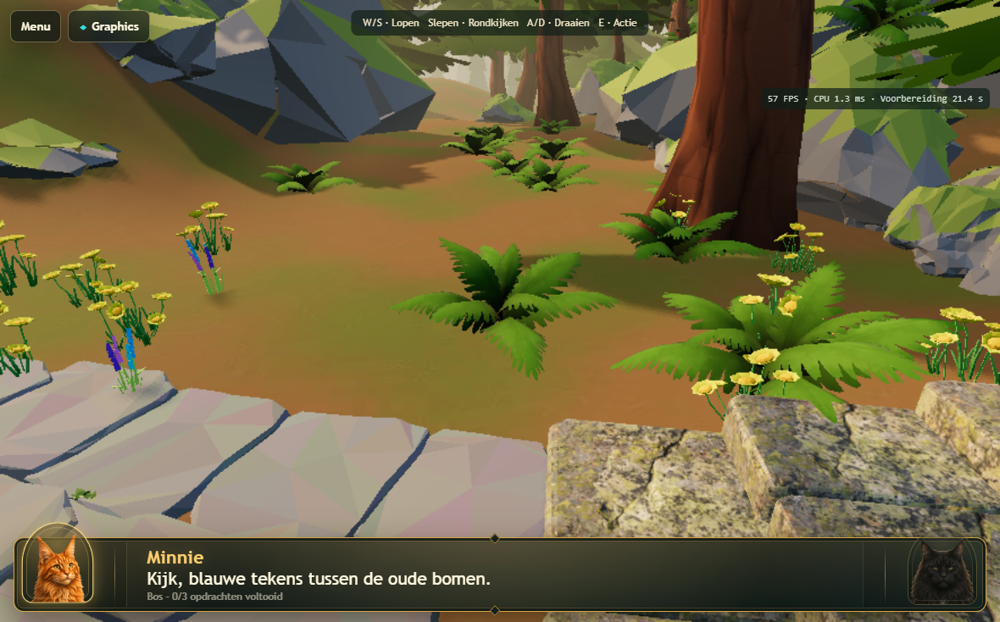

# Atlas 3D — aangeleverde Poly Pizza-begroeiing, lokaal v165

Deze vervangingsronde gebruikt de vijf door de gebruiker aangeleverde GLBs uit
`3dmodels/`. De modellen zijn niet opnieuw ontworpen of gedecimeerd. Blender MCP
heeft ze geïmporteerd in de afzonderlijke Atlas-authoringscène en dezelfde scène
via de bestaande Draco/GLB-export naar de runtime gebracht. Real 3D is ongewijzigd.

## Vervanging en plaatsing

| Bron | Geplaatste instanties | Driehoeken per bronmodel | Gebruik |
| --- | ---: | ---: | --- |
| Fern.glb | 165 | 288 | Hoofdbegroeiing in losse groepen langs route, open plekken en geschikte rotsbanken |
| Pine1.glb | 122 | 1.646 | Voor- en middengrond, met zichtbare stammen en open doorgangen |
| Flower1.glb | 28 | 1.619 | Kleine gele bloemgroepen |
| Flower2.glb | 31 | 568 | Spaarzame blauwe/paarse accenten |
| Flower3.glb | 31 | 1.872 | Paarse klokbloemen tussen varens en open bodem |

Verwijderd: alle 1.470 oude custom varens, 248 oude voor-/middengrondpijnen,
180 custom bloemgroepen en 4.838 concurrerende bodemplanten, struiken en losse
boomvoetkragen. De 100 eenvoudige verre dennen blijven achtergrondsilhouetten.
Kleine bestaande klaverachtige voegplantjes blijven bij de bestrating.

De nieuwe verdeling volgt de bestaande ontworpen plantlocaties, met ruimte tussen
groepen. Slechte boomlocaties zoeken lokaal een beter grondvlak; 126 voormalige
locaties zijn niet herbeplant omdat de bredere bronboom daar geen goed contact
of voldoende ruimte kreeg. Er is geen uniforme nieuwe vegetatiemat toegevoegd.

## Minimale aanpassingen aan de bronnen

Eén gedeelde mesh per bron, oorspronkelijke materiaalsets en UVs. Alleen de
importtransformatie en een wortelpuntcorrectie zijn ingebakken; plaatsingen gebruiken
uniforme schaal en rotatie. Geen topologie-, blad-, kroon- of materiaalherontwerp.
De sourcebestanden zijn ongewijzigd; SHA-256 en driehoekaantallen zijn vastgelegd
en tegen de werkelijke export getest. De bestaande GLB-compressie en runtime-
textuurbegroting blijven van toepassing.

De varen is circa 1,5–2,1 meter breed, met schaal 0,17–0,23 van de bron.
Bloemen zijn circa 38–56 cm hoog. Pine1 varieert tussen jonge bomen van circa
5–7 meter en volwassen bomen van circa 15–18 meter, zonder niet-uniform rekken.

## Gronding

De laagste varenvertex is een neerhangende bladpunt, niet het wortelpunt.
Daarom blijft bij Fern de oorspronkelijke centrale stengelbasis het anker.
De overige bronnen zijn uitgelijnd op hun onderste stengel-/stamvoet.

De plaatsingsroutine gebruikt een BVH van de werkelijke getransformeerde bodem en
rotsbanken. Lage planten volgen de lokale oppervlaktenormaal; bomen blijven
rechtop. Alle wortelvertices worden gecontroleerd, plus alle lage boomvertices
en alle varen-/bloemvertices op onaanvaardbare terreinpenetratie. Steile of
gebroken steunvlakken worden afgewezen. Dit voorkomt dat één centrale raycast
een brede plantvoet ten onrechte goedkeurt.

Een aparte controle van de uiteindelijke objecttransformaties controleerde
**377 objecten en 21.530 wortelmeetpunten: nul zwevende wortelpunten**.
Het hoogste wortelcontact ligt circa 8 mm onder het oppervlak. De diepste
wortelrand van een boom zit circa 24,7 cm in een helling; bij varens maximaal
4,2 cm en bloemen maximaal 4,9 cm. Een neerhangende varenbladpunt kan de bodem
licht raken; de plaatsingslimiet voor de volledige varen is 9,5 cm penetratie.
Er zijn geen half begraven of zwevende vervangende planten in de gecontroleerde
runtimebeelden aangetroffen. Dit is geen claim dat iedere bestaande rots of
niet-vervangen achtergrondasset opnieuw is gecontroleerd.

Alle 2.127 niet-vervangen scèneobjecten behouden hun transformatie. Routebestand,
Real 3D, runen, tempel, NPC-/challengeposities en gameplay zijn niet aangepast.
De bestaande bosbodem, belichting en rendererinstellingen blijven behouden.

## Kosten

| Exportgegeven | Voor deze ronde (v164) | v165 |
| --- | ---: | ---: |
| GLB bytes | 18.448.344 | 17.350.948 |
| Nodes | 8.861 | 2.502 |
| Unieke meshes | 256 | 231 |
| Instancegewogen driehoeken | 1.280.265 | 1.035.367 |
| Materialen | 13 | 24 |
| Textures | 16 | 21 |

De bronmaterialen voegen 11 materialen en 5 textures toe, terwijl het aantal
objecten en driehoeken afneemt. Geen nieuwe renderpasses. De bestaande
groundcover-shadowregel omvat nu ook de nieuwe varens/bloemen; dennen blijven
schaduwen werpen. Dezelfde Atlas-kwaliteit geldt op desktop en tablet.

## Runtimebeelden en meetresultaten

Echte Chromium/WebGPU-beelden, op dezelfde routeposities als vóór de vervanging:

| Gebied | Voor (v164) | Nu (v165) |
| --- | --- | --- |
| Beginroute / rotskader | [Voor](images/atlas-v165/before-1.png) | [Nu](images/atlas-v165/runtime-1.png) |
| Zijopening | [Voor](images/atlas-v165/before-2.png) | [Nu](images/atlas-v165/runtime-2.png) |
| Bovenste open plek | [Voor](images/atlas-v165/before-3.png) | [Nu](images/atlas-v165/runtime-3.png) |
| Valleizicht | [Voor](images/atlas-v165/before-4.png) | [Nu](images/atlas-v165/runtime-4.png) |

De varen is nu duidelijk het hoofdmodel van de ondergroei. De oude overlappende
stroken en struikmassa's zijn verdwenen; rotsen en boomstammen zijn afzonderlijk
leesbaar. De open bodem is veel zichtbaarder. Die ruimere verdeling is bewust,
maar kan op sommige plekken nog kaal ogen. De oorspronkelijke gekartelde
bladcontouren van Pine1/Fern blijven behouden en kunnen op de bestaande lage
renderresolutie nog aliasen. Er is geen nieuwe anti-aliasing of beeldbewerking
toegepast om de screenshots mooier te laten lijken.

Eén opeenvolgende vergelijkingsrun met dezelfde renderer, 1180×734 en dezelfde
vier bewegingsfasen (6,5 seconden per fase):

| Meting | Voor | Nu |
| --- | ---: | ---: |
| Voorbereiding | 26,1 s | 21,4 s |
| FPS over vier fasen | 57,0–57,2 | 57,0–57,3 |
| Gemiddelde CPU, stilstaand | 4,56 ms | 3,72 ms |
| Gemiddelde CPU, lopen | 4,66 ms | 3,92 ms |
| Gemiddelde CPU, rondkijken | 2,28 ms | 1,84 ms |
| Gemiddelde CPU, lopen+rondkijken | 2,66 ms | 2,34 ms |
| Draws, stilstaand | 604 | 490 |
| Runtime shader modules bij voorbereiding | 1.282 | 1.082 |

Alle fasen zonder pagina-/GPU-fouten. Frames met een schaduwvernieuwing zijn
iets duurder: bij lopen gemiddeld 8,96 versus 7,71 ms CPU; bij lopen+rondkijken
7,22 versus 5,40 ms. De totale gemiddelde kosten nemen af. Deze korte lokale
meting is geen statistische benchmark en geen fysieke iPad-meting.
Volledige samenvatting: `atlas-curated-measurements.json`.

## QA

- 20 export-, Graphics-, wereldwissel- en real-WebGPU-acceptatietests geslaagd
  in 6,8 minuten, inclusief 1180×734, 1180×689, dezelfde sessie opnieuw betreden,
  annulering/herstel, desktop/tablet-pariteit en 1770×1101-voorbereiding.
- Beide vergelijkingsruns geslaagd, zonder pagina- of GPU-fouten.
- Grondingsaudit: 377 objecten / 21.530 wortelpunten, nul fouten.
- 9 real-WebGPU-pressure/gameplaytests geslaagd in 7,3 minuten: Desktop High en
  tablet, normaal/stilstand/validatiefout/device loss, herstel naar Cinematic,
  plus daadwerkelijk lopen, kijken, drie challenges en het openen van de poort.
  Foutinjecties bewijzen herstelgedrag, niet de oorzaak van eerdere fysieke iPad-fouten.
- 23 bron-/grondings-/presettests geslaagd in 1,3 seconden, inclusief hercontrole
  van kleur, alpha, normal-mapgebruik en de oorspronkelijke PBR-factoren.
- 12 WebKit-navigatie-/cleanupchecks geslaagd in 1,2 minuten: Menu/Terug,
  Graphics, formulieren, startupfouten en late/defecte cleanup. Dit is WebKit
  met iPad-layout en gecontroleerde startupgrenzen, geen fysieke Safari-GPU-test.
- JavaScript-syntaxcontroles en `git diff --check` geslaagd.

## Reproduceerbaarheid

- `scripts/place-curated-atlas-foliage.py`: bronimport, gedeelde meshes, plaatsing en penetratiecontrole.
- `scripts/audit-curated-atlas-foliage.py`: onafhankelijke controle van uiteindelijke wereldcoördinaten.
- `Levels/LVL-0001/3d/atlas-curated-ledger.json`: bronhashes, aantallen, plaatsing en behoud van gameplaybestanden.
- `Levels/LVL-0001/3d/atlas-curated-grounding.json`: alle wortelcontrole-resultaten.
- `lvl0001-stylized.blend`: bijgewerkte lokale authoringscène; reservekopie vóór import onder `output/curated-foliage-backup/`.

Niet gecommit of gedeployed. Fysieke iPad-acceptatie van deze nieuwe content
vereist nog een fysieke test na een afzonderlijk geautoriseerde deployment.
