# Atlas 3D v168 — evening delta

Local art pass from the saved v167 curated world. No commit or deployment.
Real 3D, route/challenges, temple/rune transforms and controls are unchanged.

## Visual changes

- **Evening:** warm golden sun `#ffd49a`, intensity 7, direction offset `[-38,24,-52]` (20.4° elevation). Warm beige distance fog and horizon, restrained blue sky overhead, warm bounce. Existing directional light and its linked sky disc only; no additional effect or shadow light.
- **Floor:** replaced the rejected broad striped texture with one 512×512 dark earth/moss/needle color map. Existing UVs and shared roughness .94 material remain. No normals, displacement, extra terrain layers or runtime texture generation. A distinct image filepath prevents Blender's old packed image resolving over the replacement.
- **Rocks:** all four supplied models used once, sharing one opaque 512×512 palette, metallic 0, roughness .94 and flat polygon shading. Source GLBs remain unchanged. Actual imported/exported triangle counts are 342 / 244 / 244 / 342. The earlier quick metadata estimate of 117/83 was incorrect; final counts use the complete index buffers.
- **Grounding:** 174 distinct foliage objects adjusted: 2 pines, 19 ferns, 152 grass patches, 1 Flower2 group. Most were within the temple footprint; the rest needed contact corrections around replaced rocks. No foliage count reduction or new scatter pass.
- The first rune's nearest trunk moves from 0.804 m to 5.277 m centre distance. A second pine is moved outside the temple. Rune and stair/temple gameplay transforms remain protected.

| Supplied model | Final Blender XY | Use |
|---|---|---|
| rock1 | 9.06, 5 | Opening forest, beyond the right-hand framing trunk |
| rock2 | -0.5, 18 | Left edge of the middle trail, before the first rise |
| rock3 | 1.6, 31.3 | Left bank alongside the trail rise |
| rock4 | 8.3, 50 | Left side of the temple approach |

Four existing stones were replaced; four further overlapping old stones were removed. The new stones sit partly embedded in slopes rather than hovering. Their sampled lower hulls have maximum terrain gap −3.5 cm. Some buried vertices reach −0.98 m on sloped ground; this is deliberately embedded rock geometry, not a foliage root depth.

Independent audit: **4,335 foliage objects, 462,800 root samples, zero failures**. Maximum root gap −0.008 m. A separate survey of **321 medium/large stones and outcrops** found no entirely floating sampled bases. These numeric checks supplement the runtime screenshots; they cannot prove that every possible view is free of all visual overlap.

## Budget and unchanged behavior

80 Pine1, 165 Fern, 4,000 shared grass2 patches and 90 flower groups remain. FXAA stays enabled, with `?debug3d=1&atlasFxaa=0` for A/B inspection. Canonical desktop/tablet quality, 1× MSAA, DPR cap .75, 1024 shadows, conservative HDR, sequential compact uploads, frame fencing, cleanup and recovery are preserved.

GLB: **18,675,348 → 18,834,420 bytes** (+159,072 bytes, 0.85%). Unique meshes 230→234, materials 25→26, images 21→22. One additional 512px rock color texture costs approximately 1.33 MiB including RGBA8 mipmaps, excluding driver overhead. The floor replaces an existing texture of the same dimensions. No new fullscreen targets.

Current Atlas SHA256: `563ef2eb88beb0acf07c78019fa19048c1fd9109231029e4874e8e8f1ae586db`.

## Authoring and asset provenance

Blender MCP edited the actual saved `Levels/LVL-0001/3d/lvl0001-stylized.blend`; v167 was backed up under `output/evening-v168-backup`. The delta script is `scripts/atlas-evening-delta.py`; the exact final object changes and independent audits are in `atlas-evening-ledger.json`, `atlas-evening-rock-grounding.json` and `atlas-curated-grounding.json`. Do not rerun the guarded authoring script on the finished checkpoint.

No Poly Haven / Poly Pizza downloads were added. Rocks came from the user's local `3dmodels/rock1–4.glb` files. The floor used the built-in imagegen tool, technically downsampled in Blender to the existing 512px budget. Asset: `assets/textures/atlas-evening-floor-512.png`. Original generated image is preserved in `output/evening-v168-backup/woodland-source.png`.

Generation prompt:

> Create a seamless tileable square game albedo texture for a stylized low-poly woodland forest floor, top-down orthographic flat surface filling entire image. Dark rich umber earth and muted olive moss, softly irregular small moss islands, sparse tiny short fallen pine needles and understated tiny organic flecks. Calm readable medium-size shapes, tasteful hand-painted stylized game texture, restrained low contrast, not photorealistic. Isotropic organic distribution with NO stripes, NO wavy bands, NO smears, no dominant directional flow. No large leaves, no plants, no rocks, no perspective, no cast shadows, no baked sunlight or highlights, no border, no text. Seamless matching all four edges. Rich dark brown/olive base supports green foliage without drawing attention. Intended to tile across terrain, final runtime size 512x512.

## Remaining limits

This is a restrained delta, not a recreation of the B moodboards. Existing broad pine canopies still cast heavy shade; grass and flowers retain their existing stylization. Some old moss-rock color borders remain angular. The repeated 512px ground texture can still be recognized on large exposed hillsides. Physical Safari acceptance remains outstanding; desktop WebGPU/WebKit testing does not establish physical iPad stability.

## QA evidence

- Main sequential Chromium/WebGPU release run: **27 passed in 10.3 minutes** (`test-results/evening-acceptance`). Includes both tablet acceptance dimensions, four prepared frames per entry, re-entry, FXAA on/off allocation and disposal, 1770×1101 preparation, world switching, device-loss recovery, unchanged assets and gameplay data.
- Preset/texture/instrumentation tests: **22 passed** (`test-results/evening-policy`). An initial sandbox browser-launch failure was resolved by running the same tests with browser permission.
- WebKit navigation/forms/native touch/cleanup: **13 distinct tests passed**. Initial combined run: 11 passed, two carrousel-tile actionability timeouts. Both failed tests passed unchanged in a separate 46.4-second run; no timeout extension or production-menu modification (`test-results/evening-webkit`, `evening-webkit-recheck`). This timing sensitivity remains a test limitation.
- JavaScript syntax checks and `git diff --check` passed.

- Final GPU pressure/gameplay run: **6 passed in 5.4 minutes** (`test-results/evening-pressure`). Covers Desktop High, tablet normal rendering, stalled frames, validation failures, device loss, Cinematic recovery and walking the Atlas route while completing all three challenges and unlocking the gate.

## Files changed for this delta

- Runtime/art: `src/atlas-world-policy.js`, `src/three-renderer.js`, `service-worker.js`, `Levels/LVL-0001/3d/atlas-3d.glb`, local `lvl0001-stylized.blend`, new `assets/textures/atlas-evening-floor-512.png`.
- Authoring evidence: `scripts/atlas-evening-delta.py`, `atlas-evening-ledger.json`, `atlas-evening-rock-grounding.json`, updated `atlas-curated-ledger.json` and `atlas-curated-grounding.json`.
- QA: new `tests/atlas-evening.spec.js`; updated current-art expectations in `atlas-morning.spec.js`, `graphics-modes.spec.js`, `graphics-world-switch.spec.js`, `three-preparation.spec.js`, `three-tablet-acceptance.spec.js`; added before/current and detail poses to `atlas-composition-performance.spec.js`.
- Documentation: this report, measurements/screenshots, `renderer-current-spec.md`, `3d-world-modes.md`. Earlier uncommitted foliage/renderer work was preserved.

## Matched final performance

Back-to-back runs of the preserved v167 asset/renderer and final v168, same 1180×734 viewport, 885×551 actual render buffer, FXAA on, same route poses and profiling. No other GPU test ran concurrently. Both complete captures passed without page/GPU errors.

| Measurement | Current v167 before | v168 after |
|---|---:|---:|
| Preparation | 21.92 s | 21.98 s |
| Stationary FPS | 60.00 | 60.00 |
| Walking FPS | 60.00 | 60.00 |
| Walking + looking FPS | 60.00 | 60.00 |
| Stationary CPU | 5.01 ms | 5.19 ms |
| Walking CPU | 5.69 ms | 5.59 ms |
| Looking CPU | 2.57 ms | 2.62 ms |
| Walking + looking CPU | 3.47 ms | 3.38 ms |
| Stationary scene draw calls | 480 | 482 |
| Shadow draws on refresh | 420 | 263 |

The shadow draw reduction reflects the changed light direction and frustum, not lower resolution or disabled shadows. These are CPU submission/observed frame timings, not isolated GPU timings. Vsync limits both runs to 60 FPS, so no throughput improvement is claimed. Earlier candidate runs varied under host load; the final matched pair is the comparison used here. See [raw measurements](atlas-evening-measurements.json). Expected iPad impact is small from the extra 512px shared texture and similar draw cost, but physical results are unverified.

## Before / after runtime views

Same camera poses and canonical Atlas renderer. These are actual browser screenshots, not generated concept images.

| Area | Before v167 | After v168 |
|---|---|---|
| Opening route / light | 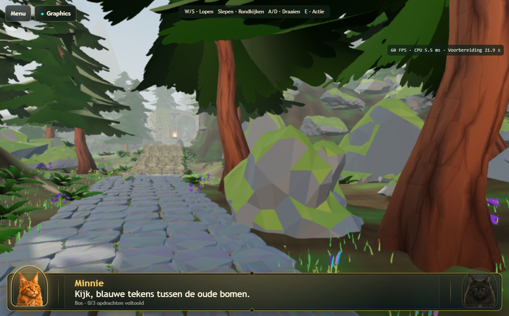 | 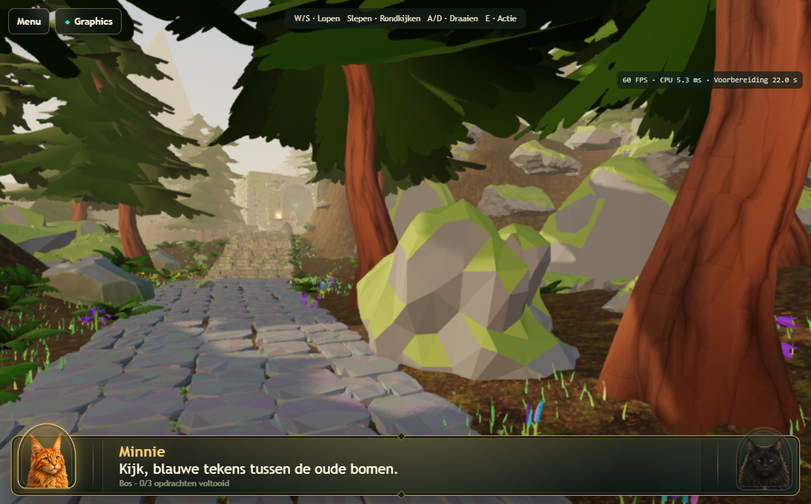 |
| Forest floor / ferns | 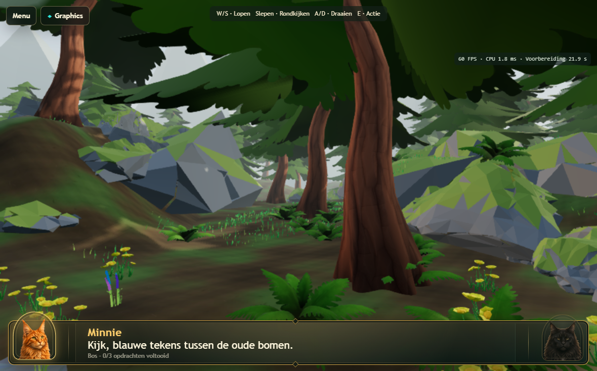 | 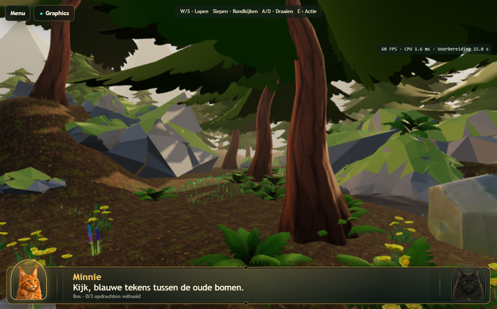 |
| Hillside | 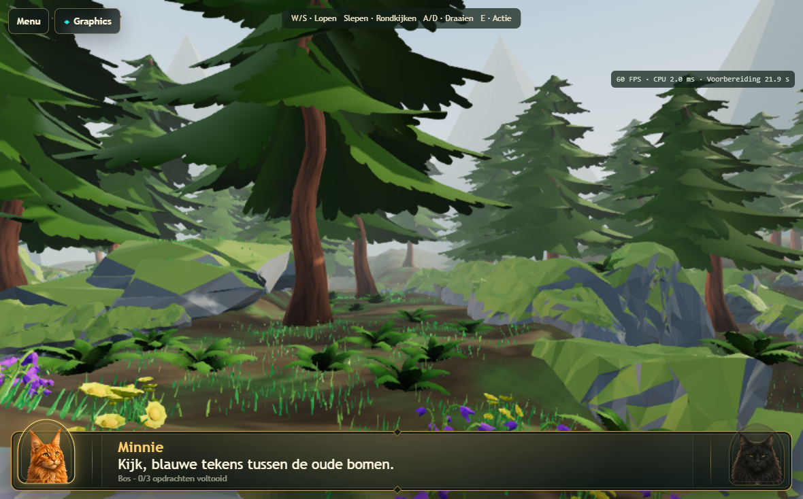 | 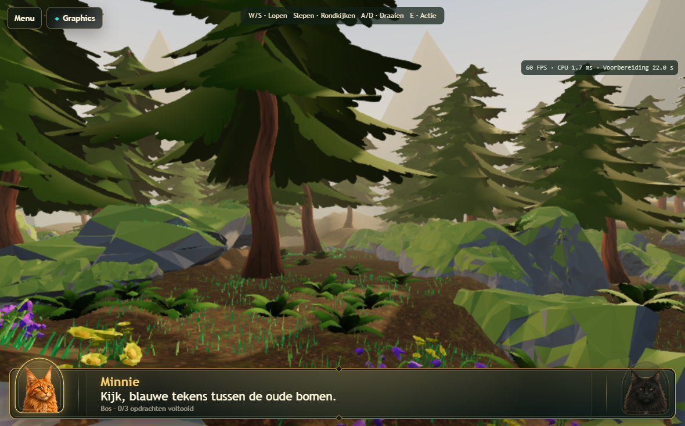 |
| Temple approach | 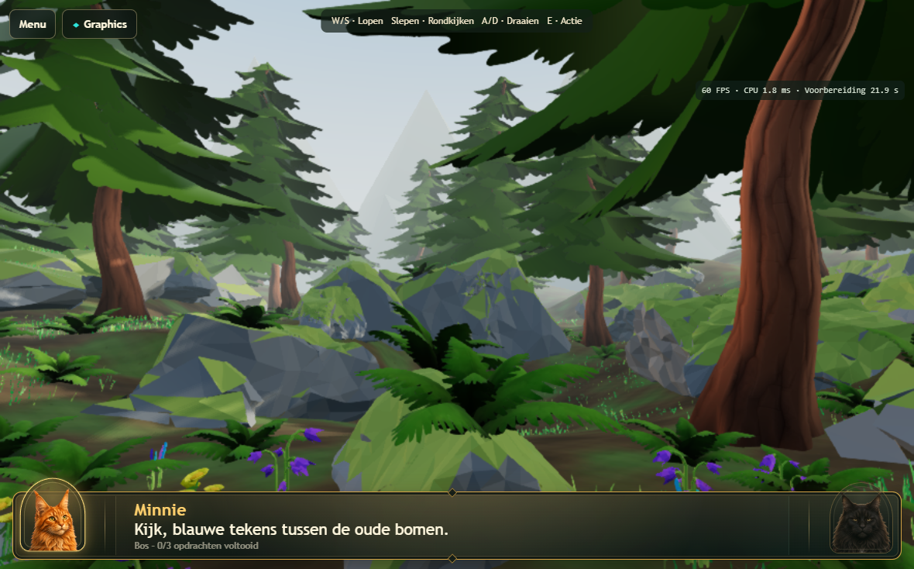 | 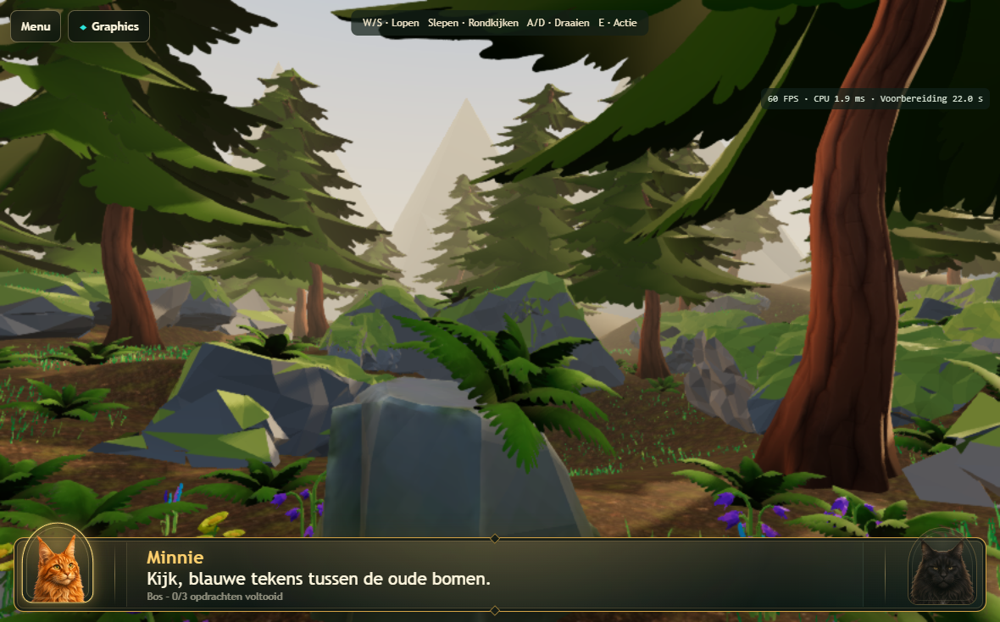 |
| First rune / trunk clearance | 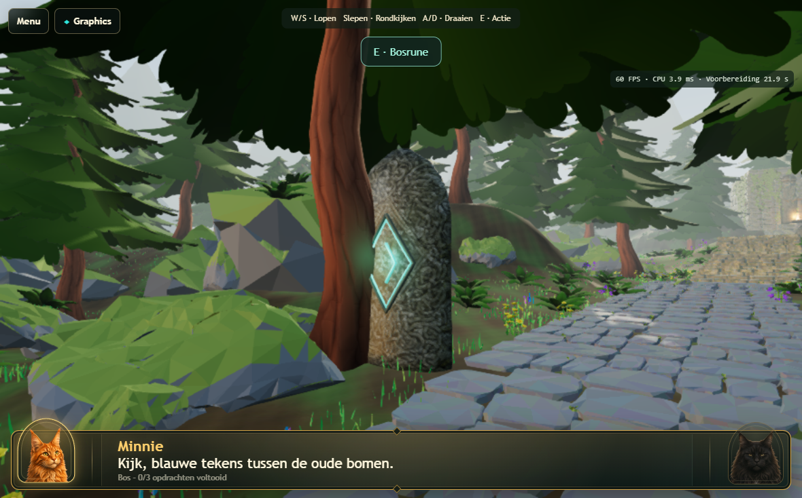 | 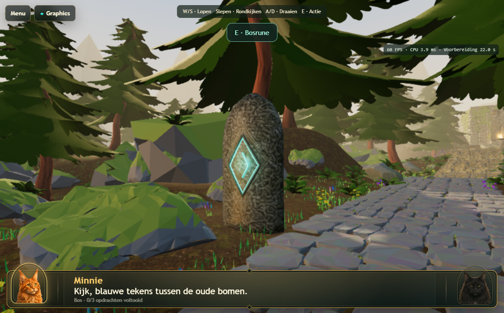 |
| Temple frontage | 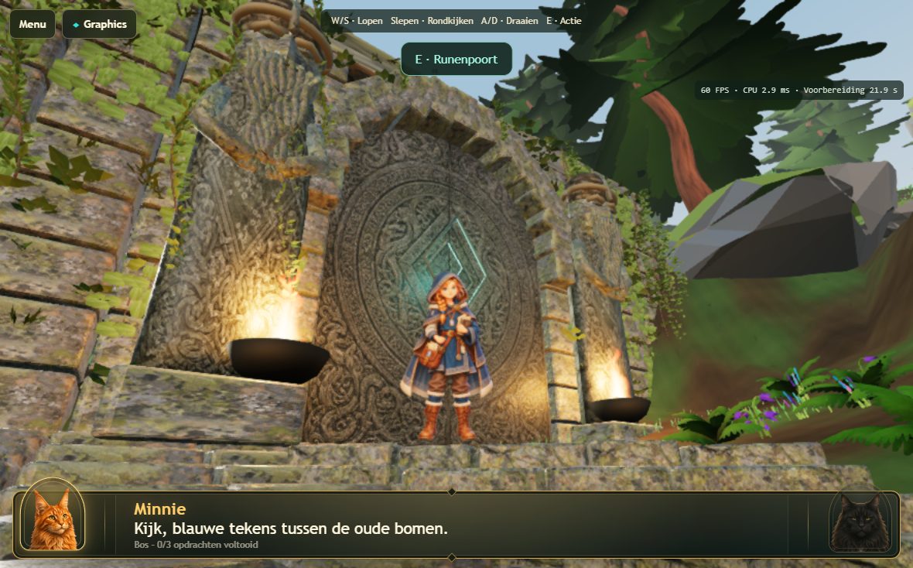 | 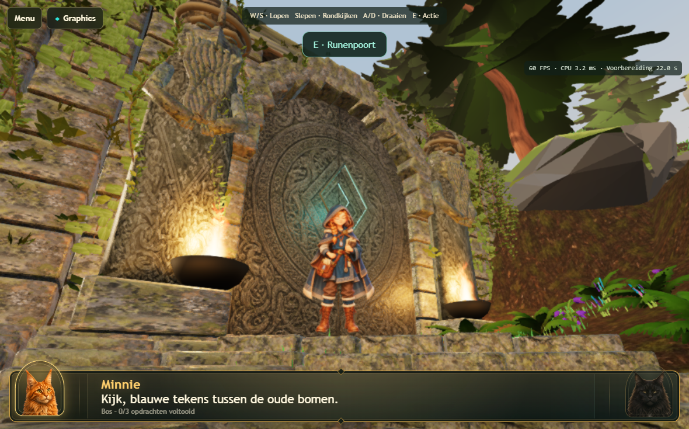 |

Final supplied-rock detail views: [rock1](images/atlas-v168/after-rock-1.png), [rock2](images/atlas-v168/after-rock-2.png), [rock3](images/atlas-v168/after-rock-3.png), [rock4](images/atlas-v168/after-rock-4.png). [Sun and evening horizon](images/atlas-v168/after-sun-650.png). [Fern/floor close view](images/atlas-v168/after-fern-close.png).
