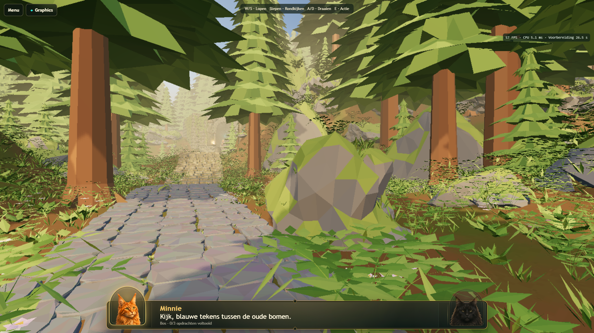
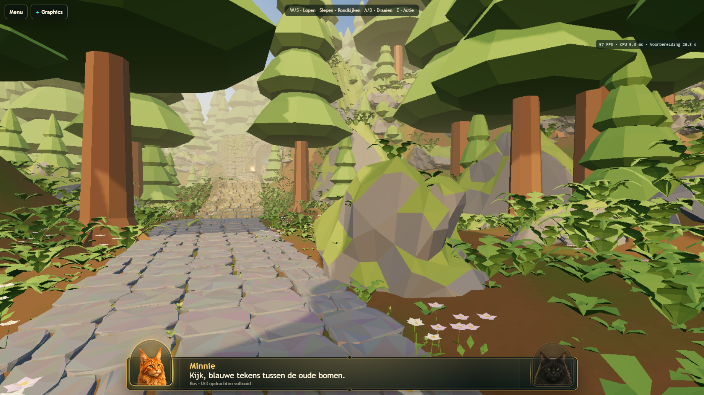
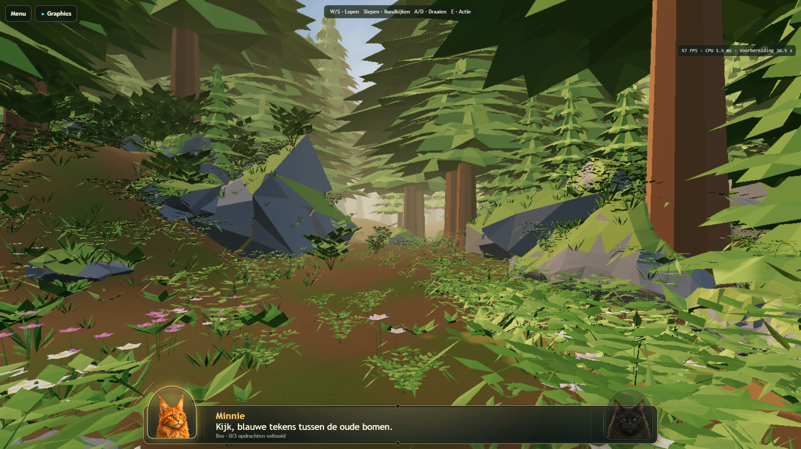
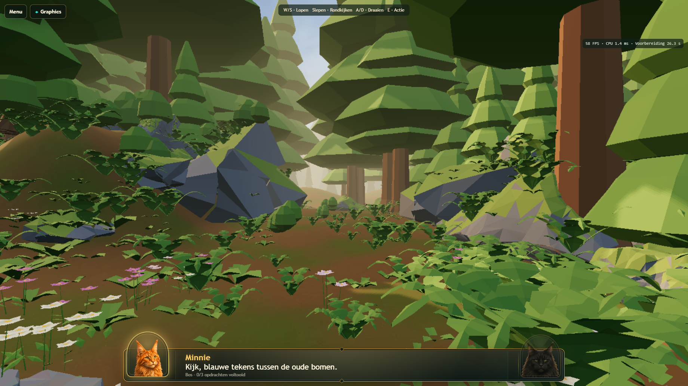
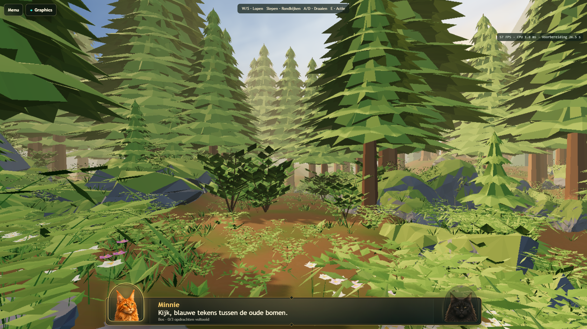
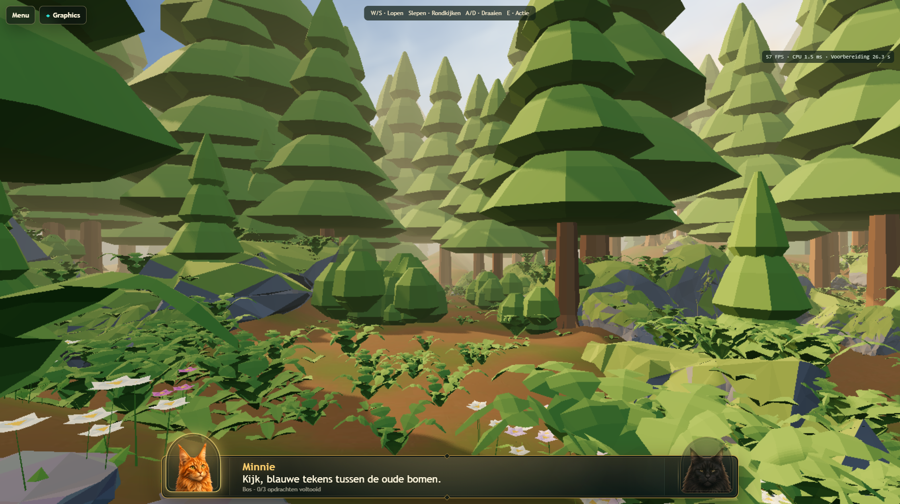
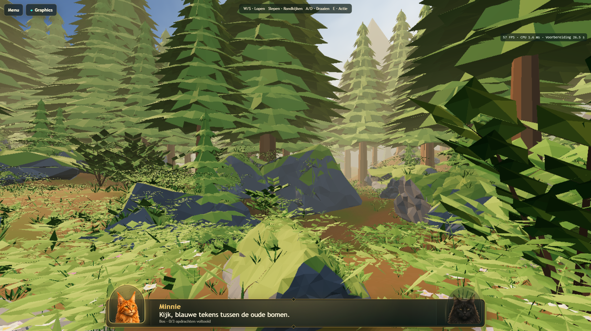
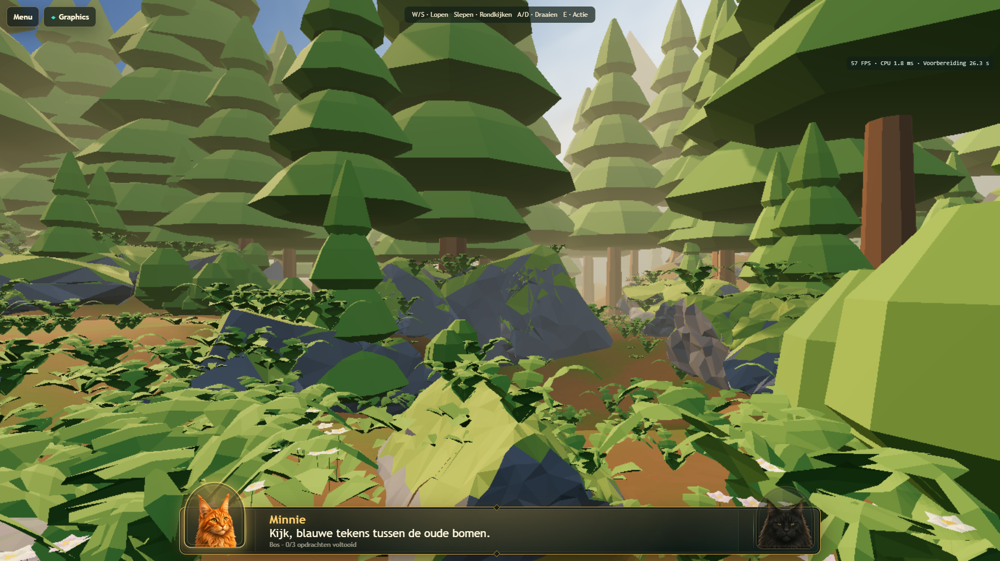

# Atlas 3D calm foliage — local v163

This pass uses the latest attached screenshot as the primary **shape-language** reference: broad foliage masses, quiet edges, visible trunks, and separation between plant groups. It does not attempt to reproduce the reference's lighting/post-processing. The v162 floor, flowers and lighting remain unchanged.

## Changes in Blender

The actual `lvl0001-stylized.blend` authoring scene was edited through Blender MCP and exported through the existing Draco GLB pipeline. No library assets were required. All new foliage shares the existing Atlas painted-nature material; no textures or render passes were added.

| Family | Before | v163 |
| --- | --- | --- |
| Mature trees | Many thin, jagged tiers; 952 triangles/tree | Five broad, closed, slightly asymmetric crown masses; 412 triangles/tree |
| Young trees | Thin overlapping tiers; 712 triangles/tree | Four broad crown masses; 344 triangles/tree |
| Ferns | Six fronds with detached thin leaflets; 444 triangles | Five arched, continuous fronds with broad blunt lobes; 280 triangles, two shared variants |
| Shrubs | Many small leaves and exposed branches; 370 triangles | Three overlapping compact faceted masses; 180 triangles, three shared variants |
| Groundcover | Nine narrow blades or seven pointed leaves; 28–36 triangles | Three short broad folded leaves; 18 triangles |

The shrub base audit caught a small positive offset at the bottom of the new rounded meshes. All three shared meshes were lowered 0.06 local units so their lowest face crosses the existing planted root plane; object positions remain unchanged. The export regression now checks this.

The first fern revision was too smooth and read as a generic broadleaf plant. The final revision uses deeper lobe separations with wide ends so the central fronds remain readable without detached needle-like pieces.

Planting was thinned spatially into groups: 2,665 small grass/groundcover objects and 424 fern placements were removed from gaps between retained groups. Larger fern accents and all flowers remain. This is intentional groundcover simplification, not a change to the walking route or tree count. 175 mature trees and 73 young trees remain. Their original trunk/root faces and transforms were retained.

All **8,861 retained exported node transforms** were compared with the pre-pass GLB and are unchanged. The compressed geometry of 1,148 protected rock, flower, terrain and gameplay nodes also matches the pre-pass export byte-for-byte. Real 3D and route file hashes are unchanged. The Atlas renderer, canonical quality configuration, floor, light settings, rocks, flowers, NPCs and gameplay logic were not edited in this pass.

## Runtime review

Four actual WebGPU runtime captures use the existing representative viewpoints at 1840×1034 CSS pixels with the unchanged canonical 0.75 render scale. These are unretouched captures, not generated illustrations.

| View | Previous v162 | Current v163 |
| --- | --- | --- |
| Opening route / boulder |  |  |
| Side glade |  |  |
| Upper clearing |  |  |
| Valley view |  |  |

Tree edges no longer have the dense sawblade pattern. Shrubs read as compact volumes and the open ground is less covered by tiny competing shapes. Ferns have broader paired lobes and more space between groups.

Remaining shortcomings: the simplified crowns are conspicuously tiered and somewhat toy-like compared with the reference's more organic clusters. Some overlapping foreground fern lobes still produce angular edges, especially in views 3–4. Distant small vegetation and flower stems can still alias at the unchanged 0.75 render scale. The reference remains considerably richer in shading and atmosphere; this shape-only pass does not claim full visual parity.

## Cost and QA

Atlas GLB: **18,449,900 bytes**, versus 19,372,116 before this pass (4.8% smaller). Instance-weighted exported triangles: **1,309,665**, versus 2,065,279 (36.6% fewer). Runtime inventory: 736 mesh batches, 264 geometries, 16 materials and 18 textures. Material/texture counts did not increase. Final screenshot preparation took 26.3 seconds on the local PC; this is not an iPad loading estimate.

The four capture views passed without page/GPU errors. The short desktop benchmark held 57.0–57.2 FPS through stationary, walking, turning and combined movement, with mean CPU times 2.3–4.4 ms (6.5 seconds per phase). [Measurements](atlas-foliage-measurements.json). This is a local regression measurement, not a physical iPad FPS estimate.

QA completed: 20 real-WebGPU/export/mode tests, including both tablet acceptance sizes and 1770×1101 preparation; 18 preset tests; 12 WebKit navigation/forms/cleanup tests. The additional 10-test sequential run passed: short benchmark, all eight Desktop High/tablet pressure and recovery scenarios, and full Atlas progression through three challenges and the gate. After the final shrub-base correction, all **16 export/capture/tablet acceptance tests passed again (4.2 minutes)**, including both same-session re-entry cases. JavaScript/Python syntax checks and `git diff --check` passed. No GPU assertions, timeouts or quality settings were weakened.

Physical iPad acceptance remains necessary after a separately authorized deployment. No commit or deployment was performed.

## Files and reproduction

- `scripts/calm-atlas-foliage.py`: guarded Blender authoring transformation, using the pre-pass `.blend` backup.
- `Levels/LVL-0001/3d/atlas-3d.glb`: current runtime world.
- `Levels/LVL-0001/3d/atlas-foliage-ledger.json`: mesh budgets and removed placement names.
- `tests/atlas-world-policy.spec.js`: actual-export fern/tree/shrub budgets, sharing, opacity, retained trees and protected assets.
- `tests/graphics-modes.spec.js` and `service-worker.js`: updated asset hash and v163 cache identifier.
- This report and its runtime captures; current renderer/world documentation points here.

The `.blend` checkpoint and pre-pass backup remain local as in the existing project conventions. The pre-pass GLB backup is in ignored `output/atlas-calm-backup/`. New runtime GLB SHA-256: `2ed1fe7511b8bc0570dac541dd9f9d1106e83c5b87ef61c5dadca6ce9f66f24c`.
