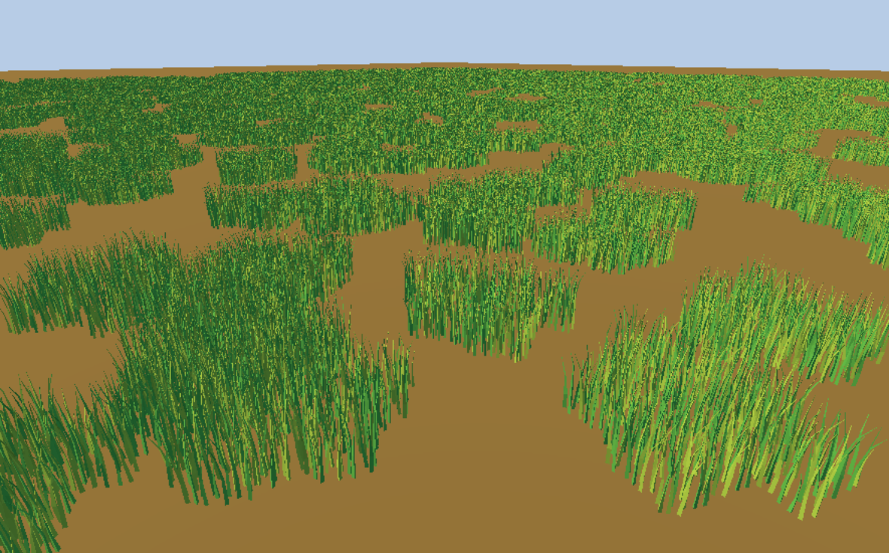
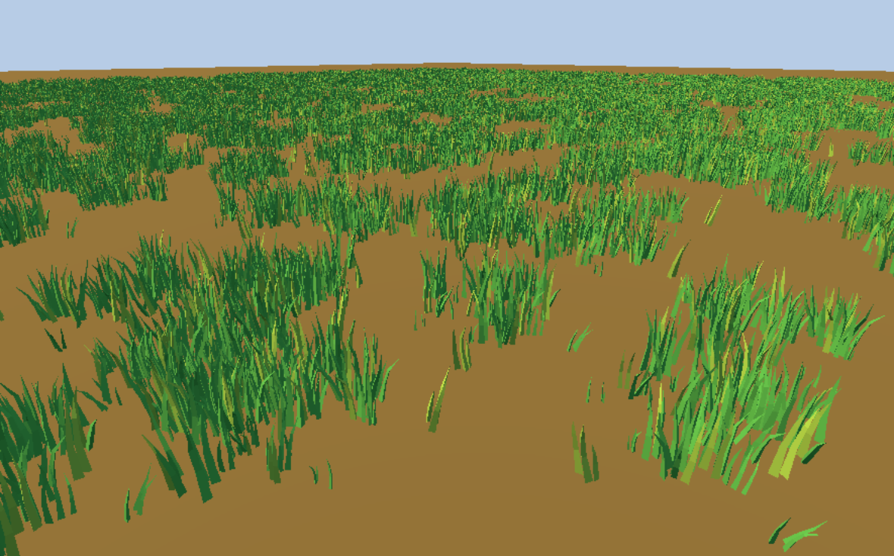
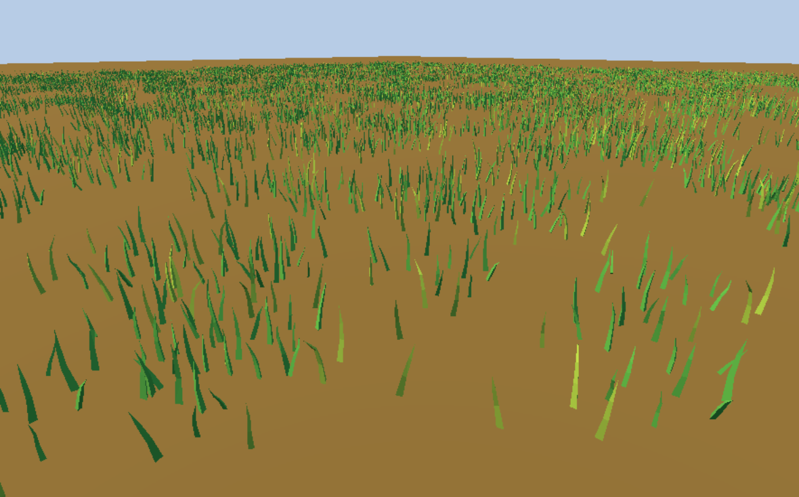
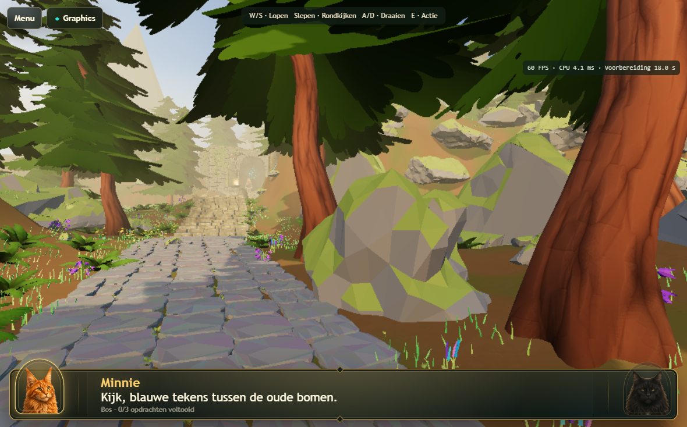
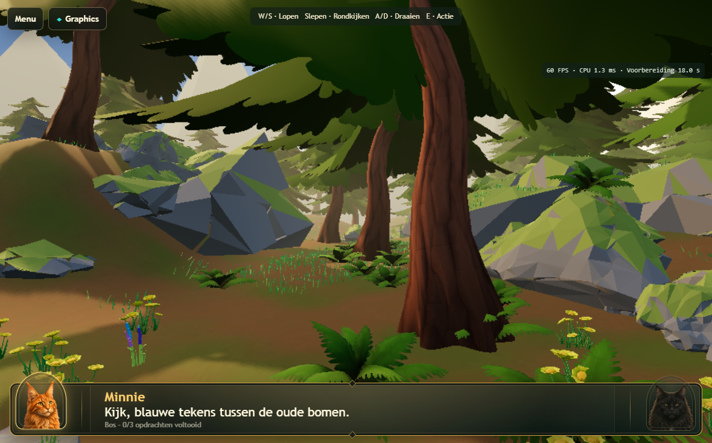
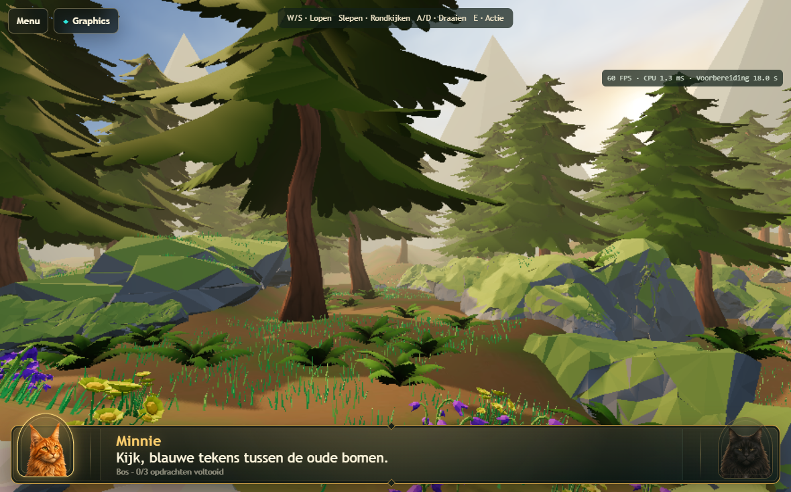
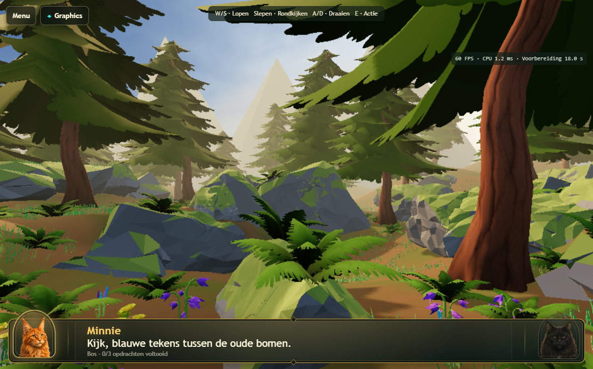
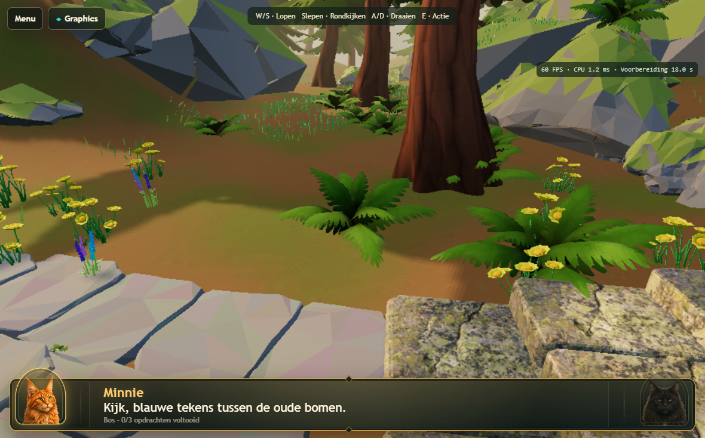

# Atlas 3D v166 — 80 pines and shared grass

Local authoring/export revision, 2026-09-12. Not committed or deployed. Real 3D,
route, gameplay, renderer settings, forest-floor materials and lighting are unchanged.

## Placement and grounding

- **80 Pine1 instances total**, including distant trees. The previous 100 distant
  custom pine silhouettes are removed; there is no hidden second tree population.
- 13 foreground trees, 20 midground and 47 closure trees. Zones use distance from
  the route (3.5–12, 12–28 and 28–58 world units). Irregular spacing, minimum measured
  trunk-center distance **7.303 m**. Source Pine1 geometry/materials are unchanged;
  placements use uniform scale, rotation and grounded bases.
- **4,000 grass2-derived patches**, **165 Fern**, **90 flower groups** (28 Flower1,
  31 Flower2, 31 Flower3). A flower group is one source GLB instance, not one blossom.
- Grass forms irregular patches and gaps rather than a uniform carpet. Exclusion
  distances keep it away from the route center, fern/flower roots and tree bases.
  Scale is 0.64–0.92 of the normalized one-meter patch, about 0.19–0.27 m tall.
- All **4,335 foliage placements** were independently audited against the actual
  terrain/rock surface: **462,800 root samples, zero floating-root failures**.
  Maximum gap −0.00797 m; deepest base sample −0.24682 m (tree base on slope).
  Grass follows surface normals and checks the spread of root contacts before
  accepting a location. Original grass2 blade root heights were uneven; the selected
  blades are leveled in the shared derived mesh before placing instances.
- The 2,282 protected non-tree transforms were checked unchanged. See the
  [placement ledger](../Levels/LVL-0001/3d/atlas-curated-ledger.json) and
  [independent grounding audit](../Levels/LVL-0001/3d/atlas-curated-grounding.json).

## Grass comparison

| Property | grass1 source | grass2 source | Selected grass2 patch |
|---|---:|---:|---:|
| Triangles | 8,540 | 2,352 | **256** |
| Source mesh objects | 1 | 147 | **1 shared merged mesh** |
| Materials | 2 opaque | 2 opaque | **1 opaque vertex-color material** |
| Textures | 0 | 0 | **0** |
| GLB source bytes | 550,544 | 335,936 | Included in world export |

Grass2 has 72.5% fewer triangles than grass1. Its full patch is still dense for
plentiful filler. The selected version retains 16 distributed original blades
(no blade remodelling), giving 89.1% fewer triangles than full grass2 and 97.0%
fewer than grass1. The two original flat colors become vertex colors in one shared
lit material. Source GLBs on disk are untouched.

For a fair instancing comparison, both complete candidates were also merged into
one mesh/material with their colors retained and normalized to equal patch width.
Each benchmark uses the real vendored WebGPU renderer, 500 and 3,000 instances,
three warm renders followed by 100 measured frames, and one in-flight GPU frame.
All candidates have three total draws (grass, floor and renderer background).

| Candidate at 3,000 patches | Submitted triangles incl. floor/background | FPS | CPU ms | GPU queue completion wait ms |
|---|---:|---:|---:|---:|
| grass1 | 25,620,003 | 59.99 | 0.261 | 4.226 |
| grass2 | 7,056,003 | 59.99 | 0.293 | 3.108 |
| selected grass2 | 768,003 | 60.00 | 0.259 | 3.052 |

Queue completion wait is wall time, **not a hardware GPU timestamp**. These runs
are vsync-limited and do not establish a large FPS improvement. Geometry cost and
the quieter open silhouette support the grass2 choice. Full grass1 forms dense,
repetitive clumps; reduced grass2 leaves ferns and flowers visually dominant.

## Runtime cost

Grass adds one geometry and one material, **14 spatial instancing groups** across
the entire map, and no new textures or shadow casters. Existing 32-unit grouping
provides frustum culling. There are no individual tuft draw calls or per-instance
frame updates. Grass receives scene shadows but does not cast them.

Controlled world comparison uses the same 80-pine export with grass omitted, then
the final export with grass, at 1180×734 CSS and the unchanged canonical .75 DPR cap.

| Phase | No grass CPU ms | With grass CPU ms | No grass draws | With grass draws |
|---|---:|---:|---:|---:|
| Stationary | 3.866 | 3.719 | 469.0 | 479.0 |
| Walking | 4.106 | 4.412 | 428.7 | 437.0 |
| Turning | 1.922 | 2.117 | 195.6 | 203.2 |
| Walking + looking | 2.328 | 2.836 | 206.1 | 212.8 |

Both runs remained **59.99–60.00 FPS**. Preparation measured **18.046 s without**
and **17.981 s with grass**; this small difference is run-to-run variation, not
evidence that grass makes loading faster. Grass adds 7–10 visible draws and
roughly 0.2–0.5 ms CPU in moving views. Stationary submitted triangles rise from
862,823 to 1,715,047: instancing saves draw overhead, not vertex work.

The final GLB is **18,671,260 bytes** versus 17,318,772 for the otherwise identical
no-grass export (+1,352,488 bytes, mostly placement metadata). Its SHA-256 is
`b53bd3a55878fc8bfa7e03d6ce92566e1d62958ca9ac2a9d9b09a6df11310802`.
See [raw measurements](atlas-grass-measurements.json).

## Runtime visual review

The stair sightline stays clear; pines frame the route and extend into the distant
forest. Grass fills low gaps around the existing fern/flower groups without
covering rocks or turning the floor into a uniform carpet. Four eye-level views
and a closer groundcover view were inspected; no floating foliage was apparent.

Remaining limits: individual grass blades can look thin/pixelated at the canonical
0.75 DPR, especially in the distance. Some exposed floor is deliberate. The large
Pine1 canopies still overlap overhead in foreground views; the source silhouette
is retained as requested. This is not a new lighting or world-redesign pass.

## Validation and physical limits

- Grass candidate benchmark: **3 passed**, 13.2 seconds, no GPU/page errors.
- Matched no-grass/with-grass world measurements: **both passed**, 54.1/55.2
  seconds, no GPU/page errors.
- Export, world-mode switching, strict preparation and real-WebGPU tablet
  acceptance: **21 passed**, 6.4 minutes. Includes 1180×734 and 1180×689, all three
  warm-up views plus first playable frame, movement/look, sustained rendering,
  Illustrated/Cinematic recovery, same-session reentry, and separate 1770×1101
  preparation. No unexpected device loss, validation or RangeError occurred.
  Instrumented tablet-configuration reentry preparation measured 21.8/21.4 s
  on this desktop host; these are not physical iPad timings.
- Final export/grounding/preset/texture/diagnostic checks: **28 passed**, 21.5 seconds.
- WebKit iPad navigation, forms, native touch IDs and cleanup: **13 passed**,
  1.2 minutes. These exercise navigation/input and controlled startup boundaries,
  not physical Safari GPU behavior.
- Desktop High/tablet GPU failure/recovery and Atlas gameplay: **9 passed**, 6.6
  minutes. Both modes recover to Cinematic after normal use, injected stalls,
  validation failures and device loss. Actual Atlas walking/looking, three
  challenges and gate progression pass. Failure injection checks recovery, not
  the cause of historical physical iPad failures.
- JavaScript syntax and `git diff --check`: passed.

Reproduction: use `scripts/prepare-atlas-grass-candidates.py` in Blender to produce
the opt-in benchmark fixtures under `output/grass-v166/`. The one-off placement
script `scripts/place-atlas-grass-and-80-pines.py` starts from the v165 checkpoint
and requires the prepared grass mesh; it intentionally rejects a v166 scene.
The final authoring checkpoint already contains the exported placement. Preserve
the no-grass comparison export when repeating cost measurements.

Physical iPad impact is expected to be modest in memory/material/draw overhead,
but additional grass vertices still cost GPU time. Desktop/Chromium measurements
do not prove physical Safari performance or stability. The next physical test
should cover loading Atlas 3D, walking/looking along the route, and switching to
Illustrated/Cinematic and back. No deployment was performed.
