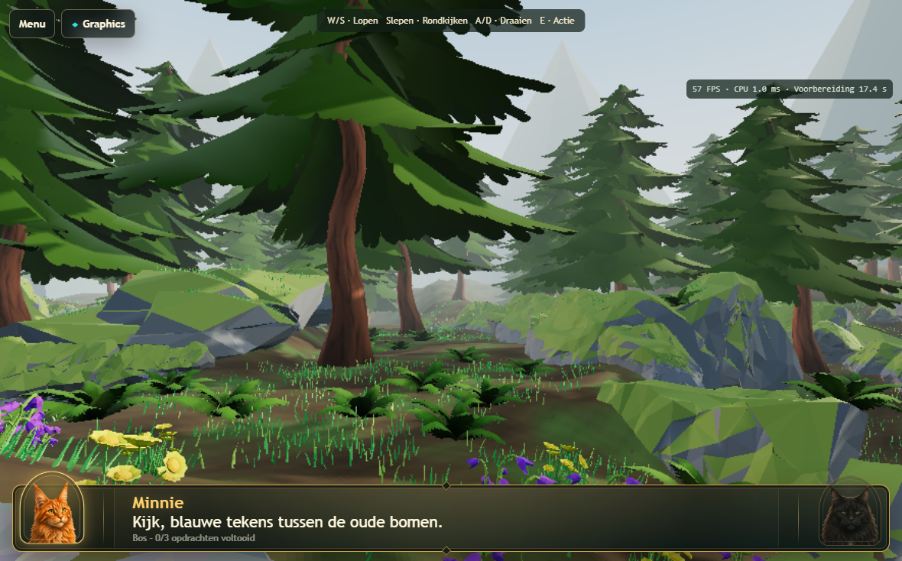
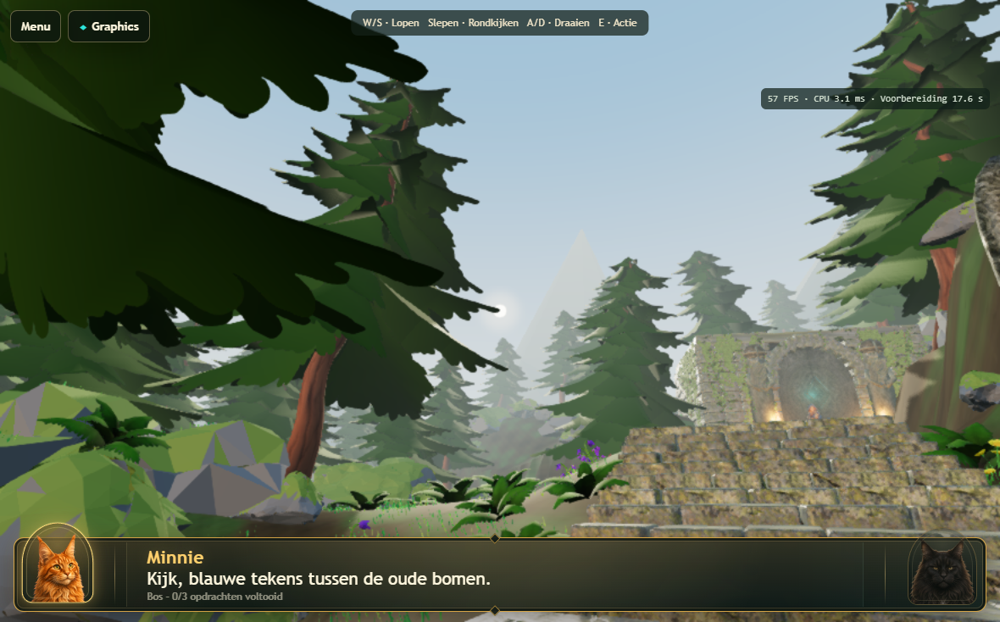
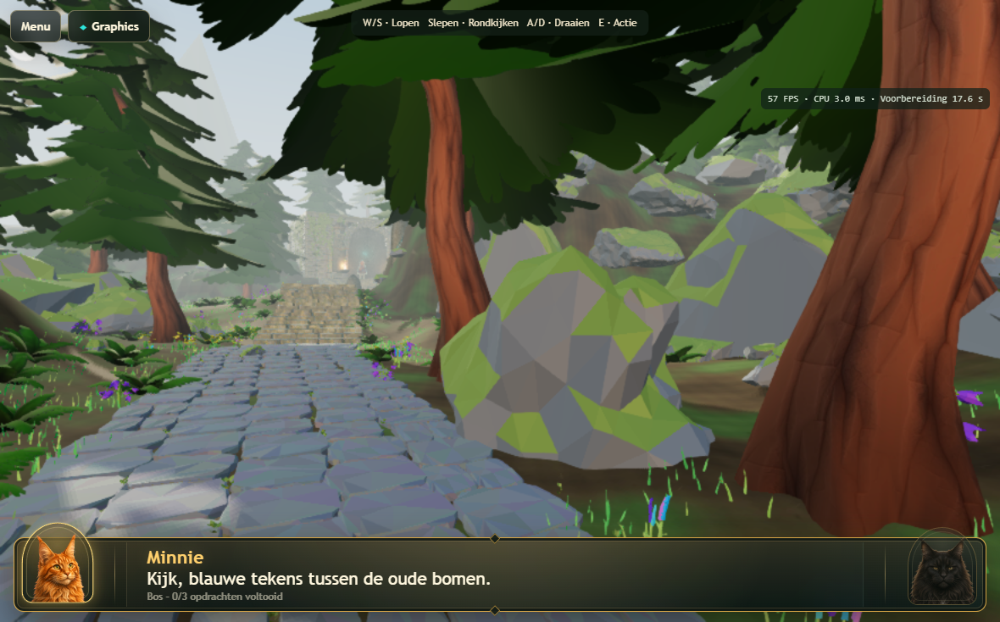
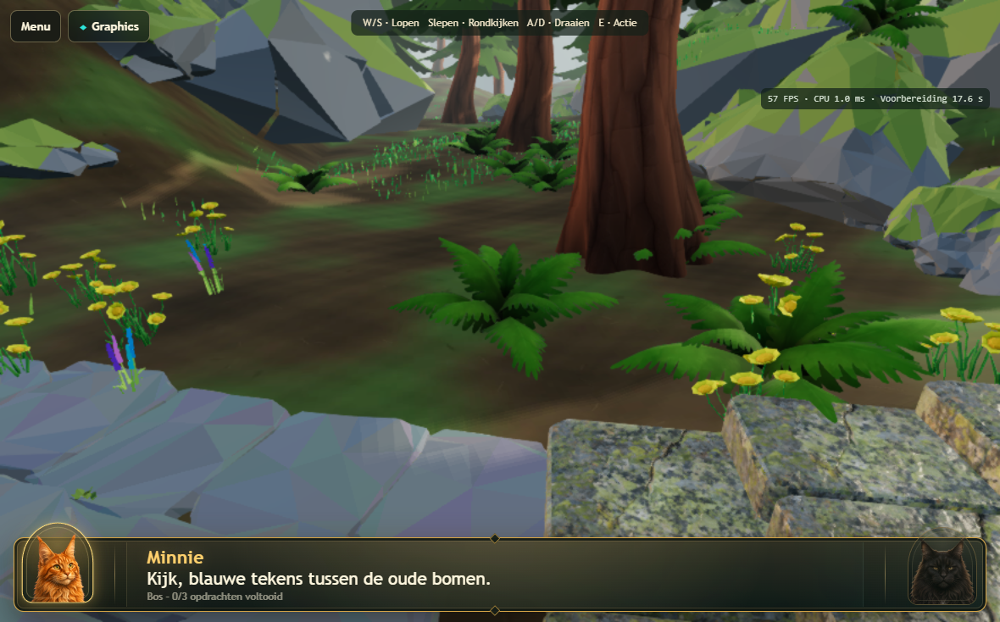

# Atlas 3D v167 — FXAA, morning sun and woodland floor

Local targeted pass, 2026-09-12. No commit or deployment. Real 3D, the canonical
Atlas quality budget, route and world structure are preserved.

## FXAA

FXAA is **enabled by default for Atlas on desktop and tablet**. Test the same
world with `?debug3d=1&atlasFxaa=0` (off) or `?debug3d=1&atlasFxaa=1` (on).
Without debug mode, query overrides are ignored. There is no dynamic quality
switching, TAA or MSAA increase.

The [official Three.js r180 FXAA node](https://github.com/mrdoob/three.js/blob/r180/examples/jsm/tsl/display/FXAANode.js)
is vendored unchanged. Its input receives ACES tone mapping and sRGB conversion
before filtering, matching the [upstream integration example](https://github.com/mrdoob/three.js/blob/r180/examples/webgpu_postprocessing_fxaa.html).
The final automatic color transform is disabled on this branch to avoid applying
it twice. The off branch and Real 3D retain their existing output path.

This adds one fullscreen draw and one **RGBA8, single-sample, depth-free**
intermediate. It uses the actual capped render size, not device-native resolution:
about **1.86 MiB at 885×551**, or 7.43 MiB in the separate 1770×1101 stress test.
No mip chain is generated for the intermediate. Warm-up uses the existing small
size; resizing releases its previous allocation. Because r180 RTTNode does not
own resource disposal, this integration explicitly disposes its target and quad
material during normal exit, cancellation and failure cleanup.

The A/B images show smoother tree, fern and grass edges while broad rock shapes
stay readable. Some fine texture detail is softened. FXAA is spatial filtering:
it cannot eliminate all temporal shimmer or recover subpixel blades at 0.75 DPR.
The modest measured cost and visible edge improvement support keeping it default.

## Morning light and visible sun

The existing shadow-casting directional light now uses offset **[-10, 23, -60]**,
approximately **20.7° elevation**, with pale-golden `#fff0cf` light at intensity 6.
The hemisphere is cooler `#b9d5ef`, with a cool `#cadbe5` bounce. The existing
exposure is 1.12, shadow intensity .75 and shadow map remains 1024². Fog is a
cool pearl `#c7d4d2`, density .0115. No extra shadow light, volumetric or bloom
effect is introduced.

The existing sky dome is reused. A cheap direction-based node shader draws a
blue-to-pearl gradient, a 0.65°-radius bright sun and a subtle 4° halo. Its sun
direction is derived from **the same policy offset used by the real light**, and
is evaluated against the camera ray. It therefore remains aligned as the camera
and shadow focus move. Geometry occludes the disc naturally. The retained small
HDR still supplies environment lighting/reflections; it no longer paints a
potentially conflicting sunset into the visible Atlas sky. Real's HDR dome is
untouched. There is no separate sun mesh or added draw call.

The sun can be seen through the opening near the middle of the route; it is
normally hidden by nearby crowns in covered areas. The low light produces longer
shadows and cooler woodland shade rather than orange evening lighting.

## Forest floor

The shared `forrest_ground_01` material now uses one **512×512 tiling base-color
texture** with an earthy brown/olive base, broad moss patches, quiet organic
flecks and sparse fallen-needle marks. It is authored procedurally as a bitmap,
packed in the Atlas Blender checkpoint, and embedded as WebP in the GLB. It is
stylized, not a photogrammetry asset. No library download was needed for the floor.

The source PNG is 169,736 bytes. Roughness stays .94, metallic 0; no normal,
roughness, displacement, parallax or terrain-blend map is added. UVs and material
sharing are unchanged. Compared with the former 256² image, the maximum RGBA8
texture footprint including mips increases by about **1 MiB**. The GLB grows only
**4,088 bytes**, to 18,675,348 bytes. Source file:
`assets/textures/atlas-woodland-floor-512.png`.

The new ground is darker than the old plain tan floor without losing all detail
in shade. Ferns, grass and flowers sit against a more coherent soil/moss surface.
Organic detail is deliberately low contrast; some broad tiling variation remains
noticeable on open slopes.

## Performance

Sequential real-WebGPU measurements at 1180×734 CSS, unchanged .75 DPR, same route
and four movement phases. The preserved v166 files were also rerun on this host
to avoid confusing an earlier 60 Hz measurement with the current ~57 Hz cadence.

| Configuration | Preparation | FPS range | Stationary CPU | Walking CPU | Turning CPU | Walk/look CPU |
|---|---:|---:|---:|---:|---:|---:|
| Preserved v166 | 17.327 s | 57.08–57.17 | 3.379 ms | 3.547 ms | 1.657 ms | 2.073 ms |
| Morning, FXAA off | 17.442 s | 57.03–57.23 | 3.201 ms | 3.535 ms | 1.642 ms | 2.145 ms |
| Morning, FXAA on | 17.590 s | 57.08–57.20 | 3.412 ms | 3.754 ms | 1.785 ms | 2.364 ms |

FXAA costs approximately **0.14–0.22 ms CPU**, one fullscreen draw and the small
intermediate above in this A/B run. These are CPU frame measurements, not isolated
GPU timestamps. No meaningful FPS difference is resolved at this cadence. The
~0.15 s preparation difference is a single-run observation, not a guarantee.

Low-angle shadows cover more existing geometry: moving-view shadow refresh draws
rise from about 255 to 420 on refresh frames, which occur around 3.2 times/second.
This is the cost of the changed light direction, not extra shadow lights or
resolution. Overall measured average frame time remains close to the baseline.
Likely iPad cost is modest but nonzero: approximately 1 MiB extra floor texture,
1.86 MiB FXAA target at the normal test size, filtering bandwidth, and the wider
shadow footprint. Physical Safari acceptance is still required.

See [raw measurements](atlas-morning-measurements.json).

## Preservation, diagnostics and validation

The GLB node list, mesh descriptors and all **241 Draco geometry streams** were
compared with the v166 backup and are identical. Counts remain 80 Pine1, 4,000
grass patches, 165 ferns and 90 flower groups. No position or grounding changed.
Real GLB and route hashes remain protected by the existing tests.

With `debug3d=1`, the existing diagnostic panel reports FXAA on/off, morning sun
offset and the active 512px floor. The runtime snapshot exposes `actualEffects`.
Normal gameplay receives no new UI clutter. The five-stage loader includes the
actual FXAA work before revealing the scene; it is not a delayed first-use effect.

- **25 passed (7.1 min):** FXAA on/off target allocation and explicit release,
  export integrity, mode availability/persistence, Desktop High/world switching,
  cancellation during decode, canonical desktop/tablet pixel parity and recovery,
  strict 1770×1101 preparation, and real-WebGPU tablet acceptance at 1180×734 and
  1180×689. Both tablet configurations finish all three small warm-up views and the
  playable frame, support movement/look, sustained rendering, Illustrated/Cinematic
  switching and same-page reentry. No unexpected device loss or GPU validation error.
- **22 passed (1.6 s):** presets, channel-preserving texture/HDR budgets and
  opt-in diagnostic behavior.
- **13 passed (1.2 min):** WebKit navigation, forms, native touch and controlled
  cleanup/startup boundaries. Not a physical Safari GPU test.
- Three before/on/off measurement runs passed without page or GPU errors.
- **6 passed (4.9 min):** Desktop High sustained rendering; Atlas/tablet sustained
  rendering, injected stall/validation/device-loss recovery to Cinematic; and
  actual walking, looking, three challenges and unlocking the gate. Injected
  errors test recovery, not the cause of historical physical iPad failures.
- JavaScript syntax and `git diff --check` passed.

Local A/B entry URLs (select Atlas 3D in Graphics):
[FXAA on](http://127.0.0.1:4173/?dev=editor&level=LVL-0001&debug3d=1&atlasFxaa=1),
[FXAA off](http://127.0.0.1:4173/?dev=editor&level=LVL-0001&debug3d=1&atlasFxaa=0).

Remaining visual limits: FXAA mildly softens fine textures and cannot remove all
thin-grass shimmer. Overhead trees legitimately hide the sun in many positions.
The sky gradient is intentionally simple, without clouds/scattering. Open floor
areas can reveal broad tiling. This is not a redesign of the existing forest.

No claim of physical iPad success is made. After a separately authorized deployment,
test Atlas loading, several minutes of walking/look, mode switching/reentry, and
the FXAA debug A/B URLs on the physical iPad.
