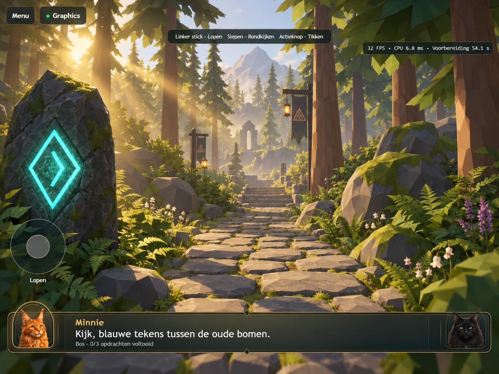
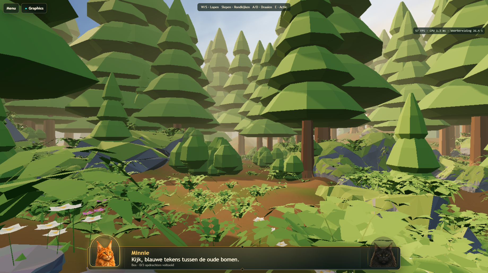

# Atlas-varens naar het voorbeeld — lokaal v164

De varens zijn in Blender MCP opnieuw gemodelleerd naar de aangeleverde afbeelding: vijf gebogen middenstelen, elk met zes paar brede blaadjes die naar de top kleiner worden. De blaadjes volgen de helling van de middensteel, zodat ze vanuit de spelcamera niet allemaal als horizontale streepjes verschijnen. De vorige aaneengesloten bladvormen zijn vervangen.

Twee gedeelde varianten bedienen alle 1.470 bestaande varenposities. Elke plant heeft 260 driehoeken, tegenover 280 voorheen. Er zijn geen materialen, textures of renderpasses toegevoegd. De renderer, Real 3D, bomen, struiken, bloemen, bodem en gameplay zijn niet aangepast. Alle objecttransformaties zijn gelijk gebleven.

De vorm is nu dichter bij een geveerd varenblad uit de referentie. Het blijft een eenvoudige low-poly uitvoering: kleine blaadjes op afstand kunnen nog kartelen op de bestaande renderresolutie. De zachte belichting van de referentie is geen onderdeel van deze varenaanpassing.

## Referentie en echte runtimebeelden

[Begin van de route](images/atlas-v164/runtime-1.png) · [Zijopening](images/atlas-v164/runtime-2.png) · [Valleizicht](images/atlas-v164/runtime-4.png)

## Controle

De vier runtimebeelden zijn vastgelegd in Chromium/WebGPU. De screenshotrun slaagde zonder pagina- of GPU-fouten. De voorbereiding duurde lokaal circa 26 seconden; dit is geen fysieke iPad-meting.

Alle 15 export-, menu- en real-WebGPU-tabletacceptatietests zijn geslaagd (3,6 minuten), inclusief beide viewportformaten en opnieuw laden in dezelfde sessie. Syntaxcontroles en `git diff --check` zijn geslaagd.

Bron: `scripts/atlas-reference-ferns.py`; meshgegevens: `Levels/LVL-0001/3d/atlas-fern-ledger.json`. De bestaande Atlas `.blend` is bijgewerkt. Back-ups van vóór deze varenaanpassing staan lokaal in `output/atlas-fern-backup/`.

Niet gecommit of gedeployed. Fysieke iPad-acceptatie is niet geclaimd.
