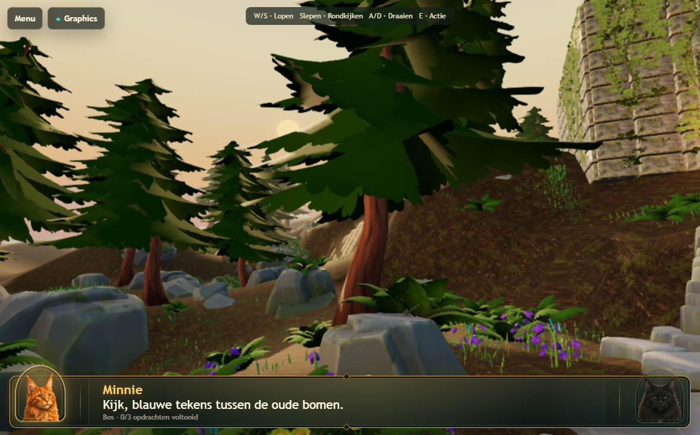
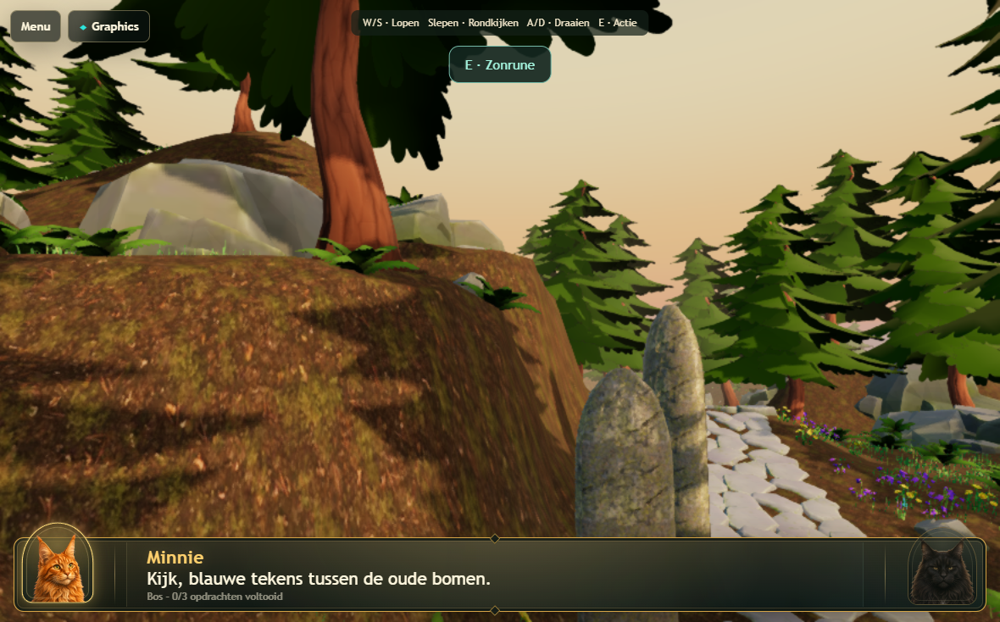
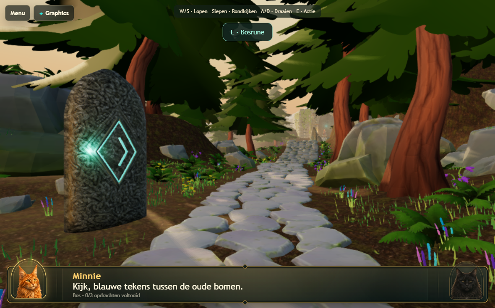
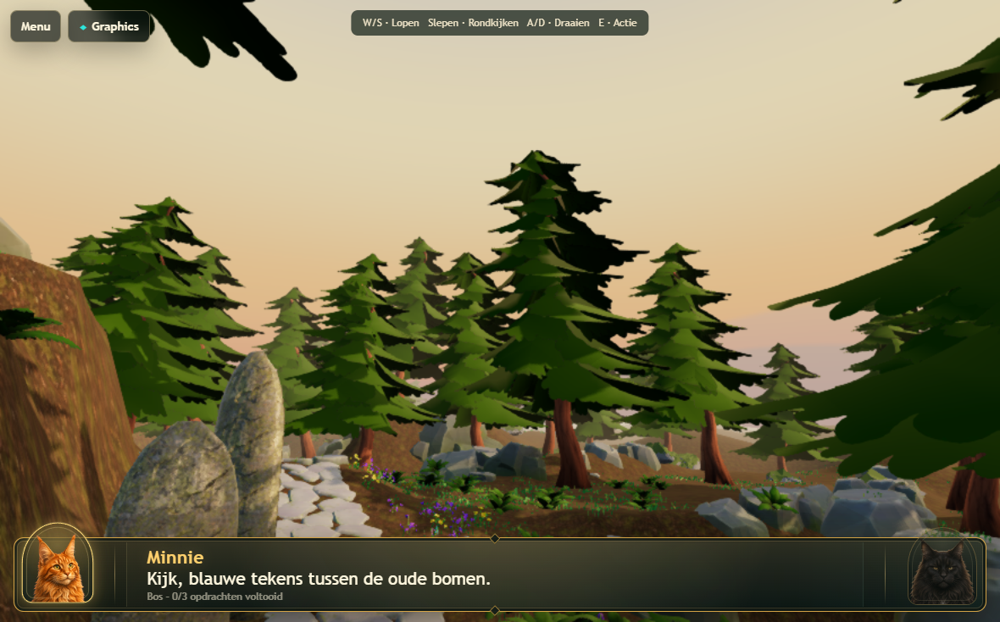
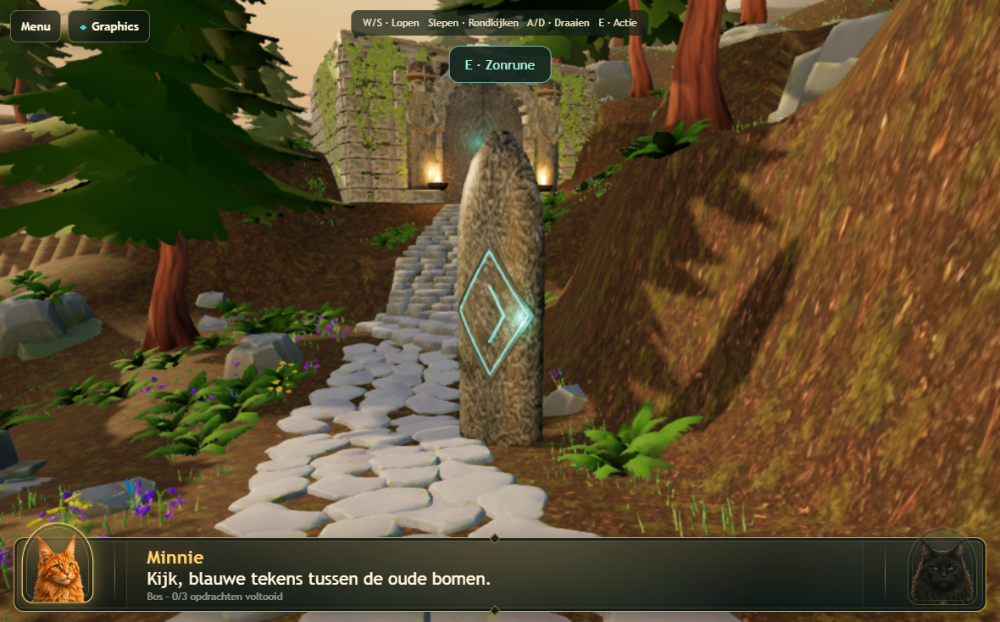
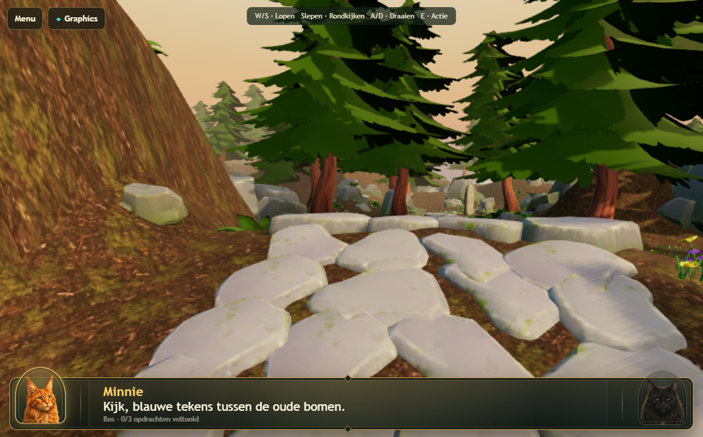

# Atlas v175 temple and background review

Continues the existing v174 authoring scene. The local pre-pass checkpoint is in `output/v175-backup`; the active Blender file and Atlas GLB contain this placement pass. Real 3D, route data, improved paving, tree assets, and renderer presets are preserved.

## Scene changes

- **Temple support:** 119 temple-area rock placements were corrected, including `Atlas moss rock.260`, `.071`, `.186`, `.295`, `Atlas moss cliff.009`, and `Enclosure outcrop.021`. Support uses vertices and centroids of downward-facing facets, rather than just the lowest vertex band. Pieces are embedded until those samples are seated; replacements also receive restrained slope tilt. Previously supplied good assets retain their meshes.
- **Temple hill:** 60 existing grass instances and 9 existing ferns were redistributed into five groups on suitable slope shelves. Broad olive/mineral vertex-color variation breaks up the brown material. The existing contact mask was rebaked. No plants were added; totals remain 4,000 grass, 177 ferns, 99 flowers and 80 pines. Seven pines whose rock footing changed were re-seated/relocated; their source mesh and scale remain intact. Final minimum pine separation is 7.114 m.
- **Weak rock sweep:** 239 instances of the rejected `Atlas painted nature` family in the visible route corridor and larger adjoining banks were replaced: 211 moss rocks, 5 moss cliffs, 11 enclosure outcrops, 5 scanned banks, 5 scanned shelves and 2 lower terraces. This includes old rocks among fern/flower groups. All 56 previously supplied/replacement rocks remain on their established source assets. Distant old pieces outside this targeted corridor were not blanket-replaced.
- **Asset choice:** `rock1.glb` ×62 and `rock4.glb` ×67 provide broad large silhouettes at 342 triangles each; `rock2.glb` ×57 and `rock3.glb` ×53 provide smaller shapes at 244 triangles each. They reuse four shared meshes and the existing opaque rock palette. Replacement geometry drops from 196,036 to 70,958 triangles. Source closure was established by the existing welded-mesh audit. Some old scanned pieces had world coordinates baked into their meshes and zero object pivots; those pivots were recentered without changing their geometry before substitution.
- **Runes:** the complete stone/carving/glow assemblies rotate together: forest rune +51.84° and sun rune −51.57° around Blender Z. Each face points toward a route approach 2.2 m before closest passage. Small vertical corrections seat their bases. The sun-rune interaction/light metadata follows its grounding shift. All carved and luminous vertices are above terrain; buried lower stone vertices provide contact. Full plant footprints are excluded from the rotated rune envelope.
- **Evening sky:** the peach–orange–gold gradient extends much higher. The blue transition begins at approximately 30° elevation (previously 13°), completing near 78° (previously 46°). Soft upper blue remains. The warm 1.8° sun and camera-following dome are retained.
- **Distant hills:** two smooth, low-contrast hill profiles are calculated from periodic azimuth harmonics in the existing sky material. They wrap continuously through 360° and sit behind all world geometry. Warm haze colors and soft edges keep them subordinate to the trees. No background mesh, panorama, texture, shadow caster, or extra draw is added.
- **Contact darkening:** the existing 1024² mask was rebaked for current contacts, using the same texture and lifecycle. Darkening remains local and capped at 23%, with overlap taking the strongest value. Its cost remains one ground-material texture sample; no new AO render pass is introduced.

The exact replacement sources and placement changes are recorded in [the review ledger](../Levels/LVL-0001/3d/atlas-temple-review-ledger.json). The authoring stages are `atlas-temple-review.py`, `atlas-temple-planting.py`, then `atlas-temple-tree-spacing.py`. `atlas-premium-export.py` exports the current verified Atlas scene.

## Validation

Independent Blender audits: 4,356 plant objects, 464,195 root samples, zero failures. Maximum root gap is −0.00321 m; deepest pine root −0.24682 m, within the existing 0.25 m guardrail. Non-pine burial limits were unchanged. The paving audit retains 98.526% coverage across 2,849 samples and a 0.15 m sampled maximum joint radius.

The first release attempt caught four relocated trees violating the existing seven-metre spacing rule. That run was interrupted, placements corrected, the mask rebaked and GLB re-exported. Neither spacing nor grounding thresholds were weakened. An earlier visual invocation omitted the required GPU opt-in and returned no adapter; corrected invocations use real Chromium WebGPU.

Runtime captures cover the forward route, reverse temple view, two rune approaches, temple hill sides, and eight look directions. The dome's maximum sampled camera depth is 179.87 m, inside the unchanged 220 m far plane.

The final sequential Chromium release run passed all 55 tests in 13.1 minutes: scene regressions, full-direction visual audit, cleanup, both preset pressure suites, preset selection, separate 1770×1101 preparation, and real-GPU tablet acceptance at 1180×734 and 1180×689/DPR 2. Both tablet cases completed repeated entries with four real preparation frames and zero captured GPU errors. No GPU checks were skipped or thresholds relaxed.

WebKit passed 18 relevant tests across navigation without Pointer Lock, mode selection/persistence, cleanup, and startup/cancellation diagnostics. One older native-3D navigation case was skipped by its existing runner guard; the separate WebKit navigation test ran and passed. These fixtures do not establish native Safari WebGPU performance.

Logs: `output/v175-release-final.log`, `output/v175-webkit.log`, and `output/v175-webkit-startup.log`. The pre-correction interrupted run is retained separately in `output/v175-release.log`.

No bloom, volumetric fog, realtime SSAO, raymarching, extra lights, shadow upgrades, fullscreen post effects, or blanket vegetation increase were added. Physical iPad Safari frame rate and GPU stability still require device testing; Chromium tablet configuration is not physical Safari.

## Captures

Final Atlas GLB SHA-256: `422dc665a810fcff80d984bdfa3842cc98037a3e1861937191c5b6239ee88d1d`.

## Final matched benchmark

The saved v174 scene and final v175 export were measured sequentially on this host at the same tablet configuration (1180×734 CSS, reported DPR 2, unchanged 885×551 world render resolution). Both maintained approximately 60 FPS in stationary, walking, turning, and combined movement phases. No page or GPU errors occurred.

| Phase | Before CPU ms | After CPU ms | Before draws | After draws |
|---|---:|---:|---:|---:|
| stationary | 3.29 | 3.27 | 420.0 | 407.0 |
| walking | 3.69 | 3.65 | 391.4 | 379.2 |
| turning | 2.43 | 1.67 | 182.7 | 172.9 |
| walking-looking | 2.19 | 1.88 | 187.2 | 175.7 |

These are host CPU submission and frame-interval measurements, not physical iPad GPU timings. Stationary visible triangles increased slightly due to changed placement/culling despite the lower total rock geometry; walking/turning visible triangles decreased. Presets, MSAA, DPR, shadows, and texture caps are unchanged. The final GLB is 17,720,896 bytes versus 17,994,068 bytes before.

See [the measurements](atlas-temple-measurements.json) for inventories, phases, configuration, errors and the final asset hash. Final benchmark log: `output/v175-benchmark-final.log`.

